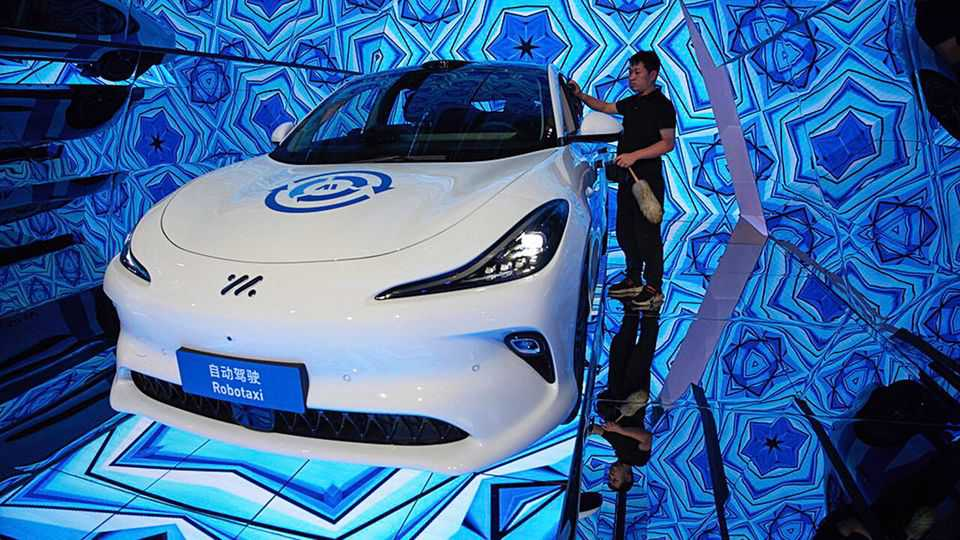

Business | Driving east
Why China is pulling ahead in the robotaxi race
Government enthusiasm and cheap technology are giving it an edge
November 27th 2025

A Journey in one of Pony.ai’s robotaxis is, in some respects, a familiar experience for anyone who has ridden in a cab in China. For one thing, the horn honks just as often. Yet as the steering wheel moves of its own accord and a screen shows outlines of surrounding cars, it also feels futuristic. Pony.ai is one of a number of Chinese firms that have launched robotaxi services in recent years. The biggest, Apollo Go, has deployed more than 1,000 self-driving cars, mostly in China. The service, which is owned by

Baidu, a Chinese tech giant, hopes to have 20,000 robotaxis operating worldwide by 2027. Pony.ai has launched its service in four cities and WeRide in three. CaoCao Mobility, the ride-hailing arm of Geely, a Chinese carmaker, has started trials of its own in two cities. A wider ecosystem is also taking shape. Momenta, an autonomous-software startup, is building robotaxis with SAIC, a state-owned carmaker. Xpeng, a maker of electric cars, recently said that it would start producing dedicated robotaxis next year.

China’s robotaxi industry is “on the cusp of commercial breakout”, reckons HSBC, a bank. Revenues will grow from a little over $50m this year to nearly $50bn by 2035, according to Goldman Sachs, another bank, by which time a fleet of 1.9m robotaxis in China will account for 25% of all ride-hailing vehicles. UBS, one more bank, is even more bullish, forecasting that the market could be worth around $180bn by the late 2030s.

By some measures China’s robotaxi industry is already pulling ahead of America’s. Over 50 Chinese cities allow testing of self-driving cars on public roads. In at least ten of them commercial operations are up and running, twice the number in America. And the potential for robotaxis in the country is vast: China has 139 cities with over 1m people and an urban population more than three times as large as America’s. The bigger opportunity, however, could lie in the rest of the world.

There are several reasons to believe China may win the race to build a robotaxi industry at scale. One is strong state backing. China’s central government is pushing autonomy as a means of strengthening the country’s technological heft. At the same time, many local governments, which are keen to attract investment, have approved robotaxi pilots at a rapid clip and are installing the necessary infrastructure. In the city of Wuxi in eastern China, for example, traffic lights at 1,723 crossroads have been connected to intelligent networks, while sensors are in place at 330 sites in the city to ease the passage of robotaxis.

China’s self-driving cars are also relatively cheap. Waymo, America’s robotaxi leader, spends between $130,000 and $200,000 each on its current generation of vehicles, which are equipped with a multitude of sensors and oodles of computing power. HSBC puts the average cost of a Chinese robotaxi at $40,000. Baidu’s RT6, made in partnership with Jiangling, another state- owned carmaker, costs just $35,000. Cars and the peripheral technology

needed to make autonomy work are much less expensive in China. An enormous domestic market and fierce competition have pushed down vehicle costs in general, while the availability of basic self-driving systems in even cheap cars has brought scale and lowered prices for the sensors required for autonomy, such as the laser-based lidars that create a 3D model of the area around a vehicle. Four Chinese companies, led by Hesai, control around 90% of the global lidar market.

Even with cheaper vehicles, however, China’s robotaxi operators have not yet turned a profit. Pay is low for Chinese taxi drivers, as are fares. Apollo Go once claimed it would break even at the end of 2024 and be profitable this year. It has since gone quiet on the matter. WeRide and Pony.ai are several years away from making a profit. The crumbling share price of both after they recently floated in Hong Kong suggests that investors don’t expect them to start generating cash soon. Goldman Sachs expects the robotaxi industry in China to break even on operating profits in the biggest cities in 2032, but to keep losing money in smaller cities.

Difficulty reaching customers may present an added challenge in China. In America, Uber, the leading ride-hailing platform, is opening its enormous user base to various robotaxi operators. But Didi, the Uber of China, which controls around 70% of the local ride-hailing market, is unlikely to open its platform in the same way as it seeks to protect its own lagging robotaxi efforts. That will force other Chinese robotaxi operators to develop their own customer networks through proprietary apps or to strike deals with smaller ride-hailing platforms.

There are also signs that China’s regulators may slow down the development of the robotaxi industry as they work to ensure public safety and acceptance. More than 70 new regulations for autonomous driving were put in place in various districts, cities and provinces in the first half of this year alone. Officials in Beijing have been reluctant to move forward with trials, and have little intention of allowing robotaxis into the centre of the capital soon. Their counterparts in Shanghai are also hesitant to approve pilots. And no company has yet been permitted to operate across any city in its entirety.

That may be one reason why Chinese robotaxi operators are looking abroad. Another may be the size of the opportunity. UBS reckons that the robotaxi market outside China could be worth more than $210bn by the late 2030s,

excluding America, the door to which seems firmly closed. Pony.ai is testing its service in Luxembourg. It also has pilots under way in Dubai and Seoul, and has permission to operate its robotaxis across South Korea. Apollo Go began its first tests outside mainland China at the end of last year in Hong Kong. It has permission to test its vehicles in Abu Dhabi and Dubai, and has plans to start tests in Switzerland in partnership with PostBus, one of the country’s biggest public-transport operators. Next year it may enter Britain and Germany in partnership with Lyft, an American ride-hailing company. WeRide, too, has permits to test or run commercial robotaxis in six countries outside China. Across much of the world, hailing a self-driving cab may soon feel commonplace. ■

To stay on top of the biggest stories in business and technology, sign up to the Bottom Line, our weekly subscriber-only newsletter.

This article was downloaded by zlibrary from https://www.economist.com//business/2025/11/26/why-china-is-pulling-ahead-in-the- robotaxi-race