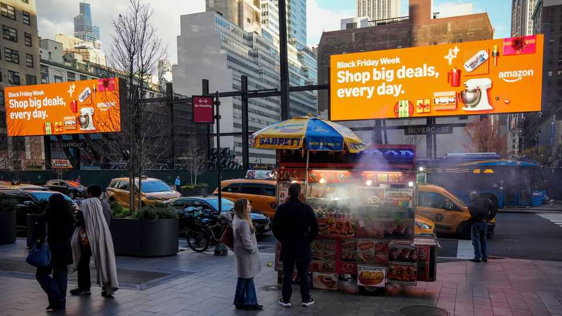
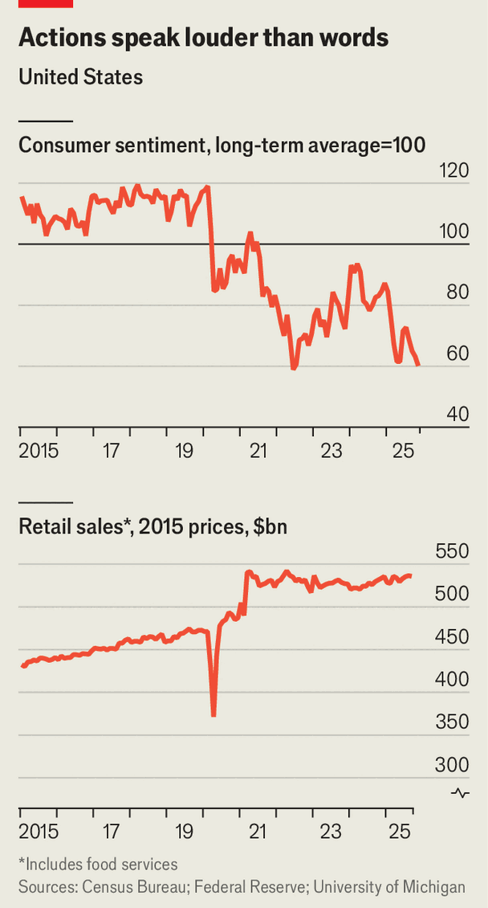

Business | Shop till you drop
American consumers are miserable. But they keep spending
Consumer sentiment and retail sales have decoupled
November 27th 2025

This weekend America will once again be plunged into a frenzy of consumerism as retailers bombard shoppers with “Black Friday” and “Cyber Monday” sales. Even more than usual, bosses will be nervously watching the extent to which Americans are willing to empty their wallets. This month the University of Michigan’s gauge of consumer sentiment fell to only just above its level in June 2022, when the index reached its lowest point since tracking began in 1952 (see chart, top panel). Americans on the whole are feeling

dejected about their job prospects and nervous about inflation. As a result, they are telling pollsters that they plan to cut back on spending.

In practice, however, they have been doing the opposite. On November 25th America’s Census Bureau released figures showing that spending at retailers and restaurants in September was up by 1% year on year, adjusting for inflation, hardly suggesting that consumers are tightening their belts (see chart, bottom panel). Businesses are struggling to gauge how long the mismatch between the gloominess of shoppers and the resilience of their spending can continue. For now, they have reasons to remain optimistic.

Figures on consumer sentiment treat rich and poor Americans alike. Yet their spending differs greatly. Despite recent wobbles, America’s stockmarket remains lofty, helping to boost consumption by the share-owning wealthy. For LVMH, the world’s largest purveyor of luxury goods, sales in America in the three months from July to September were up by 3% compared with the same period in 2024, having fallen in the first half of the year. Unilever, a consumer-goods giant, said that premium products fuelled its sales growth in America in the third quarter. Poorer consumers, however, have been under greater strain. Chipotle, a restaurant chain, and Home Depot, a home- improvement store, have both noted a drop in business from lower-income customers in recent months.

Still, even poorer Americans have been increasing their overall spending, even if at a slower pace. Data from Numerator, a research firm, shows that those earning over $100,000 spent 4.3% more in the third quarter than in the same period a year ago, while those earning less than $60,000 spent 3.8% more.

To get more for their money, some stretched consumers are switching where they shop. Retailers that cater to the thrifty, such as T.J. Maxx, have enjoyed a bump in sales. Other shoppers appear to be spending on small indulgences to lift their spirits, a pattern known as the “lipstick effect”, in homage to Leonard Lauder, a beauty tycoon, who observed that sales of the product rose during a recession. More than make-up, perfume appears to be the indulgence of choice these days. According to data from Circana, another research firm, sales in America of mass-market fragrances in the nine months from January to September were up by 17% year on year. (“I don’t know if we should call it the ‘lipstick effect’ or the ‘smell good fragrance effect’,” Nicolas Hieronimus, the boss of L’Oréal, a beauty giant, recently pondered.)

Retailers will be hoping that consumers, despite their gloominess, continue to spend in the weeks leading up to Christmas. Plenty of analysts remain upbeat. Shannon Grein, an economist at Wells Fargo, a bank, reckons that “a longing for comfort will help keep overall holiday sales elevated”. She and her colleagues predict that nominal retail spending in November and December will be 3.5-4% higher than last year, comfortably above inflation. Eventually, though, what Americans spend may catch up with how they feel. ■

To stay on top of the biggest stories in business and technology, sign up to the Bottom Line, our weekly subscriber-only newsletter.

This article was downloaded by zlibrary from https://www.economist.com//business/2025/11/27/american-consumers-are-miserable-but- they-keep-spending