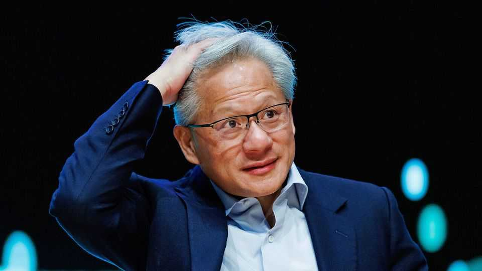
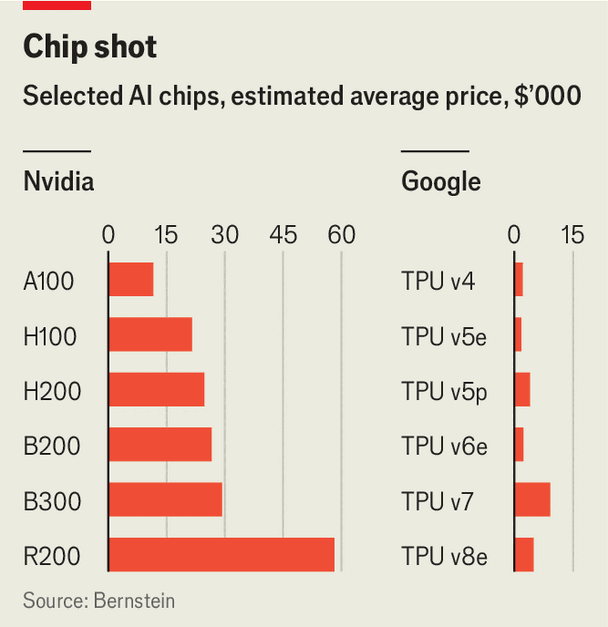

Business | Silicon smackdown
Google has pierced Nvidia’s aura of invulnerability
But the search giant’s custom chips may prove tricky for others to adopt
November 27th 2025

No company has benefited more from the craze for artificial intelligence than Nvidia, these days the world’s most valuable company. Over the past three years investors have bid its shares into the stratosphere in the belief that its dominance of the market for AI chips is unassailable. Rival chipmakers and startups alike have tried to elbow their way into its business, with little success.

Now, however, one of Nvidia’s biggest customers has emerged as its fiercest competitor yet. This month Google, which pioneered the “transformer” architecture that underpins the current AI wave, launched Gemini 3, a cutting- edge model that outperforms those of its biggest rivals, including OpenAI, on most benchmarks. Crucially, Gemini 3 was trained entirely on Google’s own chips, called tensor-processing units (TPUs), which it has begun peddling to others as a cheaper alternative to Nvidia’s graphics-processing units (GPUs). Last month Anthropic, a model-maker, announced plans to use as many as 1m of Google’s TPUs in a deal reportedly worth tens of billions of dollars. Reports that Meta, another tech giant with big AI ambitions, is also in talks to use Google’s chips in its data centres by 2027 caused Nvidia to lose more than $100bn in market value, some 3% of its total, on November 25th, though it has since partly recovered.

Nvidia’s customers have a big incentive to explore cheaper alternatives. Bernstein, an investment-research firm, estimates that Nvidia’s GPUs account for over two-thirds of the cost of a typical AI server rack. Google’s TPUs cost between a half and a tenth as much as an equivalent Nvidia chip (see chart). Those savings matter, given the vast sums currently being poured into computing power for AI. Bloomberg Intelligence, another research group, expects Google’s capital expenditures to hit $95bn next year, with nearly three-quarters of that being used to train and run AI models. Investors have lately caught on to the enormous cost advantage Google has gained thanks to its in-house chips; in the past three months the shares of its corporate parent,

Alphabet, have soared by half, making it the third-most valuable company in the world.

Other tech giants including Amazon, Meta and Microsoft have also been developing custom processors, and last month OpenAI announced a collaboration with Broadcom, a chip designer, to develop its own silicon. But none has progressed as far as Google. It began designing its chips more than a decade ago. Back then, Google’s engineers estimated that if users ran a new voice-search feature on their phones for just a few minutes a day, the company would need to double its data-centre capacity, a prediction that spurred the development of a more efficient processor tailored to Google’s needs. The company is now on its seventh generation of TPUs. Jefferies, an investment bank, reckons Google will make about 3m of the chips next year, nearly half as many units as Nvidia.

For Nvidia’s other customers, however, switching to Google’s chips will not be straightforward. Nvidia’s edge lies partly in CUDA, the software platform that helps programmers make use of its GPUs. AI developers have become accustomed to it. And whereas the software surrounding TPUs has been created with Google’s own products in mind, including search, CUDA is intended to cater to a wide range of applications. What is more, reckons Jay Goldberg of Seaport Research Partners, an industry analyst, there may be a limit to Google’s willingness to sell its TPUs; it could prefer instead to steer prospective customers towards its lucrative cloud-computing service. To stymie its AI competitors, Google may also be tempted to keep prices for its chips high.

All this may explain why Jensen Huang, Nvidia’s boss, does not seem especially worried. He has described Google as “a very special case”, given that it began developing chips long before the current AI wave, and has dismissed other efforts as “super adorable and simple”. He is also betting on flexibility. The transformer architecture behind today’s AI models is still evolving. GPUs, which were originally developed for computer games, are highly adaptable, letting AI researchers test new approaches. Nvidia may no longer look as invulnerable as it once did. But its strength should not be underestimated. ■

To stay on top of the biggest stories in business and technology, sign up to the Bottom Line, our weekly subscriber-only newsletter.

This article was downloaded by zlibrary from https://www.economist.com//business/2025/11/25/google-has-pierced-nvidias-aura-of- invulnerability