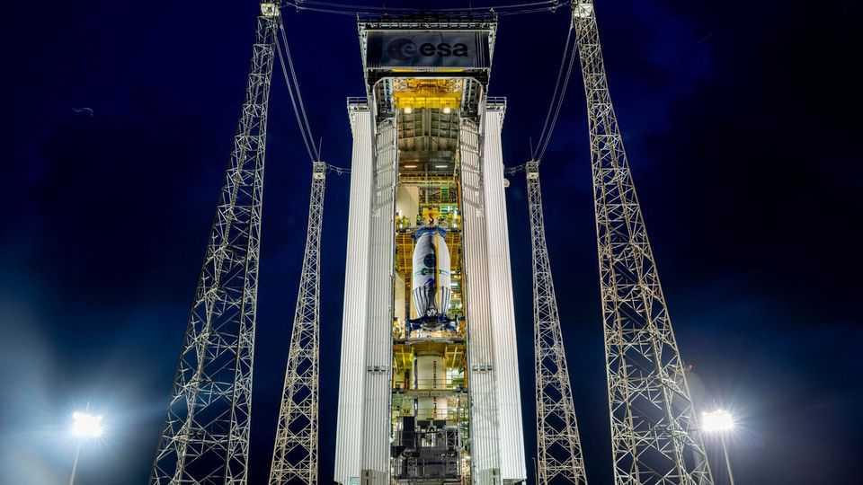

Business | Eclipsed
Europe is struggling to compete in the second space race
Its governments are starting to take action
November 27th 2025

As commercial and military interest in space continues to grow, many in Europe are keenly aware of the risk of being left behind. As The Economist went to press, the European Space Agency (ESA) was holding its latest triennial gathering, during which ministers from the agency’s 23 member countries will decide on the agency’s budget—its leaders hope for at least €22bn ($26bn), up from €17bn in 2022—and its main programmes for space exploration and Earth observation. The gathering may be the most consequential in ESA’s 50-year history.

Globally, the space business is booming. A study by Roland Berger, a consulting firm, and the Association of German Industry (BDI) forecasts that the overall market will grow from around €470bn in 2024 to €2trn by 2040, or around 9% a year. That figure includes spending by governments and research organisations, as well as companies that rely, for example, on satellite communications.

Next to America, however, Europe is a tiddler when it comes to the space business. The American government spends $77bn a year on space; Kai-Uwe Schrogl, a special adviser to Josef Aschbacher, the boss of ESA, puts European spending at around $10bn. And Europe’s private space enterprises are lightyears behind the likes of Elon Musk’s SpaceX, which last year accounted for over half of all rocket launches worldwide.

Still, ESA is managing to boost interest in Europe’s space industry. It has signed agreements with 72 investors, including venture-capital firms, banks and public institutions. Last year European space startups raised over €1.5bn, 56% more than in 2023. ESA estimates that from 2019 to 2024 the share of global private investment in space captured by European companies grew from 3% to 22%, thanks largely to interest from defence customers.

Germany, Europe’s biggest economy and long home to several space startups, is also looking to boost investment in the industry. This month the government presented its first space strategy, promising to allocate €35bn to military space technology by 2030. Isar Aerospace, which makes rockets for satellites at Ottobrunn in “Space Valley”, an industry cluster near Munich, is among those hoping to benefit from the spending. Its first rocket, launched in Norway in March, crashed into the sea after 30 seconds, but has provided valuable data for another launch planned in the next few months.

Germany’s neighbours are also doing more. This month France unveiled a new space strategy of its own. In October, after years of deliberation, Airbus and Thales, both based in France, and Italy’s Leonardo agreed to merge their space businesses. The model for the joint venture is MBDA, a missile-maker created in 2001 by Airbus, Leonardo and BAE Systems, a British defence company.

Europe is eager to reduce its dependence on America’s capabilities in space. For example, the continent would like to wean itself off Starlink, SpaceX’s

satellite-internet service, which has been vital to Ukraine’s defence effort. Yet that will not be easy. France’s Eutelsat, which runs OneWeb, a Starlink rival, also operates in Ukraine with German funding, but cannot match its scale or prices. In December last year the EU launched a €10.6bn initiative to develop iris2, another satellite constellation. But it will have only 290 satellites against Starlink’s current 9,100, and will be operational in 2030 at the earliest.

Europe has already done admirable things in space: Mr Schrogl points to Copernicus, an Earth-observation programme, and Galileo, a satellite- navigation system more accurate than America’s GPS. The continent may never match America commercially in space—but more than money is at stake. ■

To stay on top of the biggest stories in business and technology, sign up to the Bottom Line, our weekly subscriber-only newsletter.

This article was downloaded by zlibrary from https://www.economist.com//business/2025/11/27/europe-is-struggling-to-compete-in-the- second-space-race