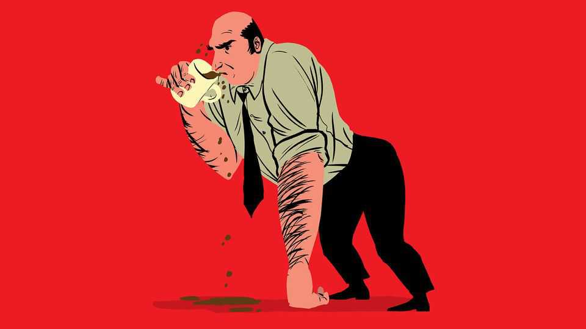

Business | Bartleby
Observed in the wild: office snackers and foragers
From the snack cupboard to the coffee machine
November 27th 2025

These are edited highlights of a live Q&A with Karen Javelin, the director of “Pantry Earth”, a new feature-length documentary from the BBC’s award- winning natural-history unit. Q. Karen, tell us about the genesis of this remarkable film. A. We have often talked about filming office workers in their natural habitat but always worried about the Hawthorne effect: people would spot the

cameras and change their behaviour. But then David [Attenborough] suggested we focus on the pantry and kitchen areas, and we realised that would be ideal. We could set up hidden cameras around the food cupboards and coffee machines, and leave employees to it.

Q. Were there any human camera operators at all?

A. We did have one person sitting inside a fake cupboard, and that was how we got the mating scene.

Q. Apart from that, what surprised you most about what you observed?

A. A lot of what we saw was anticipated: the exaggerated reactions to microwave smells, the confusion about what goes in which recycling bin. But I think the thing that surprised me most was the inability of people to learn when a pantry had run out of free food. The same people would come back to an empty cupboard and reopen it perhaps once or twice an hour for hours on end. They always lived in hope that it would be refilled, even when common sense told them there was nothing left. By nothing, I obviously mean nothing good: I’d bet serious money that those dried prunes are still there.

Q. But then there is that lovely scene when the cupboard is restocked…

A. Yes, that’s a personal favourite. We’d seen the largest male return to the pantry perhaps 20 times in one day. And then he comes back in the morning and it’s overflowing with goodies, and he does a sort of capering dance to himself. No one had ever filmed that behaviour before.

Q. One reason that the cupboards were empty was that there was a lot of raiding.

A. That’s right. We had expected to see individuals taking more food from the pantry than they needed, and sure enough that did happen. When snacks start to run low, the temptation to hoard things becomes overwhelming for some of them. The short-haired female who loves peanuts was the most cunning: she only ever took one extra bag at a time and always hid it in a coat pocket. And it took a lot of time to work out where she was storing them in her office.

Q. Yes. Inside an air vent. That was an amazing moment.

A. I know, right? But again, the real surprise was not so much individual greed, but the activity of large-scale raiding parties from other departments. We had not realised how often this was happening until we reviewed all the footage. Groups of two or three people entering another department’s kitchen at speed, taking what they could and leaving. We know that there were confrontations between rival groups, because of chocolate debris and blood stains in the corridors, but we didn’t manage to film any.

Q. Another of my favourite scenes was the one with the kettle. Tell us more.

A. Yes. We kept seeing this pattern where people would put a mug out, start a kettle boiling and then leave it. And then by the time they came back, other people would have emptied the kettle for their own drinks. Our sound engineer was the one who noticed that there was an employee who never actually managed to finish making a drink. There’s always a temptation in this kind of situation to intervene. But as film-makers we must let nature take its course.

Q. You mean…

A. She went out for coffee instead.

Q. Was there anything you left on the cutting-room floor that you wish you could have kept?

A. We had some nice scenes with employees leaving dirty work to others. The drip tray in the coffee machine is the obvious example. It fills and fills until it is literally overflowing with effluent, but no one ever changes it. People won’t throw anything out of a fridge, even if it has been there so long it has started to evolve into a new species. But we didn’t have time for everything.

Q. And before you go, what’s next for you and the team?

A. I’m not sure. I was interested in the legend of serendipitous watercooler conversations that provide the spark for world-changing innovations. So we took a lot of extra footage there, which I am reviewing right now. But it appears just to be a place where people get water. ■

Subscribers to The Economist can sign up to our Opinion newsletter, which brings together the best of our leaders, columns, guest essays and reader correspondence.

This article was downloaded by zlibrary from https://www.economist.com//business/2025/11/27/observed-in-the-wild-office-snackers- and-foragers