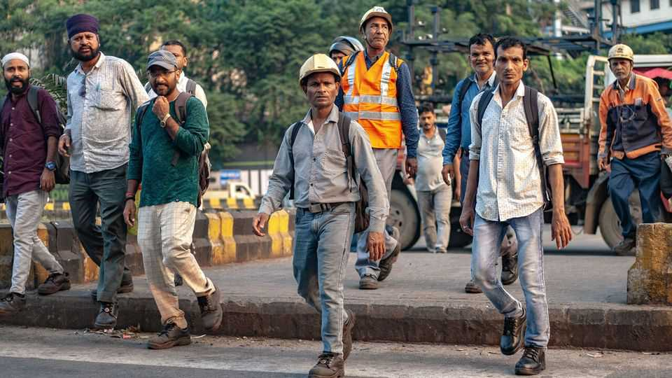

Finance & economics | Make work
Narendra Modi plans to free up India’s giant labour force
Socialist employment restrictions will be swept away
November 27th 2025

LOOK AT Indian data and strange patterns start to emerge. Why, for example, do over 95% of industrial firms employ fewer than ten workers, and many others exactly 99? Why are garment factories two-thirds of the size, on average, of rivals in Bangladesh? And why is 42% of the manufacturing workforce contract labour, hired to perform specific, limited tasks? Answers to such puzzles are often found in the country’s byzantine labour laws. For decades they have seemed unreformable because of the potential for

political backlash. But on November 21st Narendra Modi, the prime minister, announced the biggest overhaul since India’s independence from Britain in 1947. Hiring and firing will be liberalised, compliance simplified and flexibility increased. States must implement the changes; the hope is that most will in the next financial year. “It is the mother of all reforms,” says Arvind Panagariya of Columbia University.

To see why economists are excited, consider how the old laws throttled enterprise. Most obviously, firms have been reluctant to grow. Many rules apply only to those with ten or more staff. Amrit Amirapu of the University of Kent and Michael Gechter of the University of Arkansas have found that they cause a 35% increase in labour costs because of compliance and other overheads. The result is a “missing middle”: India has giant companies able to cope with the regulations and tiddlers that would rather not, but little in between.

India’s Industrial Disputes Act, passed in 1947, has also made it near- impossible for manufacturers with over 100 employees to fire workers. That has put off many firms from investing altogether, and prevented factories from reaching economies of scale often found in east Asia. It has also skewed the private sector towards capital-intensive businesses, such as chemical plants, and away from labour-intensive ones. Some companies get around the rules by relying on contract labour, which in turn discourages bosses from spending on training.

Mr Modi first tried to rewrite India’s labour codes five years ago, only to relent in the face of opposition. Since then, manufacturing subsidies have largely failed to boost industry. Observers blamed a shortage of good jobs for Mr Modi’s failure to retain his majority in last year’s election.

But his governing coalition subsequently won a string of state elections, which has given him freedom to act. President Donald Trump’s tariffs have also led to pressure for reform (Indian exporters still face an American duty of 50%, among the highest in the world). Mr Modi’s proposals have measures that will appeal to the left, too, including the promise of social security for gig workers, a provision that every worker should have the right to a contract and the removal of restrictions which stop women from working at night or in industry.

That did not prevent unions from labelling the plans a “deceptive fraud”. They began industrial action on November 26th. Yet labour organisers have less sway than they once did, particularly with younger workers, notes Manish Sabharwal of TeamLease Services, an employment agency. Although a few states have raised concerns, most will implement the new codes. Some, including Maharashtra and Uttar Pradesh, are cooking up further deregulation.

The State Bank of India, a public-sector lender, reckons that Mr Modi’s proposals will boost consumption, as well as increase the share of formal jobs by 15 percentage points. Harish Ahuja of Shahi Exports, the country’s largest garments exporter, expects them to make his industry more competitive internationally. India’s great advantage is an abundance of people. Fixing its labour laws is a big step towards making better use of them. ■

For more expert analysis of the biggest stories in economics, finance and markets, sign up to Money Talks, our weekly subscriber-only newsletter.

This article was downloaded by zlibrary from https://www.economist.com//finance-and- economics/2025/11/27/narendra-modi-plans-to-free-up-indias-giant-labour-force