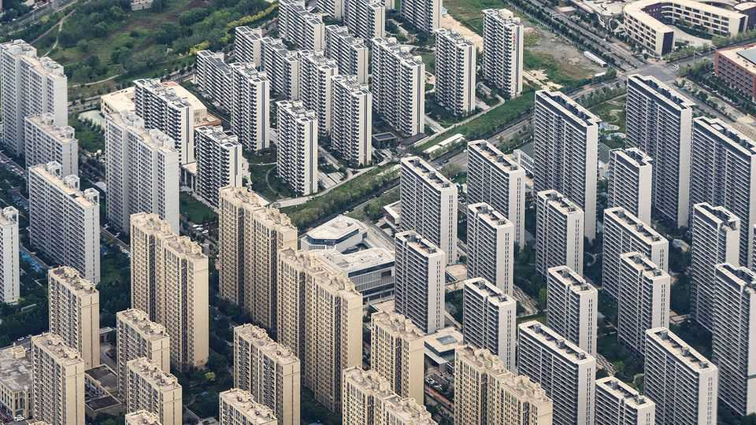
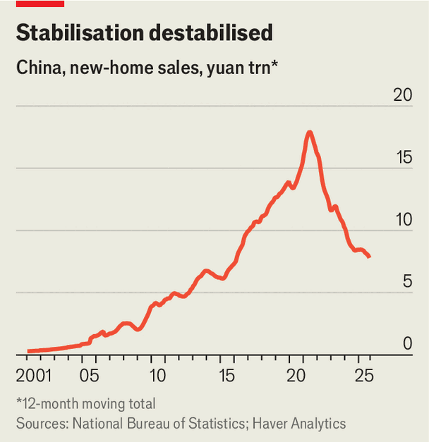

Finance & economics | Problems of the 0.00002%
China’s property market is (somehow) worsening
Government remedies are not up to the job
November 27th 2025

The Communist Party of China now has over 100m members. Only 23 (the top 0.00002%) sit on its Politburo, which sets the agenda for the party and therefore the country. And even they do not always get their way. At an emergency meeting in September 2024, these leaders resolved to stabilise China’s precarious property market. The market had other ideas. Their failure was not immediately apparent. Sales rose in late 2024 and early this year stopped plunging (see chart). In April a garden villa sold for more

than 1m yuan ($140,000) per square metre on Shanghai’s fashionable Julu Road, known as the city’s “literary living room”. Yet in more recent months, the market has fallen back into the basement. Prices in China’s 70 biggest cities dropped in October at the steepest monthly rate in a year. Although the record-breaking property purchase in Shanghai attracted curious sightseers, it did not sufficiently inspire other buyers.

China’s leaders have so far been slow to respond to this defiance of their will. The unexpected resilience of China’s exports has kept the country’s growth target of 5% or so in reach. And the cost and complexity of a nationwide

property clean-up remains offputting. But according to Bloomberg, a news service, the government is now considering another round of measures intended to arrest the market’s decline, including interest-rate subsidies and income-tax rebates for mortgage borrowers.

It is not just the leaders’ pride at stake. The drop in property prices is destroying the wealth of households, depressing their spending in other parts of the economy. That threatens another of the Politburo’s commitments, to “vigorously” boost consumption. The property slump is also eroding collateral values for many borrowers, which could add to financial strains. And if banks are quick to seize and sell the properties owned by delinquent debtors, their fire sales might add to the market’s downward momentum.

Prices have already fallen by 20-40% since their peak in 2021, depending on the measure. By April, almost half of the 2,500 people surveyed by UBS, a bank, had suffered a paper loss on their property. The value of their home was not only below its peak, it was also below what they had paid for it. Indeed, a small but growing number of flats are now worth less than the mortgage debt still owed on them. By the end of this year, 700,000 homes will be in “negative equity”, according to May Yan of UBS. She expects 1.8m to be next year.

Negative equity does not have to lead to default. In Hong Kong, after the Asian financial crisis of 1997, only 1.4% of borrowers fell far behind on their mortgages, even though over 30% of them languished in negative equity. Many mainland Chinese households will keep making mortgage payments if their income permits.

Mortgages, however, are not the only kind of property debt. Housing also serves as collateral for about 25trn-yuan worth of business loans for small firms, including fragile mom-and-pop operations. If these borrowers default, their bank could commandeer their property and flog it, even if the market is soft. UBS expects the number of foreclosed properties to reach 1.5m in 2026. If all these seized units come piling onto the market, it will make the stabilisation of prices even harder to achieve.

More forceful attempts to revive the property market are, therefore, needed. Unfortunately, the measures under consideration by China’s leaders are unlikely to be sufficient. An interest-rate subsidy might reduce the cost of

mortgages by a percentage point, in line with subsidies for consumer loans introduced earlier this year. If this generosity is limited to new mortgages it will save households only about 63bn yuan a year, according to Goldman Sachs, another bank. If the generosity were also extended to existing mortgages as well as new ones, the savings would increase to 437bn yuan a year, or about 0.3% of GDP. That could go up to almost 0.5% of GDP if mortgage holders are also allowed to deduct more of their interest payments from their taxable income.

If the mortgage rate does drop by about a percentage point, the cost of borrowing will fall roughly into line with the rental yield on Chinese properties, Goldman Sachs calculates. The subsidies would, in other words, make property prices “fairly valued” by this metric. Unfortunately, property values are unlikely to settle at such a level automatically. Asset prices tend to overshoot in both directions. After a long bubble, when homes were unfairly expensive, they may have to become unfairly cheap before enough homebuyers are tempted to jump in. China’s property market has long defied the powerful men on the Politburo. It will not immediately bow to the fundamentals, either. ■

For more expert analysis of the biggest stories in economics, finance and markets, sign up to Money Talks, our weekly subscriber-only newsletter.

This article was downloaded by zlibrary from https://www.economist.com//finance-and- economics/2025/11/27/chinas-property-market-is-somehow-worsening