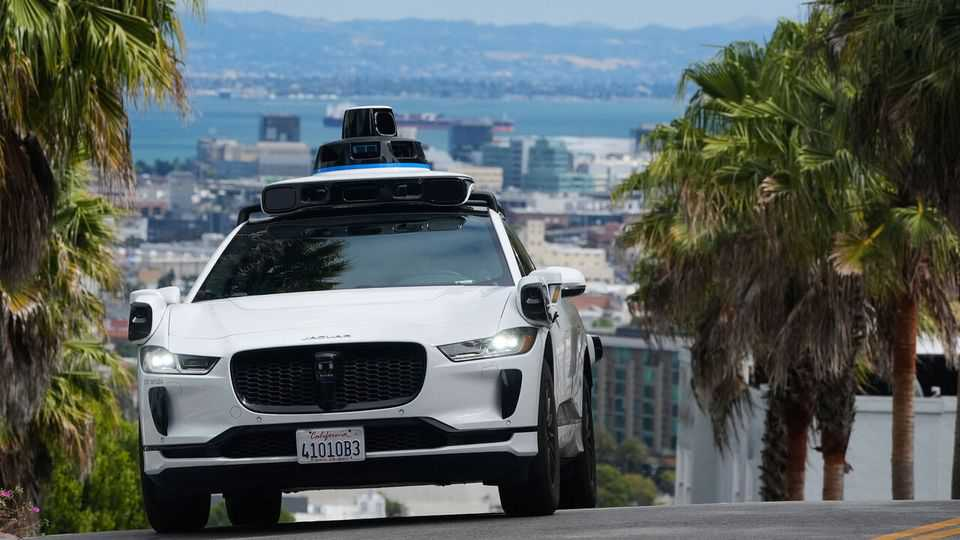
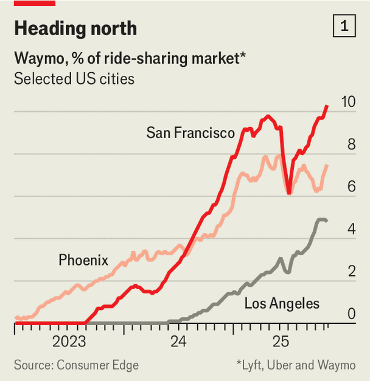
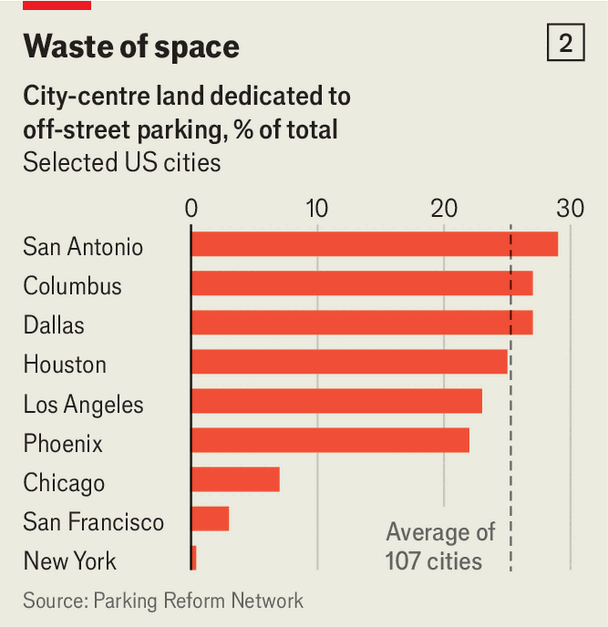

Finance & economics | Wheels of fortune
Self-driving cars will transform urban economies
A robotaxi boom is coming. The impacts might be broader than you expect
November 27th 2025

Urban Economies reflect how their residents get around. And before long, that will start to change—more dramatically than at any time since the automobile was invented over a century ago. The robotaxis now autonomously shuttling passengers around the Bay Area or Los Angeles may look like ordinary cars, perhaps with a few ungainly sensors, but as they spread and develop, they will operate under different constraints to human-driven ones, and accordingly reshape cities.

Over the next year, robotaxis will become increasingly difficult to ignore. Waymo, Google’s offering, plans to expand to cities including Miami and Washington. London will mark the company’s first international expansion and put it in direct competition with Uber, which is also set to launch a self- driving offering in the city. San Francisco’s experience suggests that public and regulatory resistance—a formidable force in many cities—can be overcome. A thin majority of residents opposed robotaxis in 2023 when Waymos hit the streets. Today two-thirds are in favour.

Pioneer cities offer a glimpse of changes to be expected elsewhere. Road safety ought to improve: Waymos are involved in ten times fewer serious crashes than an average human driver. So far, at least, in San Francisco there have not been job losses among cab or rideshare drivers. The cars operate at the top end of the market. A trip with a Waymo costs roughly a third more than a ride-hailing service on average, reflecting the swish Jaguar cars the firm uses and research spending that must be recouped. Despite the cost of a ride, robotaxis’ market share is rising fast (see chart 1).

This is just the start. Robotaxis are losing money at present, but they ought to become much cheaper. The most important fact about them is also the most obvious: no one is at the wheel. That makes their economics entirely different to either regular taxis or cars. Unlike taxis, per-trip costs can be low. A rider no longer needs to buy a driver’s time at a high enough wage to make it worth their while. Although robotaxis still need to be charged, maintained, cleaned and so on, doing so is far cheaper. Unlike regular cars, robotaxis do not sit idle for most of the day, meaning their main cost—the investment to build them— can be spread across many more journeys. Such costs will also come down once fleets begin to be built in bulk. Carmakers will be able to fiddle with the shape of cars that no longer need to accommodate a driver. Tesla, Elon Musk’s firm, is trying to work out how to just use cameras rather than more expensive lidar sensors.

Thus the economics of owning a car, even an autonomous one, will be altered. In the countryside, which may lack the population density to sustain a robotaxi network, things will probably not be too different. Yet car ownership could lose appeal for many city-and suburb-dwellers. The average American household allocates 15% of its spending to vehicle ownership. For anyone who is not a ferocious gearhead, drastically reducing this would be tempting.

A world of cheap urban transportation is alluring. But it could also cause a real problem: horrific traffic jams. Congestion is a classic economic externality. The cost of any single car’s contribution to a jam is not borne entirely by its occupants. Instead, it is spread across everyone on the road. At present, urban traffic is constrained by the fact that getting around by car either requires (expensively) paying someone else to drive or (inconveniently) driving oneself. Without such constraints, the result could be brutal gridlock— negating many of the benefits of robotaxis.

An economist’s answer to this conundrum is straightforward: put a price on traffic. Although congestion charging has been a feature of European roads for decades, it is formidably unpopular in America. New York recently set road fees, but only after a protracted battle. Swarms of robotaxis may force the matter. Self-driving cars are much less likely to break traffic rules and incur fines, meaning something will need to fill a hole in city budgets. Presenting a congestion charge as a “robot tax” might even make it easier to swallow.

San Francisco may not yet have seen job losses, but that is likely to change as costs fall. America is home to 1m taxi and bus drivers, as well as over 3m truck drivers—adding up to 3% of the working population. Other potential losers are less obvious. Without car accidents there will, for instance, be less demand for personal-injury lawyers. If people stop buying cars, dealers and used-car salesmen will go. Robotaxis might compete with short-haul air travel and even hotels if some are kitted out with beds. Although new jobs will be created—in, say, managing fleets or manning depots—they will hardly make up for the losses. Social disruption is likely; at the same time, job losses will be an opportunity. Workforces in the rich world are shrinking as populations age. Freeing people to work elsewhere might be invaluable.

Productivity in the transport industry would surge. The rest of the economy ought to perk up, too. An average working American spends just under an hour commuting each day, against eight hours on the job. Turning even a sliver of that into work could boost output appreciably, says Will Denyer of Gavekal, a research firm. Self-driving cars offer a smoother ride, which, along with better suspension, should make it easier to get work done onboard. And fewer accidents not only mean fewer human tragedies—they also mean lower hospital and rehabilitation bills.

Then comes the impact on urban areas. Parking spaces take up a quarter of the downtown of the average American city (see chart 2). Most could be put to better use, perhaps as housing or offices. On-street parking could become drop-off bays or pavements, making city strolls more pleasant. More urbanites might cycle if traffic accidents become less common. Denser and better connected city centres ought to be an economic boon.

Outside city centres, however, robotaxis will probably lead to sprawl, since longer journeys will be more tolerable. Self-driving cars could pull people away from more space-efficient transport such as buses, subways and trains,

prompting a “death spiral” where fewer customers mean lower revenues, leading to worse service and, in turn, fewer customers. Policymakers will have to increase funding and use autonomous technology to improve public transport (think of self-driving buses).

Other policy conundrums will also emerge. Roads dominated by robotaxis may need to be regulated more tightly. Already, human drivers tend to bully their robot counterparts; risk-averse algorithms tuned for safety would rather get cut off at an intersection than risk a crash, and drivers know that. Besides, there is no one behind the wheel to honk or yell profanities. Pedestrians, too, can wander across streets without the frisson of fear that comes from jumping in front of a vehicle with a potentially erratic human driver. Crime might be another problem, since driverless cars are easy to steal from and vandalise.

The final shape of the self-driving city is hard to predict. Nearly a century passed after the automobile’s invention before the car-oriented city reached its apogee in places such as Atlanta, Dallas and Los Angeles, each with thick arterial roads, enormous parking lots and sprawling suburbs. The self-driving era carries risks of its own—but also vast promise. ■

For more expert analysis of the biggest stories in economics, finance and markets, sign up to Money Talks, our weekly subscriber-only newsletter.

This article was downloaded by zlibrary from https://www.economist.com//finance-and- economics/2025/11/27/self-driving-cars-will-transform-urban-economies