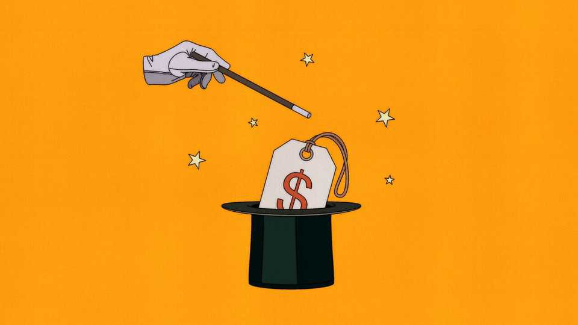

Finance & economics | Free exchange
One weird trick to solve the affordability crisis
If voters dislike big numbers, there is a purely nominal fix
November 27th 2025

Americans have a knack for turning the price of food into national theatre. In 1916 housewives boycotted “egg speculators” for daring to charge 36.5 cents a dozen. Three decades later President Harry Truman urged America to observe Meatless Tuesdays and Eggless Thursdays, earning backlash when the White House itself had to forgo pumpkin pie on Thanksgiving. By the early 1970s, with eggs pushing 80 cents a dozen and beef edging past a dollar a pound, suburban mothers marched under banners like “Save Our Sanity” and “Boycott All Meat”. One Utahn vowed to start trapping starlings before

paying supermarket prices; a New Yorker resigned herself to “more tuna-fish casserole”. President Richard Nixon tried to quell the revolt with price freezes on beef, pork and lamb. Shelves emptied, inflation eventually surged.

Today TikTok videos lamenting $13 Five Guys burgers, $12 Chipotle burritos and $5-a-dozen eggs fit into the tradition. And politicians have responded in kind. President Donald Trump has proposed $2,000 stimulus cheques supposedly funded by tariff revenue, fighting inflation by repeating what prompted it in the first place. He has also floated a 50-year mortgage so homeowners can pay off their pandemic-era house well into retirement. Democrats sound little different. “Affordability” has become their catch-all slogan, spawning calls for rent freezes, public grocery stores and other schemes designed to placate the indignant shopper.

All of which makes the following fact awkward: the numbers are not nearly as frightening as the politics suggest. True, beef and egg prices are a little hot. But overall price growth in America is unremarkable by historical standards. Annual grocery inflation is running at 2.5% and rental inflation is under 3.5% —below long-term norms. Although the 2021-22 surge was painful, since 2019 hourly pay for “non-supervisory” workers has risen faster than rents, food and overall inflation. That is a reversal from the 2010s, when rental costs routinely outpaced earnings. Measured against what a payslip actually buys, rent and even groceries—a word Mr Trump routinely calls “old-fashioned”, lest anyone be unfamiliar with it—are more affordable today than before the pandemic.

Why, then, are people still so angry? Consumer sentiment is near its lowest on record, beaten only during the inflation spike in 2022. The best explanation is that people are remarkably bad at thinking in real terms. Irving Fisher, one of America’s most influential early 20th-century economists, called this the “money illusion”—the tendency to react to the number on the price tag or payslip rather than to what the money will buy. The dollar feels fixed even as its value shifts, leaving people convinced that they are richer or poorer purely because nominal prices move.

Later work on behavioural economics showed the pervasiveness of this bias. In 1986 Daniel Kahneman and Richard Thaler, both eventual Nobel prizewinners, found that workers judged a 7% wage cut with no inflation to be more unfair than a 5% wage rise in a world of 12% inflation, even though

both leave the worker equally worse off in real terms. A decade later Eldar Shafir of Princeton University, Peter Diamond of the Massachusetts Institute of Technology and Amos Tversky, then of Stanford University, found similar distortions in buying and selling decisions. Survey respondents preferred selling a house after 25% inflation with a 23% nominal gain to selling after 25% deflation with a 23% nominal loss even though doing so left the seller worse off (in a scenario with no mortgage debt). People anchor on old nominal prices because they are salient and easy to recall. During bouts of high inflation, however, those anchors become grossly misleading.

Plenty of fixes are now in vogue. The “abundance” agenda, largely favoured by centrist Democrats, aims to make child care, energy and housing cheaper by boosting supply. Mr Trump, for his part, has had the inspired idea of selectively repealing food tariffs he himself imposed. But even if such efforts are successful, they will not change the fact that nominal prices will stay high. Short of engineering a recession and outright deflation, the absolute level of prices almost never falls. Politicians appear to be stuck with the sticker prices that voters now see and resent.

Your columnist would, therefore, like to propose another solution: simply change the numbers. France did so in 1960 with the “heavy franc”, lopping off two zeros in what officials happily called a psychological reset. Mexico followed suit in 1993 with its nuevo peso, worth 1,000 of the old, instantly making prices look sane again. Poland’s reform in 1995 went further, replacing 10,000 old zloty with one new unit. Although the true Polish stabilisation had come from fiscal discipline, the new price structure helped stabilise inflation expectations. Even Europe’s adoption of the euro in 1999 showed how much people react to the numbers themselves: inflation barely budged, yet German shoppers were convinced prices had jumped because the digits changed. Redenomination alters nothing real. It nevertheless makes a big difference.

If other countries can clean up their price tags, why not America? A “new dollar” would not make life cheaper, but it would make prices look less alarming—an outcome generations of egg-boycotters, meat protesters and today’s TikTok price warriors might welcome. Even with low inflation, the numbers will soon drift into the absurd. Housing shows it most clearly. A one- bed flat in Williamsburg, Brooklyn’s once-bohemian, now mainstream neighbourhood, rents for about $4,000 a month today. Within a generation it

could easily be $8,000, perhaps $16,000 in the next, then something like $32,000 after that. Just imagine the outrage! Americans have never taken kindly to ballooning numbers. The obvious answer for politicians is to knock a zero off the dollar and at last give voters the cheap-looking prices they crave. ■

Subscribers to The Economist can sign up to our Opinion newsletter, which brings together the best of our leaders, columns, guest essays and reader correspondence.

This article was downloaded by zlibrary from https://www.economist.com//finance-and- economics/2025/11/27/one-weird-trick-to-solve-the-affordability-crisis

Science & technology

There’s more to cholesterol than simply “good” or “bad” When LLMs learn to take shortcuts, they become evil A new way to generate electricity from water Should adults take colostrum supplements?