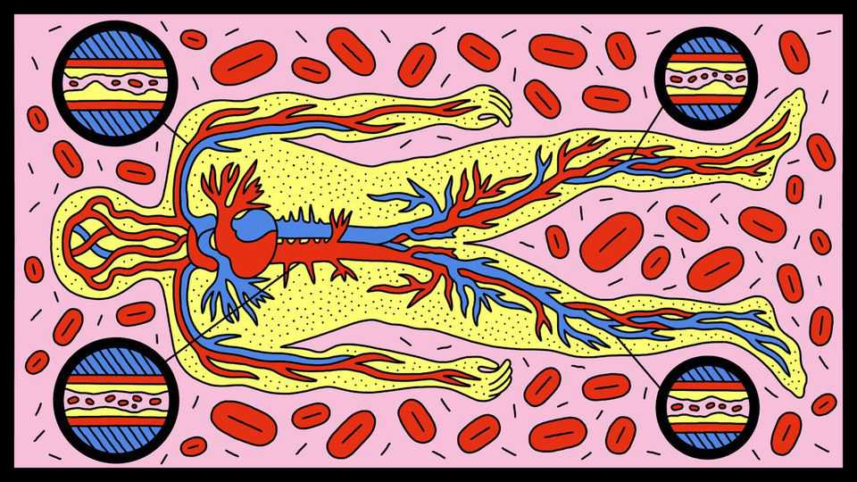
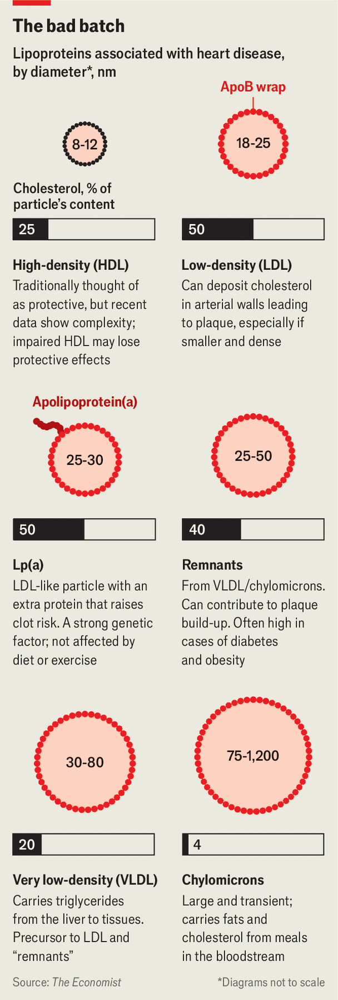

Science & technology | Cardiovascular health
There’s more to cholesterol than simply “good” or “bad”
Standard health tests may miss those at most risk
November 27th 2025

Once upon a time, cholesterol was simple. This molecule, it was proclaimed, came in two varieties: an artery-clogging “bad” sort and an artery-clearing “good” one. The difference was not in the cholesterol molecules themselves, but rather in the way they are packaged up for transport in the bloodstream as nanoparticles called low-density lipoproteins (LDLs) and high-density lipoproteins (HDLs).

The public-health message was clear: minimise the bad LDL-cholesterol by cutting down on fatty foods, red meat and dairy products. Increase the good HDL type by doing more exercise and eating more fruits and vegetables. Since a third of heart attacks and a fifth of strokes are blamed on too much of the former or too little of the latter—or both—this message is important. Helpful drugs have also been widely available since the 1990s. Statins, for example, boost clearance of LDL by the liver.

A new picture of cholesterol has been emerging in recent years, however, thanks to several strands of research over the past two decades. Medical guidelines are now being rewritten to better reflect who is at most risk of heart disease. The standard measure of “bad” cholesterol, it turns out, fails to account for the riskiest form of it. This extra-bad cholesterol is also resistant to the usual countermeasures.

Scientists are also trying to solve a mystery: why is it that “good” cholesterol appears, in many cases, to end up being bad news? At very high levels, HDL- cholesterol has recently been linked to higher mortality and a wide range of health problems, including heart disease and cancer.

These discoveries come from a better scientific understanding of the lipoprotein particles themselves, which turn out to come in more varieties than just LDLs and HDLs. There is, in fact, a whole lipoprotein ecosystem. And, as in a real ecosystem, the denizens have different roles. Some are more dangerous than others.

Cholesterol is an important biochemical. It is found in cell membranes and is particularly abundant in the fatty sheaths which insulate nerve cells (25% of the body’s cholesterol is found in the brain). It is also a precursor molecule to hormones such as oestrogen and testosterone.

It becomes troublesome, though, when it accumulates in the walls of arteries, where it provokes the formation of structures called plaques. They may rupture and create blood clots that block arteries, leading to heart attacks and strokes.

Besides cholesterol, lipoprotein particles comprise various fats, proteins and other molecules. Acting in concert they shuttle cholesterol between the cells that use it and the liver, where it is made.

Some lipoproteins—most notably, LDLs—deliver their cargo to cells in need of supply. Once they have dropped it off they return to the liver for disposal. Others, particularly HDLs, collect cholesterol that is surplus to requirement (mopping up the cholesterol from dead cells, for example) and carry it back to the liver. Together, LDLs and HDLs account for 80-90% of the cholesterol in circulation. Plaque formation happens when this system gets out of whack. Too much LDL cholesterol, the theory goes, results in the stuff being deposited in arterial walls faster than HDLs can clear it away. And that, particularly if exacerbated by high blood pressure or chronic inflammation, means trouble.

The notion that too much LDL cholesterol is bad for you has solid evidence behind it. Statins and other medicines which lower it reduce the rate of heart attacks, for a start. And a genetic variant carried by one person in 250, which blocks the clearance of LDLs by the liver, is linked to a 20-fold increased risk of developing heart disease, often before middle age.

But LDL is not the only bad particle in town. Around a fifth of people have a genetic variant that causes their bodies to make a troublesome protein called apolipoprotein(a), which then attaches itself to standard LDLs to create novel lipoprotein(a), or Lp(a) particles. People with high levels of such particles are several times more likely to develop premature heart disease than those with little or none of them.

Worryingly, these high-risk patients often pass standard cholesterol checkups —which do not look for Lp(a)—with flying colours. Lp(a) levels are impervious to changes in diet or lifestyle, although drugs from Amgen, Eli Lilly and Novartis are on the horizon.

Yet another troublesome LDL-like particle, again not measured in standard medical tests, is called a remnant. These are leftovers of large lipoproteins such as chylomicrons (which carry fats from food) that have delivered their cargo of other molecules, and typically carry several times more cholesterol than an ordinary LDL particle. In theory, because remnants are larger than

LDLs, it is harder for them to cause trouble by penetrating the protective lining of the arterial wall. But the proteins and fats on their surfaces can do serious damage. On a per-particle basis, remnants are up to four times more likely to cause heart disease than LDLs.

The revelations about remnants are among those that have led scientists to think that the problem could be too many LDL particles themselves, rather than too much of their cargo, the so-called bad cholesterol. As it happens, lipoproteins that are liable to get stuck and spill their cholesterol into the artery wall do so because of a protein on their surface called apolipoprotein-B (ApoB). Conveniently, each particle is wrapped in a single strand of it. It thus follows that an easy way to measure the number of such potentially problematic particles is simply to count ApoB.

The European Society of Cardiology now endorses this method as a better way to measure risk to the heart, but this has not yet trickled into the calculators used by most doctors in Europe and America. Yet it completely changes the results. Some 20-30% of people have low LDL-cholesterol but also high ApoB. This group are falsely reassured by typical checkups.

The understanding of “good” HDL-cholesterol has also been evolving. In 2012 a research team led by Sekar Kathiresan of Harvard Medical School reported the surprising result that people with gene variants that raise HDL- cholesterol did not have lower rates of heart attacks. Today it is understood that both low and very high HDL-cholesterol are signs of trouble, with the mid-range levels found in the majority of people seen as healthy.

Relatively low HDL-cholesterol could be a reflection of metabolic conditions such as diabetes, which come with high numbers of remnants—and the risks associated with them. Drinking alcohol raises HDL-cholesterol, so the health problems linked with very high levels could be caused in some cases by heavy drinking (which people tend to lie about in studies).

But there seems to be more going on than what alcohol could explain. HDL’s jobs in the body are many and varied; it picks up some bacterial toxins, for example. One guess is that HDL particles which are stuffed full of cholesterol are dysfunctional in some way, resulting in all sorts of problems. Observational evidence has implicated very high HDL-cholesterol (at the levels found in 3-10% of people) in conditions as varied as diabetes, non-

alcoholic fatty-liver disease, chronic kidney disease, age-related macular degeneration, Alzheimer’s and cancer. Some scientists now think that dysfunctional HDL may in fact be as bad as LDL.

Researchers have also been investigating whether faulty proteins on the surface of HDL particles may set apart the dysfunctional particles. Plenty of the proteins are known to be beneficial. For example they can block harmful enzymes, support the body’s immune system and manage early responses to injury or infection.

Scientists reckon HDL may also protect blood vessels by fighting inflammation, preventing artery damage, supporting tissue repair, reducing blood clots, and helping control immune responses and metabolism. None of this has much to do with how much cholesterol they carry.

All told, some 280 proteins and counting are thought to be part of HDLs. But working out which proteins may sit on the more dangerous HDL particles is tricky because each particle carries only a subset of two or three of these proteins.

So far, six Nobel prizes have marked the emerging understanding of the science of cholesterol. Untangling the increasingly knotty mystery of the lipoprotein ecosystem will probably be rewarded with several more gongs. ■

Curious about the world? To enjoy our mind-expanding science coverage, sign up to Simply Science, our weekly subscriber-only newsletter.

This article was downloaded by zlibrary from https://www.economist.com//science-and- technology/2025/11/25/theres-more-to-cholesterol-than-simply-good-or-bad