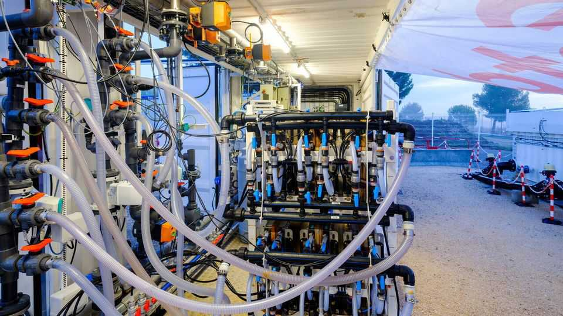

Science & technology | Blue power
A new way to generate electricity from water
An age-old technique updated with futuristic materials
November 27th 2025

Water has long been a source of renewable power. More than 2,000 years ago the Chinese used water wheels to grind grain and pound ore. In the 1700s water wheels kickstarted the Industrial Revolution in Britain. In the 1870s a Victorian industrialist, William Armstrong, installed the world’s first hydroelectric system to light his family home, Cragside, in north-east Britain. The latest idea is based on osmosis, a natural process in which water will move from a place with lower concentration of, for example, salts, through a

semipermeable membrane and into a more concentrated solution. This continues until both sides reach equilibrium.

Power can be made from this process because the volume of salty water increases as it is diluted with fresh water that passes through the membrane. Some of the resulting outflow of water from the saltier side is then tapped to drive a turbine to produce the electricity.

Osmotic power might one day provide useful base-load energy to coastal communities with an abundance of salty water, in areas like Australia and the Middle East. It could also help recover energy from desalination plants. Recent projects under way in Japan and France show how the technology is developing.

In August a ¥700m ($4.5m) osmotic power plant opened in Fukuoka, a city on the northern shore of Japan’s Kyushu Island. With a generating capacity of 110 kilowatts, enough for 200 typical homes, the energy will be used to run an adjacent desalination plant that produces fresh water for the city.

Desalination plants are hungry users of electricity and most, like the one in Fukuoka, employ a process called reverse osmosis. This goes against the natural osmotic flow by pumping seawater at high pressure through a semipermeable membrane to remove the salt. It leaves behind a waste stream of extremely salty water that, when pumped back into the sea, can harm the local environment.

The Fukuoka osmotic power plant uses the waste brine from the nearby desalination plant which, being highly concentrated, makes the osmosis work faster. And instead of using valuable fresh water from desalination, the plant is supplied with treated water from a sewage works. The Fukuoka District Waterworks, which runs the project, hopes eventually the osmotic power plant will be efficient enough to produce more electricity by adding saltwater drawn directly from the sea to the brine coming from the desalination plant.

One of the main reasons why osmotic power has become more viable today is thanks to the development of precisely tailored membranes. These have improved water permeability and are less liable to clogging by impurities. Such membranes make desalination plants more efficient.

Sweetch Energy is a company building an osmotic power plant on the river delta where the Rhone meets the Mediterranean Sea in southern France. With a warm, sunny climate causing a high rate of evaporation, the waters of the Mediterranean are particularly salty. If a trial plant currently being constructed operates as planned and proves the technology works, the company aims to construct a bigger installation over the next decade.

Nicolas Heuzé, Sweetch’s boss, estimates this will provide a generating capacity of 500 megawatts, which is enough to supply the 1.9m people living in the nearby city of Marseille and its surrounding districts. The company is also working on similar projects in other parts of the world.

Its technology relies on another form of osmosis. Instead of a membrane that allows only water molecules to pass from one solution to another, the company uses membranes that let through charged particles, known as ions, instead. The movement of ions creates an electric potential difference, which is the basis of a battery. The resulting charge is then used to produce a current directly.

The osmotic generators beside the Rhone are built by stacking together a series of ion-selective membranes and flowing through them fresh and salty water, which has been extracted from different points in the delta. Although the ion-transfer process has been known about for a number of years, the cost of making the required membranes has been prohibitive. Mr Heuzé says the company has developed cheaper and more effective versions using nanotube structures made from natural materials, such as wood. The details, however, remain proprietary.

The company eventually hopes to generate electricity at a levelised cost (an industry measure which accounts for capital and running expenses over a project’s lifespan) below $100 per megawatt hour. Some forms of solar and wind power can work out cheaper, but their intermittency—the sun does not always shine and the wind does not always blow—means batteries are needed for a sustained output. However, Mr Heuzé points out that so long as the river flows to the sea, osmotic power could generate electricity day and night, whatever the weather. ■

Curious about the world? To enjoy our mind-expanding science coverage, sign up to Simply Science, our weekly subscriber-only newsletter.

This article was downloaded by zlibrary from https://www.economist.com//science-and- technology/2025/11/26/a-new-way-to-generate-electricity-from-water