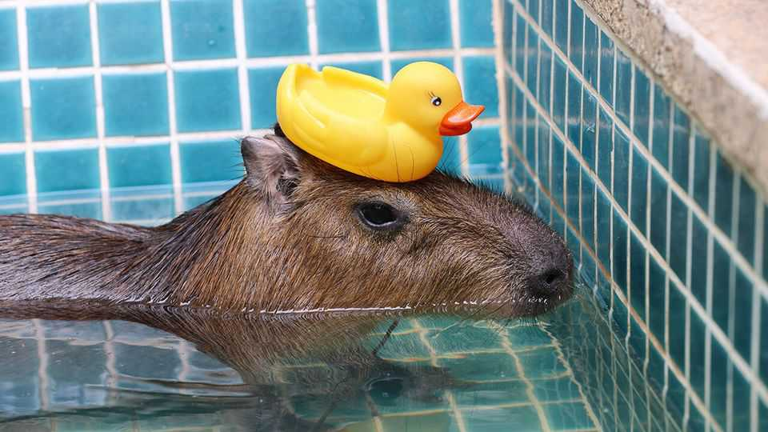
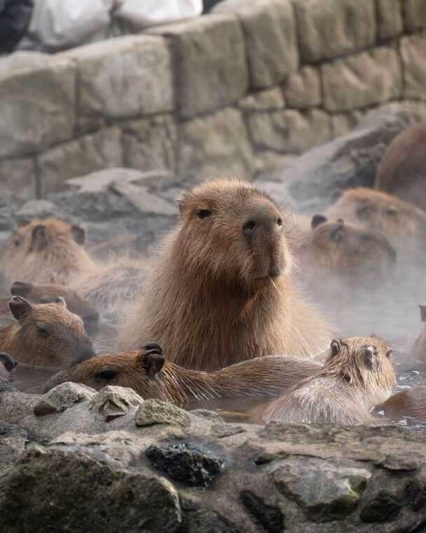
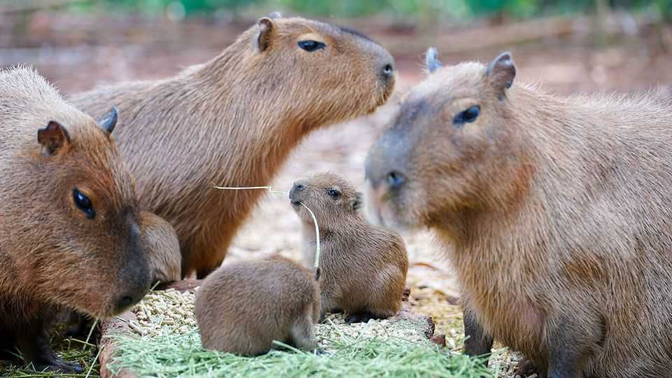

Culture | Animal magnetism
What has webbed feet, a big snout and is adored on the internet?
The capybara has a far better reputation than its fellow rodents
November 27th 2025

FOR THE most part, rodents make people shriek in disgust. But the largest rodent of all, strangely, does not. The capybara, a hirsute native of South America, typically provokes squeals of delight. It is pictured on keyrings, backpacks and stationery. Spend £40 ($52) and you can get a luxuriously soft capybara toy for your bedroom. For under £10 you can get an advent calendar containing 24 different ornaments, depicting Hydrochoerus hydrochaeris as an astronaut, magician or detective.

The capybara has become something of a cultural idol. There are capybara cafés in America, Indonesia, Taiwan and Thailand; one is expected to open in Britain soon. A catchy song—its lyrics are mainly “capybara”, repeated over and over—has more than 33m streams on Spotify. On TikTok almost 700,000 posts bear the hashtag #capybara—more than other cuties like the #koala (210,000) or #otter (190,000).

The craze began in Japan in the 1980s. Keepers at Izu Shaboten Park, a botanical garden and zoo in Shizuoka, noticed that the capybaras plonked themselves down in warm puddles after the enclosure had been cleaned and so built them their own onsen. Capybaras are semi-aquatic and loved the hot

baths; visitors loved watching them bathe. Another park, in Nagasaki, is known as “the holy land of capybaras” as visitors can pet and feed around 20 of them.

Brands soon realised capybaras’ merchandising potential. In the 2000s Bandai, a Japanese toymaker, created Kapibara-san (Mr Capybara) as an item that could be won in arcades; within a few years Kapibara-san became a hit anime character. Kapibara-san, much like Hello Kitty, was then exported around the world. The internet also allowed people to discover capybaras along with other niche animals such as axolotls (a type of salamander).

Now fans make pilgrimages to see the hairy darlings. Hertfordshire Zoo in Britain acquired a breeding pair in 2022 and is enjoying more visitors than ever. The zoo’s capybara experience, where guests can give the animals scratches and pose for photos, is almost sold out for the next year.

Capybaras are not endangered. They have small eyes, large, blunt snouts, bristly fur and ungainly webbed feet. So what gives? Capybaras appeal because they look as though they are unbothered by the vicissitudes of the world. They always wear a cool, calm and collected expression, whether they are eating a snack, being approached by an iPhone-wielding stranger or interacting with other beasties. They have earned the sobriquet of “the chillest

animal on Earth”; some joke that the collective noun for the mammal should be a “meditation”, so zen is their vibe. At a time when people talk of ever- increasing anxiety and burnout, these animals’ unflappability is almost aspirational. Lounging in their pools, capybaras remind stressed-out humans to go with the flow. ■

This article was downloaded by zlibrary from https://www.economist.com//culture/2025/11/25/what-has-webbed-feet-a-big-snout-and-is- adored-on-the-internet