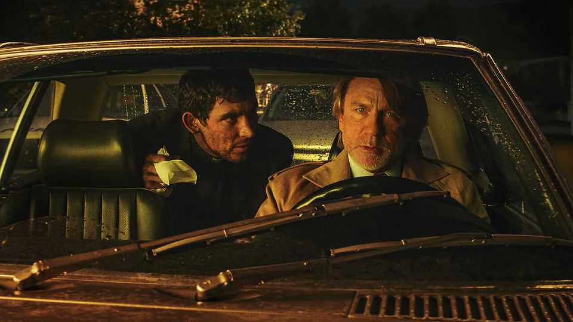
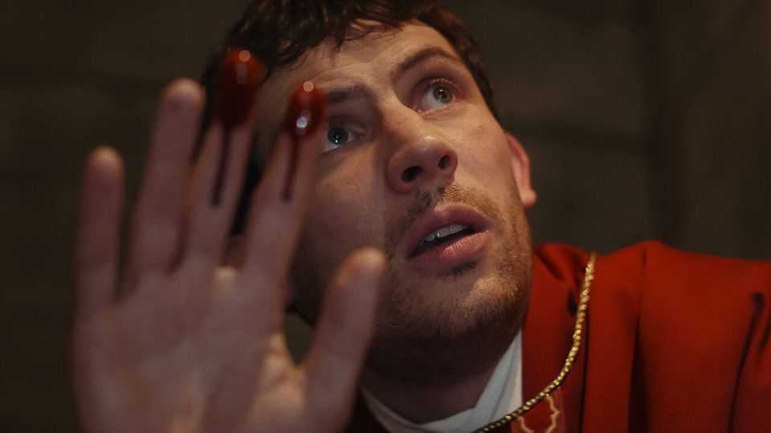
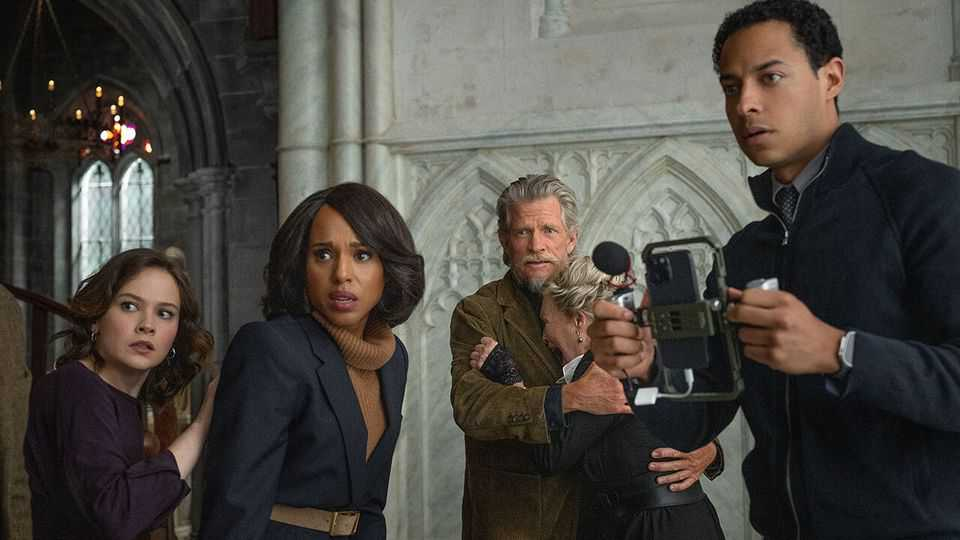

Culture | Back Story
In the latest “Knives Out” mystery, reason takes on faith
“Wake Up Dead Man” spotlights the clash at the heart of an unkillable genre
November 27th 2025

“Not more than one secret room or passage is allowable.” So decrees one of the ten commandments of detective fiction distilled by Ronald Knox, a friend of Agatha Christie, during the genre’s inter-war golden age. Unknown poisons are out, as are “all supernatural or preternatural agencies”. Murder mysteries are governed by conventions. That is part of their consoling charm: they are a safe sort of danger, in which, even as corpses and red

herrings pile up, you know roughly what to expect. In cinemas now and on Netflix soon, “Wake Up Dead Man” deliciously illustrates the fun and freedom of the formula. An heir to Knox could compile a modern set of rules from the tropes it revels in. The tension at its heart has powered the genre from the start.

In this third and best film in the “Knives Out” whodunnit franchise, a hoodlum-turned-priest, Jud Duplencity (played by Josh O’Connor, pictured left), is dispatched by his superiors to a dysfunctional congregation in upstate New York. Its tyrannical overlord, Jefferson Wicks (Josh Brolin), is elaborately murdered. Jud is the prime suspect.

Great detective stories often feature a cocooned setting—a snowbound hotel, a cruise on the Nile—which forces the characters into dangerous proximity and keeps them there. It can also serve as a microcosm of wider society. A locked or otherwise inaccessible murder scene is handy, too. Here Rian Johnson, the director, picks a remote church with gothic fixtures and crepuscular lighting, duly staging what the dialogue calls “a textbook example of a perfectly impossible crime”. A cemetery crypt has a “Lazarus door” that opens only from the inside. Will it open, do you think?

The detective in a murder mystery underwrites the peril: you may not know who the killer is, but you know a guy or girl who does. The best are walking brands, with illustrious case histories and idiosyncrasies. Sherlock Holmes had his pipe and violin; Mr Johnson’s sleuth, Benoit Blanc (Daniel Craig, pictured right), is a quirky dresser with a Southern drawl. Like Hercule Poirot he is confident but compassionate, formidable yet faintly comic; cerebral with a hint of clown.

As convention dictates, he has a sidekick. This figure is a foil for the detective’s brilliance and an avatar for the audience. You can’t imagine being Holmes, Poirot or Blanc, but perhaps you could be Watson or Hastings—or blundering, kindly Jud.

Rule-bound as they are, though, successful murder mysteries, like other populist art, are also mirrors of their time. Money and lust are recurring themes, but otherwise motives and contexts vary. “Wake Up Dead Man” depicts a small-town fusion of reactionary politics and harsh religion. Wicks, the victim, inspires fierce devotion in his flock by “keeping them angry and afraid”. Jud is derided as a “PINO”, or Priest In Name Only.

An unwritten but cardinal law of the form on screen is: have a blast! The room may be locked, but there should be a party inside it, buzzing with gorgeous

people, some of whom die, and a high quotient of maniacs. Since by itself it can be a let-down, murder should be only part of the spectacle. (As John Dickson Carr writes in “The Hollow Man”, a novel cited in the movie, when the locked room is explained, “in some vague way we are disappointed.”) Directors should lay on lush locations and casts—Mr Johnson’s includes Mila Kunis and Glenn Close—and lots of jokes. Look out, here, for the snacking pathologist.

Amid the self-referential high jinks, however, “Wake Up Dead Man” spotlights the genre’s fundamental clash. Murder mysteries pit wily detectives against scheming assassins (and bumbling plods). But those are only proxies for hidden forces, towards which Knox’s ban on the supernatural offers a clue.

Detective fiction emerged in the 19th century as science, including the evolutionary and forensic kinds, advanced. Reason rattled faith. Fictional detectives were omniscient idols of a secularising world, even if, like Poirot, they professed belief. Together the sleuths unravel not just individual mysteries but the concept of mystery; the idea that some truths are too deep for mortals to fathom.

Rationalist Blanc disputes with spiritual Jud, envisaging this fiendish case as his “final checkmate over the mysteries of faith”. He gathers the suspects for his summation, an earthly take on the last judgment, sin and hellfire transmuted into logic and proof. It doesn’t go quite as he plans. Predictable as it seems—or because it seems predictable—the murder mystery can still surprise. ■

For more on the latest books, films, TV shows, albums and controversies, sign up to Plot Twist, our weekly subscriber-only newsletter

This article was downloaded by zlibrary from https://www.economist.com//culture/2025/11/26/in-the-latest-knives-out-mystery-reason- takes-on-faith