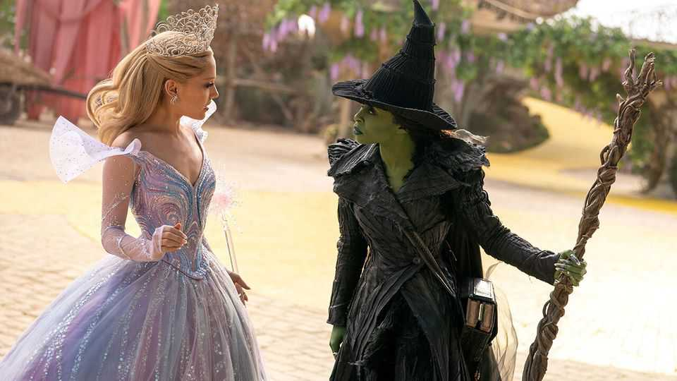
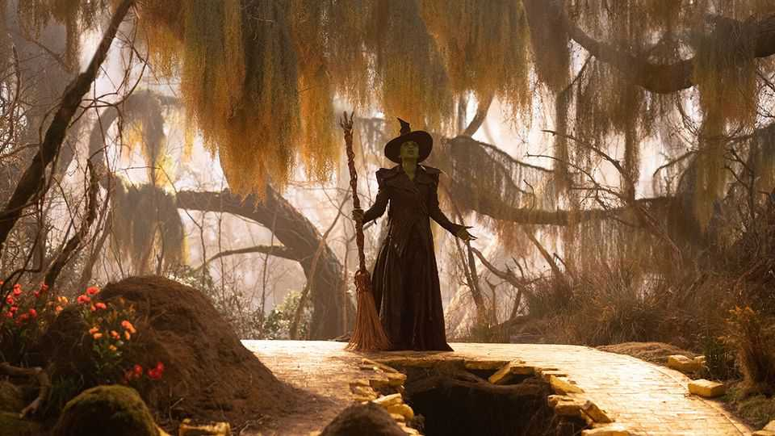
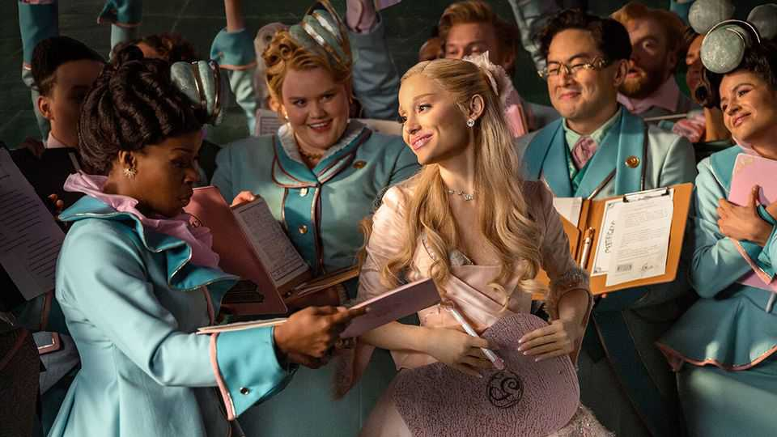

Culture | Cinematic wizardry
The gravity-defying success of “Wicked”
Two musical films are producing box-office magic
November 27th 2025

IT IS HARD to decide the wackiest thing about “Wicked”. Perhaps it is the fact that in Oz, the musical’s magical setting, animals work. (A goat is a historian; an owl a preacher.) Perhaps it is that the bad witch (Cynthia Erivo) has green skin—or that the good witch (Ariana Grande) almost exclusively wears pink and uses words like “hideodious” and “obsessulated”. However hideodious this all may sound, Hollywood is obsessulated. A two- part “Wicked” musical-movie extravaganza has struck a chord. The first

instalment took more than $750m at the global box office to become one of the highest-grossing film adaptations of a Broadway musical. In America no film has outperformed “Wicked” since it was released a year ago. “Wicked For Good”, the second part, was released on November 21st and is outpacing its predecessor in ticket sales. It has already made more than $235m. Why are the films proving so spellbindingly successful?

There are three reasons. First, the movies are part of a much-loved franchise. “Wicked” is adapted from a musical by Stephen Schwartz and Winnie Holzman. The musical is based on a novel by Gregory Maguire which tells the story of the Wicked Witch of the West from “The Wonderful Wizard of Oz”, L. Frank Baum’s yellow-brick-road adventure of 1900. That novel was adapted into a hit film in 1939.

The second factor is the musical’s artistic merits. Critics sniffed when “Wicked” opened on Broadway in 2003—an early review said the show was “more withered than wicked”—but audiences cheered. The musical has since been seen by over 70m theatregoers. The show is “very well written”, avers Paul Laird, the author of “Wicked: A Musical Biography”. Ballads such as “Defying Gravity” are uplifting; catchy tunes like “Popular” are not merely popular but tell a story, as in any good musical. It helps that the films’ leads,

including Ms Grande, a pop star, can execute the soaring melodies to perfection.

The films, which had a combined budget of around $300m, have also benefited from cinematic wizardry. The first movie won Oscars for costume and production design. On set were 9m tulips planted in a rainbow pattern, a functioning emerald-green locomotive and a road of actual yellow bricks. “Wicked” may usher in a wave of spectacular musical films: Jon Chu, the director, is already working on an adaptation of “Joseph and the Amazing Technicolor Dreamcoat” for Amazon.

The final reason for the success of “Wicked” is a bewitching advertising campaign. At a time when films seem to have fading cultural relevance, Universal’s marketing department made this one inescapable. The studio partnered with more than 400 brands to peddle everything from pink and green Le Creuset cookware (the set is $900) to pink and green laundry detergent and pink and green macaroni cheese. Fans can visit Greggs, a bakery chain, and “follow the yellow bake road” to buy a limited-edition coffee cup.

The effect of all this is akin to being unwillingly stranded in Oz, rather like Dorothy and Toto in Baum’s story. It points to Hollywood’s cosy relationship with brands. Blockbuster movies have long entered into these kinds of

partnerships—franchises from James Bond to Barbie have sought product- placement deals and licensing agreements—but “Wicked” has taken it further than most. Promotions for the first movie generated more than $330m of “media value”, a gauge of the monetary benefit of brand deals, reportedly the most ever for a Hollywood film.

So by now many will be done with “Wicked” for good, never mind “Wicked For Good”. The second half—a nearly two-and-a-half-hour film spun out of an hour-long musical act—often feels unnecessary, even as it introduces new songs and new silly phrases. (Characters say “just a clock tick”, ie, just a second, with alarming frequency.) The singing is still marvellous and the sets mesmerising, but after two years of persistent pink and green, viewers may find themselves counting down the clock ticks until its conclusion. ■

For more on the latest books, films, TV shows, albums and controversies, sign up to Plot Twist, our weekly subscriber-only newsletter

This article was downloaded by zlibrary from [https://www.economist.com//culture/2025/11/24/the-gravity-defying-success-of-wicked](https://www.economist.com//culture/2025/11/24/the-gravity-defying-success-of-wicked)