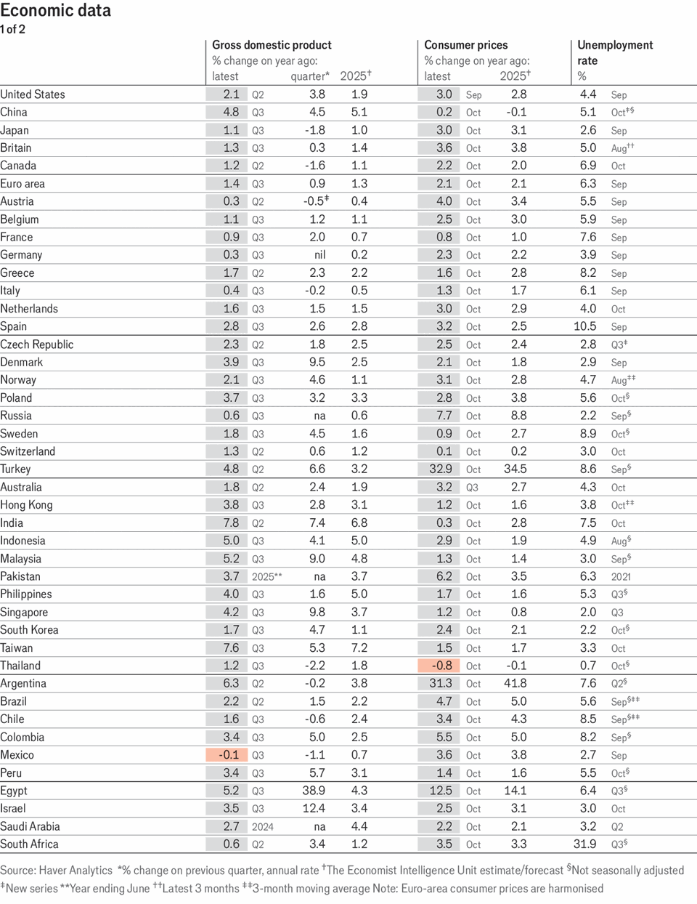
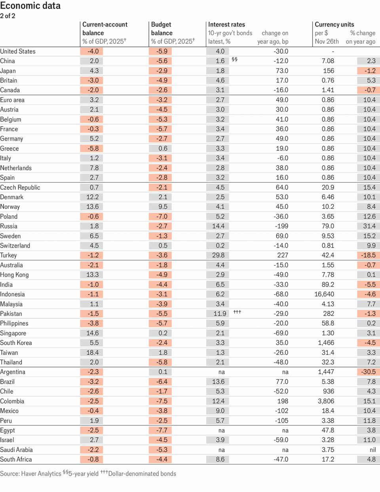
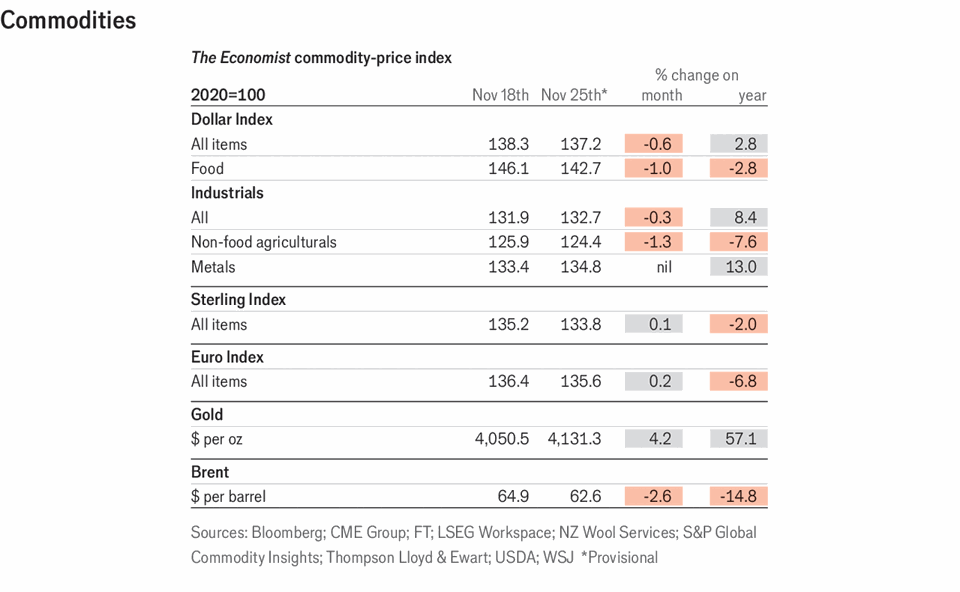

Economic & financial indicators | Indicators
Economic data, commodities and markets
November 27th 2025

This article was downloaded by zlibrary from https://www.economist.com//economic-and- financial-indicators/2025/11/27/economic-data-commodities-and-markets

Obituary He Yanxin was the steward of a women-only language