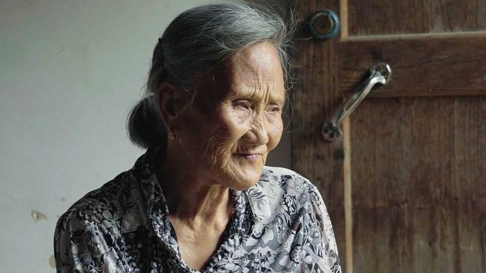
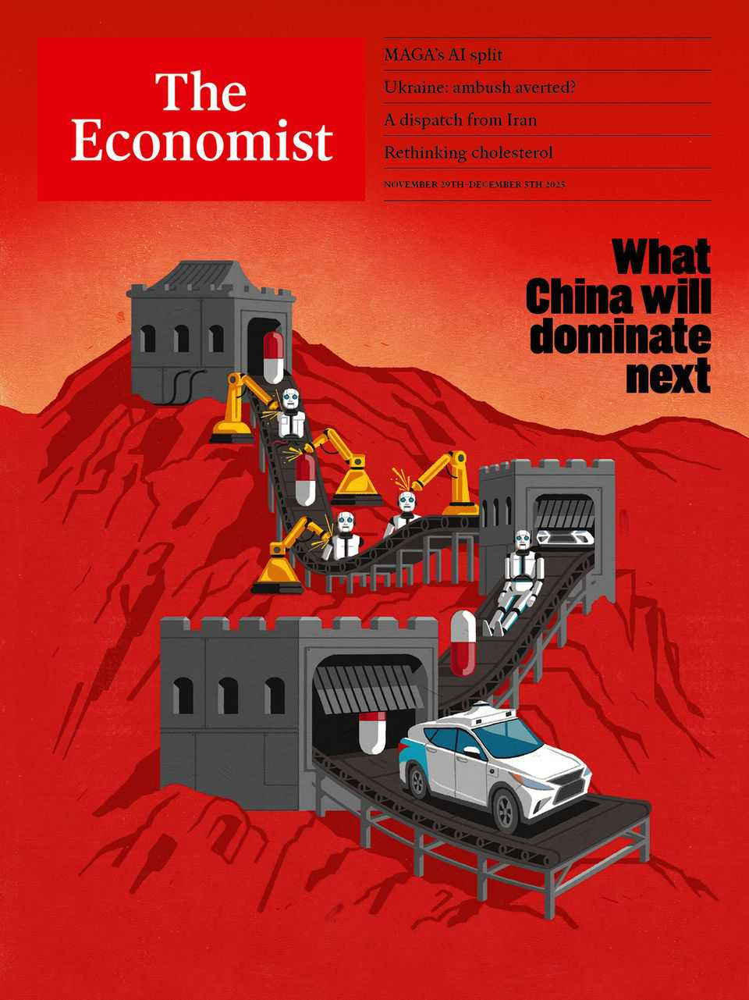

Obituary | The words of ants
He Yanxin was the steward of a women-only language
The last natural inheritor of nushu died on October 23rd, aged 86
November 27th 2025

In the summer of 1949, the year the Communists came to power in China, you might have found He Yanxin, then ten, sitting with her grandmother under a tree. It was cooler there, in the heat of the day. An ordinary scene, except that her grandmother was inscribing characters on the palm of Yanxin’s small hand. As she did so, Yanxin would sing the character, then jump up to draw it with a twig on the sand. For her, these lessons were fun. But she wondered why writing this script made her grandmother cry, sometimes so much that she could not see.

Years passed; the Cultural Revolution violently came and went; she brought up six children amid the strains of poverty and a hard marriage. Then, from the early 1980s, researchers began seeking her out. She was not easy to find. Her home, Heyuan village, was tucked away in the foggy, vertiginous sandstone peaks of Jiangyong County in Hunan, in China’s south-east. But the visitors came because Jiangyong was the only site of a mysterious ancient language used by women only. They had heard Yanxin knew it, one of very few; but once they found her, with her tough demeanour and her straight gaze, she would tell them, firmly, no.

The language was called nushu, “women’s script”. The characters were thin, slanting and graceful; locally they were called “long-legged mosquitoes” and “the words of ants”. Standard Chinese ideograms were chunky by comparison. Visually it was easy to learn, with each character representing one syllable; but to sing it well (for it was sung rather than spoken) required knowing the local dialect. It was therefore a natural medium for rural women denied education, as they all were until Mao’s time. Young unmarried women especially would meet to sing and sew nushu on fans, handkerchiefs and belts. When a bride left to live in the groom’s house, the “Third Day Books” of commiserations and hopes for her were naturally written in nushu, women to women.

Nobody knew for sure how old it was. Some said a beautiful concubine in the medieval Song dynasty had invented it, others that it was the work of Yaoji, goddess of clouds and rain. Its secrecy was also disputed. Women certainly kept it to themselves, but men would have ignored it anyway. China was—still is—a patriarchy. Nushu was overwhelmingly filled with the grief and bitterness of women who had exchanged their own families for abusive husbands, hateful mothers-in-law and bound feet that kept them home. Rather than moonlight and flowers, its most common images were of closed rooms, lost friends and pain like the slash of a sword. One of Yanxin’s favourite images was of frost and snow on plum blossom: harsh beauty that destroyed life. Yet this was not a language of resistance. Many Third Day Books reminded a woman of her “Three Obediences”: as a child, to her father; as a wife, to her husband; as a widow, to her sons. Brides were reminded to “serve your father-in-law with a smile”.

Desperate or resigned, by 1960 Yanxin did not need these songs. In earlier times there had been “sworn sisterhoods”, among the singers, “wisteria from

the same root” which often proved stronger than ties of blood. But she herself had only one sworn sister, and they had lost touch. Learning nushu had also been an education, but under Mao all girls, like boys, could go to school. Then, slaving for her family, she had no time for it. One of her daughters asked if she would teach her, but she refused. What good was it? What money did it earn? It was useless.

Yet her subsequent claim that she knew nothing of nushu did not hold up for long. A Japanese researcher, Endo Orie, having got that denial on the doorstep, handed her a pen and paper. Clumsily, out of practice, she began to draw the characters; but rapidly they became graceful, and Ms Endo urged her to go on; to write her life. At that point, her husband was gravely ill in hospital. Even there he continued to blame her. She visited him but, like a boat without wind, she could do nothing. One night in the house alone, rather than despair, she made a start on Ms Endo’s commission. Nushu made her cry too, but fortified her more. It was precious as gold to see the determined progress of the characters down the page. Her story poured out of her as if she had only been waiting to recover this near-dead language in order to speak.

There was so much to say. She was still a baby when her father was killed by a rapacious landlord, knocked to the ground and hit until his blood ran out. After childhood, she had barely one good day. With her father gone, no man sowed rice for them; at 19, she had to be married off. She refused, skipped the ceremony and for a few years was happy to live apart from him. When she finally went to her husband’s house, it was pure oppression. She felt like a baby bird that could not chirp, let alone fly. Her mother-in-law hovered in the kitchen, criticising her cooking and complaining to her son, who then “served up the beating”. Having abandoned his studies, he tried farming, while she hauled rocks in the mines.

This bitter therapy of nushu inspired her for the next two decades to help scholars research it. She also accepted the status of an “inheritor”, the last woman to learn nushu naturally, in the family. She even acquired a nushu sister, Hu Xin, an eager young student, and helped her through her divorce as well as her chanting exercises. They would walk through the streets of Heyuan with their arms around each other.

She still had huge reservations, though. The nushu of the 21st century was not what she had learned. Men had now found uses for it, as a tourist lure. In

Jiangyong you could buy trinkets with nushu inscriptions, often misspelled, and get a fan free with a bucket of fried chicken. In Pumei village an imposing nushu museum offered writing courses. But the songs were bland and pretty now, and young women very different. No one needed to understand—as she, now, fully understood—why her grandmother had so often wept as she inscribed the words of ants. ■

This article was downloaded by zlibrary from https://www.economist.com//obituary/2025/11/27/he-yanxin-was-the-steward-of-a-women- only-language

