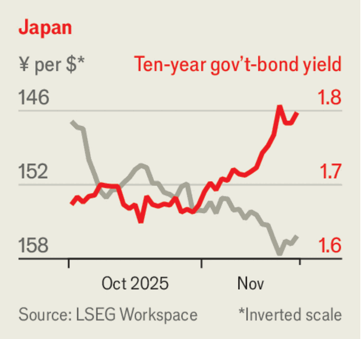

Leaders | The yen
Japan’s big-spending Takaichinomics is ten years out of date
In a time of higher inflation, a falling yen and rising bond yields make a noxious blend
November 27th 2025

Tourists in the bars of Tokyo are rejoicing. Visiting Japan was once a mightily expensive endeavour; now it is cheaper than ever. The yen has fallen by 9% against the dollar in the past six months, and has never been weaker against the euro in the single currency’s 27 years.

- **tourists**：/[音标待填写]/ "tourists的中文释义待填写"；文中用来表达xxx意思；补充说明（如有）
- **bars**：/[音标待填写]/ "bars的中文释义待填写"；文中用来表达xxx意思；补充说明（如有）
- **tokyo**：/[音标待填写]/ "tokyo的中文释义待填写"；文中用来表达xxx意思；补充说明（如有）
- **rejoicing**：/[音标待填写]/ "rejoicing的中文释义待填写"；文中用来表达xxx意思；补充说明（如有）
- **visiting**：/[音标待填写]/ "visiting的中文释义待填写"；文中用来表达xxx意思；补充说明（如有）
- **japan**：/[音标待填写]/ "japan的中文释义待填写"；文中用来表达xxx意思；补充说明（如有）
- **once**：/[音标待填写]/ "once的中文释义待填写"；文中用来表达xxx意思；补充说明（如有）
- **mightily**：/[音标待填写]/ "mightily的中文释义待填写"；文中用来表达xxx意思；补充说明（如有）
- **expensive**：/[音标待填写]/ "expensive的中文释义待填写"；文中用来表达xxx意思；补充说明（如有）
- **endeavour**：/[音标待填写]/ "endeavour的中文释义待填写"；文中用来表达xxx意思；补充说明（如有）

The yen is not the only thing declining in value. Japan’s long-term government bonds have slumped in price, raising their yields. Those maturing in ten years now yield 1.8%, up from around zero for much of the period between 2016 and 2021. Yields on 30-year bonds have risen to 3.3%, the highest such since long-dated debt was first issued in 1999. Investors are becoming more fretful about the big-spending instincts of Takaichi Sanae, Japan’s new prime minister.

- **declining**：/[音标待填写]/ "declining的中文释义待填写"；文中用来表达xxx意思；补充说明（如有）
- **value**：/[音标待填写]/ "value的中文释义待填写"；文中用来表达xxx意思；补充说明（如有）
- **japan**：/[音标待填写]/ "japan的中文释义待填写"；文中用来表达xxx意思；补充说明（如有）
- **term**：/[音标待填写]/ "term的中文释义待填写"；文中用来表达xxx意思；补充说明（如有）
- **government**：/[音标待填写]/ "government的中文释义待填写"；文中用来表达xxx意思；补充说明（如有）
- **bonds**：/[音标待填写]/ "bonds的中文释义待填写"；文中用来表达xxx意思；补充说明（如有）
- **slumped**：/[音标待填写]/ "slumped的中文释义待填写"；文中用来表达xxx意思；补充说明（如有）
- **price**：/[音标待填写]/ "price的中文释义待填写"；文中用来表达xxx意思；补充说明（如有）
- **raising**：/[音标待填写]/ "raising的中文释义待填写"；文中用来表达xxx意思；补充说明（如有）
- **yields**：/[音标待填写]/ "yields的中文释义待填写"；文中用来表达xxx意思；补充说明（如有）

Ms Takaichi has announced a supplementary budget of ¥17.7trn ($113bn). Although that is a small share of GDP, it sends a bad signal. She has also been an outspoken critic of the Bank of Japan’s modest increases in interest rates. In an era of higher inflation and higher bond yields, her policies are as out of date as tired reboots of Hollywood franchises.

- **takaichi**：/[音标待填写]/ "takaichi的中文释义待填写"；文中用来表达xxx意思；补充说明（如有）
- **announced**：/[音标待填写]/ "announced的中文释义待填写"；文中用来表达xxx意思；补充说明（如有）
- **supplementary**：/[音标待填写]/ "supplementary的中文释义待填写"；文中用来表达xxx意思；补充说明（如有）
- **budget**：/[音标待填写]/ "budget的中文释义待填写"；文中用来表达xxx意思；补充说明（如有）
- **although**：/[音标待填写]/ "although的中文释义待填写"；文中用来表达xxx意思；补充说明（如有）
- **share**：/[音标待填写]/ "share的中文释义待填写"；文中用来表达xxx意思；补充说明（如有）
- **sends**：/[音标待填写]/ "sends的中文释义待填写"；文中用来表达xxx意思；补充说明（如有）
- **signal**：/[音标待填写]/ "signal的中文释义待填写"；文中用来表达xxx意思；补充说明（如有）
- **also**：/[音标待填写]/ "also的中文释义待填写"；文中用来表达xxx意思；补充说明（如有）
- **outspoken**：/[音标待填写]/ "outspoken的中文释义待填写"；文中用来表达xxx意思；补充说明（如有）

The market dynamic Japan now faces—yields up, currency down—is becoming increasingly familiar. It used to be associated with troubled developing economies, which suffered in this way when foreign investors dumped local assets and exited their foreign-exchange positions at the same time. But it has spread to rich countries, too. In 2022, during the short-lived tenure of Liz Truss, British gilt yields surged and the pound slumped, as some pension-fund strategies blew up. Earlier this year, investors sold American Treasuries and the dollar as they worried about Donald Trump’s erratic trade policy.

- **market**：/[音标待填写]/ "market的中文释义待填写"；文中用来表达xxx意思；补充说明（如有）
- **dynamic**：/[音标待填写]/ "dynamic的中文释义待填写"；文中用来表达xxx意思；补充说明（如有）
- **japan**：/[音标待填写]/ "japan的中文释义待填写"；文中用来表达xxx意思；补充说明（如有）
- **faces**：/[音标待填写]/ "faces的中文释义待填写"；文中用来表达xxx意思；补充说明（如有）
- **yields**：/[音标待填写]/ "yields的中文释义待填写"；文中用来表达xxx意思；补充说明（如有）
- **currency**：/[音标待填写]/ "currency的中文释义待填写"；文中用来表达xxx意思；补充说明（如有）
- **becoming**：/[音标待填写]/ "becoming的中文释义待填写"；文中用来表达xxx意思；补充说明（如有）
- **increasingly**：/[音标待填写]/ "increasingly的中文释义待填写"；文中用来表达xxx意思；补充说明（如有）
- **familiar**：/[音标待填写]/ "familiar的中文释义待填写"；文中用来表达xxx意思；补充说明（如有）
- **associated**：/[音标待填写]/ "associated的中文释义待填写"；文中用来表达xxx意思；补充说明（如有）

Japan’s enormous stock of government debt means that even small rises in bond yields translate into surging interest bills. In recent years the country avoided trouble because its immediate fiscal position had been improving. At around 1.3% of GDP this year, its budget deficit is much smaller than those of Britain or America. Inflation, which is currently running at around 3%, has helped reduce the government’s net debt to 130% of GDP, down from 162% five years ago.

- **japan**：/[音标待填写]/ "japan的中文释义待填写"；文中用来表达xxx意思；补充说明（如有）
- **enormous**：/[音标待填写]/ "enormous的中文释义待填写"；文中用来表达xxx意思；补充说明（如有）
- **stock**：/[音标待填写]/ "stock的中文释义待填写"；文中用来表达xxx意思；补充说明（如有）
- **government**：/[音标待填写]/ "government的中文释义待填写"；文中用来表达xxx意思；补充说明（如有）
- **debt**：/[音标待填写]/ "debt的中文释义待填写"；文中用来表达xxx意思；补充说明（如有）
- **means**：/[音标待填写]/ "means的中文释义待填写"；文中用来表达xxx意思；补充说明（如有）
- **even**：/[音标待填写]/ "even的中文释义待填写"；文中用来表达xxx意思；补充说明（如有）
- **rises**：/[音标待填写]/ "rises的中文释义待填写"；文中用来表达xxx意思；补充说明（如有）
- **bond**：/[音标待填写]/ "bond的中文释义待填写"；文中用来表达xxx意思；补充说明（如有）
- **yields**：/[音标待填写]/ "yields的中文释义待填写"；文中用来表达xxx意思；补充说明（如有）

That improvement has come at the expense of consumers’ purchasing power, especially hurting those on low and fixed incomes. And it is unlikely to last. The imf expects Japan’s deficit to rise to around 4.4% of GDP by 2030, well above the country’s predicted growth rate. Spending on defence and an ageing population, and rising bond yields, will start to take a toll.

- **improvement**：/[音标待填写]/ "improvement的中文释义待填写"；文中用来表达xxx意思；补充说明（如有）
- **expense**：/[音标待填写]/ "expense的中文释义待填写"；文中用来表达xxx意思；补充说明（如有）
- **consumers**：/[音标待填写]/ "consumers的中文释义待填写"；文中用来表达xxx意思；补充说明（如有）
- **purchasing**：/[音标待填写]/ "purchasing的中文释义待填写"；文中用来表达xxx意思；补充说明（如有）
- **power**：/[音标待填写]/ "power的中文释义待填写"；文中用来表达xxx意思；补充说明（如有）
- **especially**：/[音标待填写]/ "especially的中文释义待填写"；文中用来表达xxx意思；补充说明（如有）
- **hurting**：/[音标待填写]/ "hurting的中文释义待填写"；文中用来表达xxx意思；补充说明（如有）
- **fixed**：/[音标待填写]/ "fixed的中文释义待填写"；文中用来表达xxx意思；补充说明（如有）
- **incomes**：/[音标待填写]/ "incomes的中文释义待填写"；文中用来表达xxx意思；补充说明（如有）
- **unlikely**：/[音标待填写]/ "unlikely的中文释义待填写"；文中用来表达xxx意思；补充说明（如有）

So far, there have been few signs of financial distress akin to those seen in Britain during the Truss episode. Indeed, that precise form of blow-up looks less likely in Japan, because many of its biggest investors, such as its life insurers, combine unhedged foreign assets with yen-denominated liabilities, meaning that they benefit from a falling currency. But other risks could surface. One danger is a loss of faith in Japan that translates into disruptive capital flight. Whereas the Bank of Japan has been reluctant to raise interest rates decisively, a more protracted sell-off would spur it into action, regardless of Ms Takaichi’s objections. The finance ministry may have to use some of the country’s $1.3trn in foreign-exchange reserves to defend the yen, too.

- **there**：/[音标待填写]/ "there的中文释义待填写"；文中用来表达xxx意思；补充说明（如有）
- **signs**：/[音标待填写]/ "signs的中文释义待填写"；文中用来表达xxx意思；补充说明（如有）
- **financial**：/[音标待填写]/ "financial的中文释义待填写"；文中用来表达xxx意思；补充说明（如有）
- **distress**：/[音标待填写]/ "distress的中文释义待填写"；文中用来表达xxx意思；补充说明（如有）
- **akin**：/[音标待填写]/ "akin的中文释义待填写"；文中用来表达xxx意思；补充说明（如有）
- **seen**：/[音标待填写]/ "seen的中文释义待填写"；文中用来表达xxx意思；补充说明（如有）
- **britain**：/[音标待填写]/ "britain的中文释义待填写"；文中用来表达xxx意思；补充说明（如有）
- **during**：/[音标待填写]/ "during的中文释义待填写"；文中用来表达xxx意思；补充说明（如有）
- **truss**：/[音标待填写]/ "truss的中文释义待填写"；文中用来表达xxx意思；补充说明（如有）
- **episode**：/[音标待填写]/ "episode的中文释义待填写"；文中用来表达xxx意思；补充说明（如有）

Ms Takaichi says that she is following in the footsteps of the late Abe Shinzo, who as prime minister a decade ago promised to combine structural reform with monetary and fiscal stimulus. In reality Abe proved to be much more fiscally conservative than his rhetoric suggested. Moreover, the yen is no

- **takaichi**：/[音标待填写]/ "takaichi的中文释义待填写"；文中用来表达xxx意思；补充说明（如有）
- **following**：/[音标待填写]/ "following的中文释义待填写"；文中用来表达xxx意思；补充说明（如有）
- **footsteps**：/[音标待填写]/ "footsteps的中文释义待填写"；文中用来表达xxx意思；补充说明（如有）
- **late**：/[音标待填写]/ "late的中文释义待填写"；文中用来表达xxx意思；补充说明（如有）
- **shinzo**：/[音标待填写]/ "shinzo的中文释义待填写"；文中用来表达xxx意思；补充说明（如有）
- **prime**：/[音标待填写]/ "prime的中文释义待填写"；文中用来表达xxx意思；补充说明（如有）
- **minister**：/[音标待填写]/ "minister的中文释义待填写"；文中用来表达xxx意思；补充说明（如有）
- **decade**：/[音标待填写]/ "decade的中文释义待填写"；文中用来表达xxx意思；补充说明（如有）
- **promised**：/[音标待填写]/ "promised的中文释义待填写"；文中用来表达xxx意思；补充说明（如有）
- **combine**：/[音标待填写]/ "combine的中文释义待填写"；文中用来表达xxx意思；补充说明（如有）

longer overvalued, and Japan is no longer trying to escape prolonged deflation. As the economic picture has changed, so should the prescription. In a yields-up, yen-down world, Ms Takaichi’s big-spending, low-rate ambitions are storing up more trouble than they are worth. ■

- **overvalued**：/[音标待填写]/ "overvalued的中文释义待填写"；文中用来表达xxx意思；补充说明（如有）
- **japan**：/[音标待填写]/ "japan的中文释义待填写"；文中用来表达xxx意思；补充说明（如有）
- **trying**：/[音标待填写]/ "trying的中文释义待填写"；文中用来表达xxx意思；补充说明（如有）
- **escape**：/[音标待填写]/ "escape的中文释义待填写"；文中用来表达xxx意思；补充说明（如有）
- **prolonged**：/[音标待填写]/ "prolonged的中文释义待填写"；文中用来表达xxx意思；补充说明（如有）
- **deflation**：/[音标待填写]/ "deflation的中文释义待填写"；文中用来表达xxx意思；补充说明（如有）
- **economic**：/[音标待填写]/ "economic的中文释义待填写"；文中用来表达xxx意思；补充说明（如有）
- **picture**：/[音标待填写]/ "picture的中文释义待填写"；文中用来表达xxx意思；补充说明（如有）
- **changed**：/[音标待填写]/ "changed的中文释义待填写"；文中用来表达xxx意思；补充说明（如有）
- **prescription**：/[音标待填写]/ "prescription的中文释义待填写"；文中用来表达xxx意思；补充说明（如有）

Subscribers to The Economist can sign up to our Opinion newsletter, which brings together the best of our leaders, columns, guest essays and reader correspondence.

- **subscribers**：/[音标待填写]/ "subscribers的中文释义待填写"；文中用来表达xxx意思；补充说明（如有）
- **economist**：/[音标待填写]/ "economist的中文释义待填写"；文中用来表达xxx意思；补充说明（如有）
- **sign**：/[音标待填写]/ "sign的中文释义待填写"；文中用来表达xxx意思；补充说明（如有）
- **opinion**：/[音标待填写]/ "opinion的中文释义待填写"；文中用来表达xxx意思；补充说明（如有）
- **newsletter**：/[音标待填写]/ "newsletter的中文释义待填写"；文中用来表达xxx意思；补充说明（如有）
- **brings**：/[音标待填写]/ "brings的中文释义待填写"；文中用来表达xxx意思；补充说明（如有）
- **together**：/[音标待填写]/ "together的中文释义待填写"；文中用来表达xxx意思；补充说明（如有）
- **best**：/[音标待填写]/ "best的中文释义待填写"；文中用来表达xxx意思；补充说明（如有）
- **leaders**：/[音标待填写]/ "leaders的中文释义待填写"；文中用来表达xxx意思；补充说明（如有）
- **columns**：/[音标待填写]/ "columns的中文释义待填写"；文中用来表达xxx意思；补充说明（如有）
