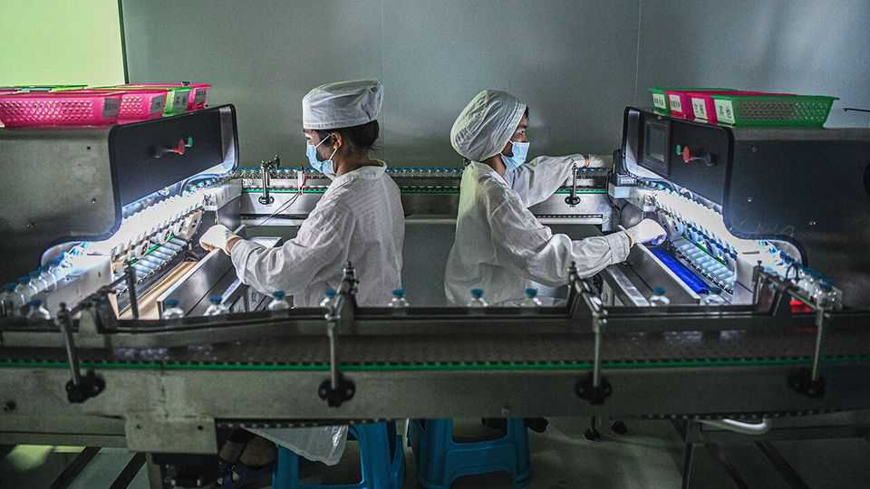
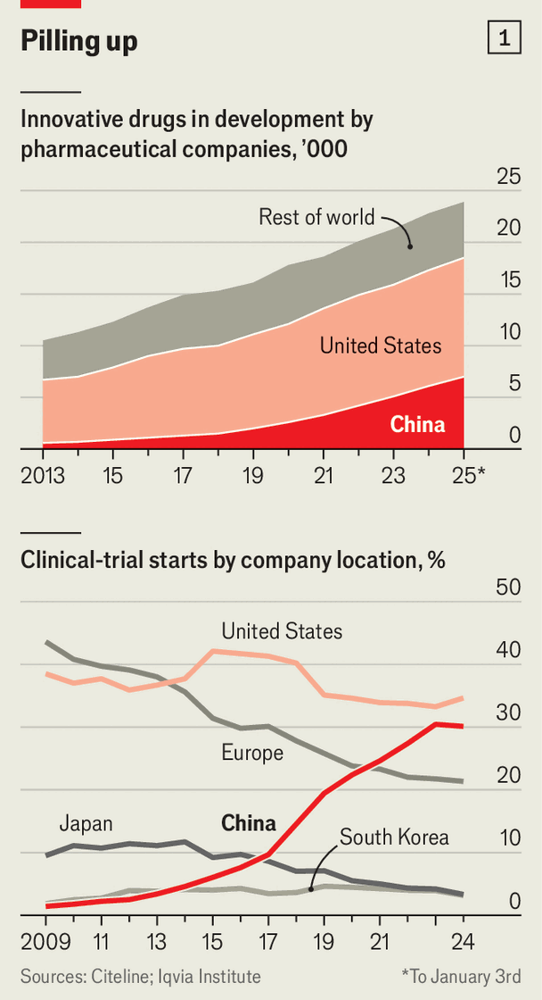
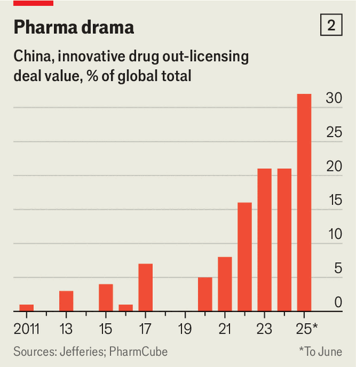

China | Drug dependency
Chinese pharma is on the cusp of going global
Its fast-moving, cut-price drugmakers stand to make more money abroad than at home
November 27th 2025

AFTER AMERICA, China is the world’s largest developer of new medicines. Its companies ran nearly a third of the planet’s clinical trials last year. That is up from just 5% a decade before (see chart 1). It is also rising to the top in several critical areas of research, including those related to cancer. Investors have taken note. Shares in Chinese biotech companies have surged by 110% this year, which is more than three times as much as their American peers.

- **after**：/[音标待填写]/ "after的中文释义待填写"；文中用来表达xxx意思；补充说明（如有）
- **america**：/[音标待填写]/ "america的中文释义待填写"；文中用来表达xxx意思；补充说明（如有）
- **china**：/[音标待填写]/ "china的中文释义待填写"；文中用来表达xxx意思；补充说明（如有）
- **largest**：/[音标待填写]/ "largest的中文释义待填写"；文中用来表达xxx意思；补充说明（如有）
- **developer**：/[音标待填写]/ "developer的中文释义待填写"；文中用来表达xxx意思；补充说明（如有）
- **medicines**：/[音标待填写]/ "medicines的中文释义待填写"；文中用来表达xxx意思；补充说明（如有）
- **companies**：/[音标待填写]/ "companies的中文释义待填写"；文中用来表达xxx意思；补充说明（如有）
- **nearly**：/[音标待填写]/ "nearly的中文释义待填写"；文中用来表达xxx意思；补充说明（如有）
- **third**：/[音标待填写]/ "third的中文释义待填写"；文中用来表达xxx意思；补充说明（如有）
- **planet**：/[音标待填写]/ "planet的中文释义待填写"；文中用来表达xxx意思；补充说明（如有）

For much of the past century drug discovery was dominated by large European and American firms, which collectively are often called “big pharma”. No longer. These companies face some of the steepest “patent cliffs” in their history, as drugs expected to generate more than $300bn in total revenue over the next six years will lose their patent protection by 2030. To plug the gap, American and European firms are scouring the globe for promising molecules, and increasingly, they are finding them in China.

- **past**：/[音标待填写]/ "past的中文释义待填写"；文中用来表达xxx意思；补充说明（如有）
- **century**：/[音标待填写]/ "century的中文释义待填写"；文中用来表达xxx意思；补充说明（如有）
- **drug**：/[音标待填写]/ "drug的中文释义待填写"；文中用来表达xxx意思；补充说明（如有）
- **discovery**：/[音标待填写]/ "discovery的中文释义待填写"；文中用来表达xxx意思；补充说明（如有）
- **dominated**：/[音标待填写]/ "dominated的中文释义待填写"；文中用来表达xxx意思；补充说明（如有）
- **large**：/[音标待填写]/ "large的中文释义待填写"；文中用来表达xxx意思；补充说明（如有）
- **european**：/[音标待填写]/ "european的中文释义待填写"；文中用来表达xxx意思；补充说明（如有）
- **american**：/[音标待填写]/ "american的中文释义待填写"；文中用来表达xxx意思；补充说明（如有）
- **firms**：/[音标待填写]/ "firms的中文释义待填写"；文中用来表达xxx意思；补充说明（如有）
- **collectively**：/[音标待填写]/ "collectively的中文释义待填写"；文中用来表达xxx意思；补充说明（如有）

The timing is rather awkward. America wants to reduce its reliance on Chinese supply chains, since it remains in a trade war that is only temporarily on hold. American officials fret already about China’s chokehold on active drug ingredients, for example. And rumours fly around that the White House plans to crack down on Chinese pharma, though nothing has happened in this regard so far. Yet when it comes to creating the next generation of medicines, America’s drugmakers, and its patients, are likely to become more, not less, dependent on Chinese innovation.

- **timing**：/[音标待填写]/ "timing的中文释义待填写"；文中用来表达xxx意思；补充说明（如有）
- **rather**：/[音标待填写]/ "rather的中文释义待填写"；文中用来表达xxx意思；补充说明（如有）
- **awkward**：/[音标待填写]/ "awkward的中文释义待填写"；文中用来表达xxx意思；补充说明（如有）
- **america**：/[音标待填写]/ "america的中文释义待填写"；文中用来表达xxx意思；补充说明（如有）
- **wants**：/[音标待填写]/ "wants的中文释义待填写"；文中用来表达xxx意思；补充说明（如有）
- **reduce**：/[音标待填写]/ "reduce的中文释义待填写"；文中用来表达xxx意思；补充说明（如有）
- **reliance**：/[音标待填写]/ "reliance的中文释义待填写"；文中用来表达xxx意思；补充说明（如有）
- **chinese**：/[音标待填写]/ "chinese的中文释义待填写"；文中用来表达xxx意思；补充说明（如有）
- **supply**：/[音标待填写]/ "supply的中文释义待填写"；文中用来表达xxx意思；补充说明（如有）
- **chains**：/[音标待填写]/ "chains的中文释义待填写"；文中用来表达xxx意思；补充说明（如有）

The evidence for this is mounting. In May Pfizer, America’s biggest drugmaker, agreed to pay $1.25bn in fees to 3SBio, a Chinese biotech firm, for the rights to manufacture and sell an experimental cancer drug outside China, if approved. The following month GlaxoSmithKline, a British rival, struck a $500m deal with Hengrui, another Chinese company, for a lung- disease treatment and the options to buy 11 more drugs, together valued at as much as $12bn, depending on whether Hengrui manages to meet particular milestones in their development. Such deals are no longer exceptions. In the first half of this year nearly a third of all global licensing agreements signed by big pharma were with Chinese firms—four times the share in 2021 (see chart 2).

- **evidence**：/[音标待填写]/ "evidence的中文释义待填写"；文中用来表达xxx意思；补充说明（如有）
- **mounting**：/[音标待填写]/ "mounting的中文释义待填写"；文中用来表达xxx意思；补充说明（如有）
- **pfizer**：/[音标待填写]/ "pfizer的中文释义待填写"；文中用来表达xxx意思；补充说明（如有）
- **america**：/[音标待填写]/ "america的中文释义待填写"；文中用来表达xxx意思；补充说明（如有）
- **biggest**：/[音标待填写]/ "biggest的中文释义待填写"；文中用来表达xxx意思；补充说明（如有）
- **drugmaker**：/[音标待填写]/ "drugmaker的中文释义待填写"；文中用来表达xxx意思；补充说明（如有）
- **agreed**：/[音标待填写]/ "agreed的中文释义待填写"；文中用来表达xxx意思；补充说明（如有）
- **fees**：/[音标待填写]/ "fees的中文释义待填写"；文中用来表达xxx意思；补充说明（如有）
- **chinese**：/[音标待填写]/ "chinese的中文释义待填写"；文中用来表达xxx意思；补充说明（如有）
- **biotech**：/[音标待填写]/ "biotech的中文释义待填写"；文中用来表达xxx意思；补充说明（如有）

Until recently, China’s drug industry was best known for making generic drugs, supplying ingredients and running trials for Western firms. Over the past decade it has reinvented itself. Approval processes have been streamlined, priority reviews conducted for drugs tackling critical conditions, and regulations brought closer to international standards. The workforce at China’s drug regulator quadrupled between 2015 and 2018, and a backlog of 20,000 new drug applications was cleared in just two years. The time taken to secure approval for human trials shrank from 501 days to 87. And the output of new

- **until**：/[音标待填写]/ "until的中文释义待填写"；文中用来表达xxx意思；补充说明（如有）
- **recently**：/[音标待填写]/ "recently的中文释义待填写"；文中用来表达xxx意思；补充说明（如有）
- **china**：/[音标待填写]/ "china的中文释义待填写"；文中用来表达xxx意思；补充说明（如有）
- **drug**：/[音标待填写]/ "drug的中文释义待填写"；文中用来表达xxx意思；补充说明（如有）
- **industry**：/[音标待填写]/ "industry的中文释义待填写"；文中用来表达xxx意思；补充说明（如有）
- **best**：/[音标待填写]/ "best的中文释义待填写"；文中用来表达xxx意思；补充说明（如有）
- **known**：/[音标待填写]/ "known的中文释义待填写"；文中用来表达xxx意思；补充说明（如有）
- **making**：/[音标待填写]/ "making的中文释义待填写"；文中用来表达xxx意思；补充说明（如有）
- **generic**：/[音标待填写]/ "generic的中文释义待填写"；文中用来表达xxx意思；补充说明（如有）
- **drugs**：/[音标待填写]/ "drugs的中文释义待填写"；文中用来表达xxx意思；补充说明（如有）

medicines soared. In 2015 China approved only 11 treatments, mostly Western imports. By 2024 the figure had risen to 93, with 42% developed domestically.

- **medicines**：/[音标待填写]/ "medicines的中文释义待填写"；文中用来表达xxx意思；补充说明（如有）
- **soared**：/[音标待填写]/ "soared的中文释义待填写"；文中用来表达xxx意思；补充说明（如有）
- **china**：/[音标待填写]/ "china的中文释义待填写"；文中用来表达xxx意思；补充说明（如有）
- **approved**：/[音标待填写]/ "approved的中文释义待填写"；文中用来表达xxx意思；补充说明（如有）
- **treatments**：/[音标待填写]/ "treatments的中文释义待填写"；文中用来表达xxx意思；补充说明（如有）
- **western**：/[音标待填写]/ "western的中文释义待填写"；文中用来表达xxx意思；补充说明（如有）
- **imports**：/[音标待填写]/ "imports的中文释义待填写"；文中用来表达xxx意思；补充说明（如有）
- **figure**：/[音标待填写]/ "figure的中文释义待填写"；文中用来表达xxx意思；补充说明（如有）
- **risen**：/[音标待填写]/ "risen的中文释义待填写"；文中用来表达xxx意思；补充说明（如有）
- **developed**：/[音标待填写]/ "developed的中文释义待填写"；文中用来表达xxx意思；补充说明（如有）

These reforms have been matched by efforts to lure back students and professionals who had studied or worked abroad. Many of China’s “sea turtles”, as such returnees are jokingly known, came back with experience of building biotech firms and dealing with investors and regulators. Their entrepreneurial zeal was bolstered by rules making it easier to raise funds and to list on the Hong Kong stock exchange.

- **reforms**：/[音标待填写]/ "reforms的中文释义待填写"；文中用来表达xxx意思；补充说明（如有）
- **matched**：/[音标待填写]/ "matched的中文释义待填写"；文中用来表达xxx意思；补充说明（如有）
- **efforts**：/[音标待填写]/ "efforts的中文释义待填写"；文中用来表达xxx意思；补充说明（如有）
- **lure**：/[音标待填写]/ "lure的中文释义待填写"；文中用来表达xxx意思；补充说明（如有）
- **back**：/[音标待填写]/ "back的中文释义待填写"；文中用来表达xxx意思；补充说明（如有）
- **students**：/[音标待填写]/ "students的中文释义待填写"；文中用来表达xxx意思；补充说明（如有）
- **professionals**：/[音标待填写]/ "professionals的中文释义待填写"；文中用来表达xxx意思；补充说明（如有）
- **studied**：/[音标待填写]/ "studied的中文释义待填写"；文中用来表达xxx意思；补充说明（如有）
- **abroad**：/[音标待填写]/ "abroad的中文释义待填写"；文中用来表达xxx意思；补充说明（如有）
- **china**：/[音标待填写]/ "china的中文释义待填写"；文中用来表达xxx意思；补充说明（如有）

Early signs of success abound. In November 2019 BeOne Medicines, a Chinese biotech firm formerly known as BeiGene, became the first local outfit to win approval from the Food and Drug Administration (FDA), America’s drug regulator, for a cancer drug. More approvals followed. But the sector’s big moment arrived last September, when a lung-cancer drug developed by Akeso Bio, a small Chinese biotech company, outperformed Keytruda, Merck’s blockbuster therapy, in clinical trials.

- **early**：/[音标待填写]/ "early的中文释义待填写"；文中用来表达xxx意思；补充说明（如有）
- **signs**：/[音标待填写]/ "signs的中文释义待填写"；文中用来表达xxx意思；补充说明（如有）
- **success**：/[音标待填写]/ "success的中文释义待填写"；文中用来表达xxx意思；补充说明（如有）
- **abound**：/[音标待填写]/ "abound的中文释义待填写"；文中用来表达xxx意思；补充说明（如有）
- **november**：/[音标待填写]/ "november的中文释义待填写"；文中用来表达xxx意思；补充说明（如有）
- **beone**：/[音标待填写]/ "beone的中文释义待填写"；文中用来表达xxx意思；补充说明（如有）
- **medicines**：/[音标待填写]/ "medicines的中文释义待填写"；文中用来表达xxx意思；补充说明（如有）
- **chinese**：/[音标待填写]/ "chinese的中文释义待填写"；文中用来表达xxx意思；补充说明（如有）
- **biotech**：/[音标待填写]/ "biotech的中文释义待填写"；文中用来表达xxx意思；补充说明（如有）
- **firm**：/[音标待填写]/ "firm的中文释义待填写"；文中用来表达xxx意思；补充说明（如有）

What explains the rapid rise of China’s drugmakers? The first answer concerns how quickly they innovated in order to produce “fast followers”, which improve on existing drugs’ safety or delivery. From there they were able to move on to “first-in-class” medicines with new targets (such as a protein or a gene linked to disease) or mechanisms (which might block or boost a target’s function).

- **explains**：/[音标待填写]/ "explains的中文释义待填写"；文中用来表达xxx意思；补充说明（如有）
- **rapid**：/[音标待填写]/ "rapid的中文释义待填写"；文中用来表达xxx意思；补充说明（如有）
- **rise**：/[音标待填写]/ "rise的中文释义待填写"；文中用来表达xxx意思；补充说明（如有）
- **china**：/[音标待填写]/ "china的中文释义待填写"；文中用来表达xxx意思；补充说明（如有）
- **drugmakers**：/[音标待填写]/ "drugmakers的中文释义待填写"；文中用来表达xxx意思；补充说明（如有）
- **answer**：/[音标待填写]/ "answer的中文释义待填写"；文中用来表达xxx意思；补充说明（如有）
- **concerns**：/[音标待填写]/ "concerns的中文释义待填写"；文中用来表达xxx意思；补充说明（如有）
- **quickly**：/[音标待填写]/ "quickly的中文释义待填写"；文中用来表达xxx意思；补充说明（如有）
- **innovated**：/[音标待填写]/ "innovated的中文释义待填写"；文中用来表达xxx意思；补充说明（如有）
- **order**：/[音标待填写]/ "order的中文释义待填写"；文中用来表达xxx意思；补充说明（如有）

Fast-follower and first-in-class treatments now make up more than 40% of the industry’s pipeline, according to interesting research published last year in Nature Reviews Drug Discovery, a scientific publication, by Zimeng Chen of Tsinghua University in Beijing and team. Wang Xingli of Fosun Pharma, a Chinese drugmaker, explains that working on fast-follower drugs gave China’s industry the “courage to do the first-in-class”.

- **fast**：/[音标待填写]/ "fast的中文释义待填写"；文中用来表达xxx意思；补充说明（如有）
- **follower**：/[音标待填写]/ "follower的中文释义待填写"；文中用来表达xxx意思；补充说明（如有）
- **class**：/[音标待填写]/ "class的中文释义待填写"；文中用来表达xxx意思；补充说明（如有）
- **treatments**：/[音标待填写]/ "treatments的中文释义待填写"；文中用来表达xxx意思；补充说明（如有）
- **industry**：/[音标待填写]/ "industry的中文释义待填写"；文中用来表达xxx意思；补充说明（如有）
- **pipeline**：/[音标待填写]/ "pipeline的中文释义待填写"；文中用来表达xxx意思；补充说明（如有）
- **according**：/[音标待填写]/ "according的中文释义待填写"；文中用来表达xxx意思；补充说明（如有）
- **interesting**：/[音标待填写]/ "interesting的中文释义待填写"；文中用来表达xxx意思；补充说明（如有）
- **research**：/[音标待填写]/ "research的中文释义待填写"；文中用来表达xxx意思；补充说明（如有）
- **published**：/[音标待填写]/ "published的中文释义待填写"；文中用来表达xxx意思；补充说明（如有）

The second answer concerns the speed, scale and low cost of other processes. China’s firms can take a drug from discovery to the start of human trials in about half the global industry’s average time. Human trials themselves, usually the slowest stage in the development of a new drug, also move faster. A vast patient pool makes enrolment easier, and a large network of trial centres also speeds things along. This model has proved especially helpful for developing antibody-drug conjugates, a novel class of treatment that seems particularly potent at tackling cancer. One big-pharma executive says that China’s appeal lies in the sheer number of firms experimenting: “You can pick the winners and improve the odds of approval.”

- **answer**：/[音标待填写]/ "answer的中文释义待填写"；文中用来表达xxx意思；补充说明（如有）
- **concerns**：/[音标待填写]/ "concerns的中文释义待填写"；文中用来表达xxx意思；补充说明（如有）
- **speed**：/[音标待填写]/ "speed的中文释义待填写"；文中用来表达xxx意思；补充说明（如有）
- **scale**：/[音标待填写]/ "scale的中文释义待填写"；文中用来表达xxx意思；补充说明（如有）
- **cost**：/[音标待填写]/ "cost的中文释义待填写"；文中用来表达xxx意思；补充说明（如有）
- **processes**：/[音标待填写]/ "processes的中文释义待填写"；文中用来表达xxx意思；补充说明（如有）
- **china**：/[音标待填写]/ "china的中文释义待填写"；文中用来表达xxx意思；补充说明（如有）
- **firms**：/[音标待填写]/ "firms的中文释义待填写"；文中用来表达xxx意思；补充说明（如有）
- **drug**：/[音标待填写]/ "drug的中文释义待填写"；文中用来表达xxx意思；补充说明（如有）
- **discovery**：/[音标待填写]/ "discovery的中文释义待填写"；文中用来表达xxx意思；补充说明（如有）

Cancer remains a central focus for Chinese firms, but they are also branching out. Weight-loss drugs are a hot target. Patents on semaglutide—the active ingredient in Wegovy and Ozempic, the wildly popular weight-loss treatments made by Novo Nordisk, a Danish pharma giant—are due to expire in China next year. That has sparked a rush to prepare generics. Yet local firms are not just copying. Bloomberg Intelligence, a research firm, reckons there are 160

- **cancer**：/[音标待填写]/ "cancer的中文释义待填写"；文中用来表达xxx意思；补充说明（如有）
- **remains**：/[音标待填写]/ "remains的中文释义待填写"；文中用来表达xxx意思；补充说明（如有）
- **central**：/[音标待填写]/ "central的中文释义待填写"；文中用来表达xxx意思；补充说明（如有）
- **focus**：/[音标待填写]/ "focus的中文释义待填写"；文中用来表达xxx意思；补充说明（如有）
- **chinese**：/[音标待填写]/ "chinese的中文释义待填写"；文中用来表达xxx意思；补充说明（如有）
- **firms**：/[音标待填写]/ "firms的中文释义待填写"；文中用来表达xxx意思；补充说明（如有）
- **also**：/[音标待填写]/ "also的中文释义待填写"；文中用来表达xxx意思；补充说明（如有）
- **branching**：/[音标待填写]/ "branching的中文释义待填写"；文中用来表达xxx意思；补充说明（如有）
- **weight**：/[音标待填写]/ "weight的中文释义待填写"；文中用来表达xxx意思；补充说明（如有）
- **loss**：/[音标待填写]/ "loss的中文释义待填写"；文中用来表达xxx意思；补充说明（如有）

new obesity drugs in development around the world; about a third of them are from China.

- **obesity**：/[音标待填写]/ "obesity的中文释义待填写"；文中用来表达xxx意思；补充说明（如有）
- **drugs**：/[音标待填写]/ "drugs的中文释义待填写"；文中用来表达xxx意思；补充说明（如有）
- **development**：/[音标待填写]/ "development的中文释义待填写"；文中用来表达xxx意思；补充说明（如有）
- **around**：/[音标待填写]/ "around的中文释义待填写"；文中用来表达xxx意思；补充说明（如有）
- **about**：/[音标待填写]/ "about的中文释义待填写"；文中用来表达xxx意思；补充说明（如有）
- **third**：/[音标待填写]/ "third的中文释义待填写"；文中用来表达xxx意思；补充说明（如有）
- **china**：/[音标待填写]/ "china的中文释义待填写"；文中用来表达xxx意思；补充说明（如有）

Although the country is the world’s second-largest drug market after America, it remains a tough place to make a profit. McKinsey, a consultancy, puts its prescription-drug sales at about $125bn in 2023, a sixth of America’s. Most sales are still of generics. New medicines account for only a fifth of the market, a share that may rise to a third by 2028. Even then, the market will remain highly price-sensitive. State insurance covers most purchases, pooling demand from hospitals and forcing firms into bidding wars. To win coverage, drugmakers must often slash prices by half or more to reach a wide patient pool, or accept a far smaller private market.

- **although**：/[音标待填写]/ "although的中文释义待填写"；文中用来表达xxx意思；补充说明（如有）
- **country**：/[音标待填写]/ "country的中文释义待填写"；文中用来表达xxx意思；补充说明（如有）
- **largest**：/[音标待填写]/ "largest的中文释义待填写"；文中用来表达xxx意思；补充说明（如有）
- **drug**：/[音标待填写]/ "drug的中文释义待填写"；文中用来表达xxx意思；补充说明（如有）
- **market**：/[音标待填写]/ "market的中文释义待填写"；文中用来表达xxx意思；补充说明（如有）
- **after**：/[音标待填写]/ "after的中文释义待填写"；文中用来表达xxx意思；补充说明（如有）
- **america**：/[音标待填写]/ "america的中文释义待填写"；文中用来表达xxx意思；补充说明（如有）
- **remains**：/[音标待填写]/ "remains的中文释义待填写"；文中用来表达xxx意思；补充说明（如有）
- **tough**：/[音标待填写]/ "tough的中文释义待填写"；文中用来表达xxx意思；补充说明（如有）
- **place**：/[音标待填写]/ "place的中文释义待填写"；文中用来表达xxx意思；补充说明（如有）

That all explains why America and other foreign markets are such big prizes. The most common route to them is through licensing agreements with Western firms. Some Chinese firms now want a bigger slice of the pie. A growing model is the “NewCo”, under which a biotech company sets up a legally distinct company in America, often backed by foreign investors, and spins off promising assets into it. Chinese pharma looks temptingly cheap to Westerners. The market value of listed Chinese biotech firms is less than 15% that of their American peers. Upfront licensing payments are typically two- thirds lower than, and total deal sizes about half of, comparable global transactions.

- **explains**：/[音标待填写]/ "explains的中文释义待填写"；文中用来表达xxx意思；补充说明（如有）
- **america**：/[音标待填写]/ "america的中文释义待填写"；文中用来表达xxx意思；补充说明（如有）
- **foreign**：/[音标待填写]/ "foreign的中文释义待填写"；文中用来表达xxx意思；补充说明（如有）
- **markets**：/[音标待填写]/ "markets的中文释义待填写"；文中用来表达xxx意思；补充说明（如有）
- **such**：/[音标待填写]/ "such的中文释义待填写"；文中用来表达xxx意思；补充说明（如有）
- **prizes**：/[音标待填写]/ "prizes的中文释义待填写"；文中用来表达xxx意思；补充说明（如有）
- **common**：/[音标待填写]/ "common的中文释义待填写"；文中用来表达xxx意思；补充说明（如有）
- **route**：/[音标待填写]/ "route的中文释义待填写"；文中用来表达xxx意思；补充说明（如有）
- **through**：/[音标待填写]/ "through的中文释义待填写"；文中用来表达xxx意思；补充说明（如有）
- **licensing**：/[音标待填写]/ "licensing的中文释义待填写"；文中用来表达xxx意思；补充说明（如有）

Another advantage of the NewCo model is that it can help mitigate some of the political concerns around Chinese pharma abroad. Others still abound, however, particularly around data privacy. Sharing patient data from clinical trials is complicated by privacy rules and related review processes. And the FDA has taken a strict approach to approving drugs based on trials that have been conducted only in China. In June it halted any new clinical trials that exported Americans’ genetic data to China. A report published in April 2025 by a congressional committee that included Eric Schmidt, Google’s former boss, warns that China’s strength in drug discovery, combined with its advances in artificial intelligence, could soon allow its firms to eclipse America’s. He and others fret about the security risks at the junction of pharmaceuticals and biotechnology.

- **another**：/[音标待填写]/ "another的中文释义待填写"；文中用来表达xxx意思；补充说明（如有）
- **advantage**：/[音标待填写]/ "advantage的中文释义待填写"；文中用来表达xxx意思；补充说明（如有）
- **newco**：/[音标待填写]/ "newco的中文释义待填写"；文中用来表达xxx意思；补充说明（如有）
- **model**：/[音标待填写]/ "model的中文释义待填写"；文中用来表达xxx意思；补充说明（如有）
- **help**：/[音标待填写]/ "help的中文释义待填写"；文中用来表达xxx意思；补充说明（如有）
- **mitigate**：/[音标待填写]/ "mitigate的中文释义待填写"；文中用来表达xxx意思；补充说明（如有）
- **political**：/[音标待填写]/ "political的中文释义待填写"；文中用来表达xxx意思；补充说明（如有）
- **concerns**：/[音标待填写]/ "concerns的中文释义待填写"；文中用来表达xxx意思；补充说明（如有）
- **around**：/[音标待填写]/ "around的中文释义待填写"；文中用来表达xxx意思；补充说明（如有）
- **chinese**：/[音标待填写]/ "chinese的中文释义待填写"；文中用来表达xxx意思；补充说明（如有）

There are also reasons for cautious optimism, however. More competition leads to more treatments appearing with smaller price tags. For patients long

- **there**：/[音标待填写]/ "there的中文释义待填写"；文中用来表达xxx意思；补充说明（如有）
- **also**：/[音标待填写]/ "also的中文释义待填写"；文中用来表达xxx意思；补充说明（如有）
- **reasons**：/[音标待填写]/ "reasons的中文释义待填写"；文中用来表达xxx意思；补充说明（如有）
- **cautious**：/[音标待填写]/ "cautious的中文释义待填写"；文中用来表达xxx意思；补充说明（如有）
- **optimism**：/[音标待填写]/ "optimism的中文释义待填写"；文中用来表达xxx意思；补充说明（如有）
- **however**：/[音标待填写]/ "however的中文释义待填写"；文中用来表达xxx意思；补充说明（如有）
- **competition**：/[音标待填写]/ "competition的中文释义待填写"；文中用来表达xxx意思；补充说明（如有）
- **leads**：/[音标待填写]/ "leads的中文释义待填写"；文中用来表达xxx意思；补充说明（如有）
- **treatments**：/[音标待填写]/ "treatments的中文释义待填写"；文中用来表达xxx意思；补充说明（如有）
- **appearing**：/[音标待填写]/ "appearing的中文释义待填写"；文中用来表达xxx意思；补充说明（如有）

denied access to cutting-edge drugs, China’s rise could help close the gap. That would particularly matter for those in need in poor countries. For Chinese drugmakers there are three critical challenges ahead: inventing novel therapies that work, breaking into new markets with them and passing the associated regulatory hurdles. Mr Wang notes that most Western giants took a century or so to reach today’s scale. By that measure, he believes, China’s industry is still “at a very early stage”. ■

- **denied**：/[音标待填写]/ "denied的中文释义待填写"；文中用来表达xxx意思；补充说明（如有）
- **access**：/[音标待填写]/ "access的中文释义待填写"；文中用来表达xxx意思；补充说明（如有）
- **cutting**：/[音标待填写]/ "cutting的中文释义待填写"；文中用来表达xxx意思；补充说明（如有）
- **edge**：/[音标待填写]/ "edge的中文释义待填写"；文中用来表达xxx意思；补充说明（如有）
- **drugs**：/[音标待填写]/ "drugs的中文释义待填写"；文中用来表达xxx意思；补充说明（如有）
- **china**：/[音标待填写]/ "china的中文释义待填写"；文中用来表达xxx意思；补充说明（如有）
- **rise**：/[音标待填写]/ "rise的中文释义待填写"；文中用来表达xxx意思；补充说明（如有）
- **help**：/[音标待填写]/ "help的中文释义待填写"；文中用来表达xxx意思；补充说明（如有）
- **close**：/[音标待填写]/ "close的中文释义待填写"；文中用来表达xxx意思；补充说明（如有）
- **particularly**：/[音标待填写]/ "particularly的中文释义待填写"；文中用来表达xxx意思；补充说明（如有）

Subscribers can sign up to Drum Tower, our new weekly newsletter, to understand what the world makes of China—and what China makes of the world.

- **subscribers**：/[音标待填写]/ "subscribers的中文释义待填写"；文中用来表达xxx意思；补充说明（如有）
- **sign**：/[音标待填写]/ "sign的中文释义待填写"；文中用来表达xxx意思；补充说明（如有）
- **drum**：/[音标待填写]/ "drum的中文释义待填写"；文中用来表达xxx意思；补充说明（如有）
- **tower**：/[音标待填写]/ "tower的中文释义待填写"；文中用来表达xxx意思；补充说明（如有）
- **weekly**：/[音标待填写]/ "weekly的中文释义待填写"；文中用来表达xxx意思；补充说明（如有）
- **newsletter**：/[音标待填写]/ "newsletter的中文释义待填写"；文中用来表达xxx意思；补充说明（如有）
- **understand**：/[音标待填写]/ "understand的中文释义待填写"；文中用来表达xxx意思；补充说明（如有）
- **china**：/[音标待填写]/ "china的中文释义待填写"；文中用来表达xxx意思；补充说明（如有）
