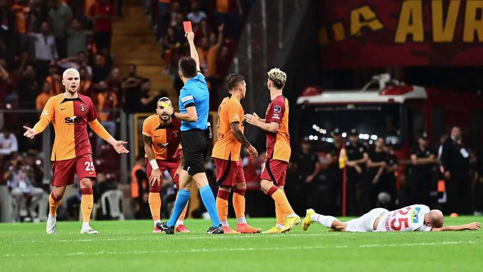

Europe | Tilting the pitch
Turkey’s refs are caught up in a huge sports gambling scandal
The country’s football may be as corrupt as its politics
November 27th 2025

HOW MUCH does a red card go for in Turkish football? According to Ozgur Ozel, an opposition politician, 5.5m lira ($130,000). That was the size of a bet he alleges was placed on a player for Goztepe, a club from Izmir, being sent off during a game on October 26th. The wager allegedly paid off when the player was given a red card, to angry howls from the club’s fans. Turkish authorities are investigating.

- **card**：/[音标待填写]/ "card的中文释义待填写"；文中用来表达xxx意思；补充说明（如有）
- **turkish**：/[音标待填写]/ "turkish的中文释义待填写"；文中用来表达xxx意思；补充说明（如有）
- **football**：/[音标待填写]/ "football的中文释义待填写"；文中用来表达xxx意思；补充说明（如有）
- **according**：/[音标待填写]/ "according的中文释义待填写"；文中用来表达xxx意思；补充说明（如有）
- **ozgur**：/[音标待填写]/ "ozgur的中文释义待填写"；文中用来表达xxx意思；补充说明（如有）
- **ozel**：/[音标待填写]/ "ozel的中文释义待填写"；文中用来表达xxx意思；补充说明（如有）
- **opposition**：/[音标待填写]/ "opposition的中文释义待填写"；文中用来表达xxx意思；补充说明（如有）
- **politician**：/[音标待填写]/ "politician的中文释义待填写"；文中用来表达xxx意思；补充说明（如有）
- **lira**：/[音标待填写]/ "lira的中文释义待填写"；文中用来表达xxx意思；补充说明（如有）
- **size**：/[音标待填写]/ "size的中文释义待填写"；文中用来表达xxx意思；补充说明（如有）

A day later, the howls spread across Turkey, after an audit by TFF, the country’s football federation, revealed evidence of widespread sports gambling by referees. The federation has since banned 149 referees and 1,024 players suspected of betting on matches. Police have detained at least 19 people, including the chairman of Eyupspor, a team in Turkey’s top league.

- **later**：/[音标待填写]/ "later的中文释义待填写"；文中用来表达xxx意思；补充说明（如有）
- **howls**：/[音标待填写]/ "howls的中文释义待填写"；文中用来表达xxx意思；补充说明（如有）
- **spread**：/[音标待填写]/ "spread的中文释义待填写"；文中用来表达xxx意思；补充说明（如有）
- **across**：/[音标待填写]/ "across的中文释义待填写"；文中用来表达xxx意思；补充说明（如有）
- **turkey**：/[音标待填写]/ "turkey的中文释义待填写"；文中用来表达xxx意思；补充说明（如有）
- **after**：/[音标待填写]/ "after的中文释义待填写"；文中用来表达xxx意思；补充说明（如有）
- **audit**：/[音标待填写]/ "audit的中文释义待填写"；文中用来表达xxx意思；补充说明（如有）
- **country**：/[音标待填写]/ "country的中文释义待填写"；文中用来表达xxx意思；补充说明（如有）
- **football**：/[音标待填写]/ "football的中文释义待填写"；文中用来表达xxx意思；补充说明（如有）
- **federation**：/[音标待填写]/ "federation的中文释义待填写"；文中用来表达xxx意思；补充说明（如有）

The scandal is Turkish football’s biggest in years. The TFF‘s president, Ibrahim Haciosmanoglu, said at least 371 of the 571 referees in Turkey’s professional leagues had accounts with betting websites. One had placed more than 18,000 bets. Ten others had placed over 10,000 each.

- **scandal**：/[音标待填写]/ "scandal的中文释义待填写"；文中用来表达xxx意思；补充说明（如有）
- **turkish**：/[音标待填写]/ "turkish的中文释义待填写"；文中用来表达xxx意思；补充说明（如有）
- **football**：/[音标待填写]/ "football的中文释义待填写"；文中用来表达xxx意思；补充说明（如有）
- **biggest**：/[音标待填写]/ "biggest的中文释义待填写"；文中用来表达xxx意思；补充说明（如有）
- **president**：/[音标待填写]/ "president的中文释义待填写"；文中用来表达xxx意思；补充说明（如有）
- **ibrahim**：/[音标待填写]/ "ibrahim的中文释义待填写"；文中用来表达xxx意思；补充说明（如有）
- **haciosmanoglu**：/[音标待填写]/ "haciosmanoglu的中文释义待填写"；文中用来表达xxx意思；补充说明（如有）
- **said**：/[音标待填写]/ "said的中文释义待填写"；文中用来表达xxx意思；补充说明（如有）
- **least**：/[音标待填写]/ "least的中文释义待填写"；文中用来表达xxx意思；补充说明（如有）
- **referees**：/[音标待填写]/ "referees的中文释义待填写"；文中用来表达xxx意思；补充说明（如有）

Referees in Turkey have a dubious reputation. José Mourinho, the short- tempered Portuguese manager who coached Fenerbahce, another top team, during the 2024-25 season, said he would not have taken the job, had he known the state of officiating there. Two years ago the president of Ankaragucu, an Ankara club, was banned from the sport after punching a referee in the face. And Mr Haciosmanoglu has his own history of dust-ups. A decade ago, during a game involving a team of which he was president, he became so incensed with the referees that he had them locked in a room in the club’s stadium. They were released only after a phone call from Recep Tayyip Erdogan, Turkey’s football-mad president.

- **referees**：/[音标待填写]/ "referees的中文释义待填写"；文中用来表达xxx意思；补充说明（如有）
- **turkey**：/[音标待填写]/ "turkey的中文释义待填写"；文中用来表达xxx意思；补充说明（如有）
- **dubious**：/[音标待填写]/ "dubious的中文释义待填写"；文中用来表达xxx意思；补充说明（如有）
- **reputation**：/[音标待填写]/ "reputation的中文释义待填写"；文中用来表达xxx意思；补充说明（如有）
- **mourinho**：/[音标待填写]/ "mourinho的中文释义待填写"；文中用来表达xxx意思；补充说明（如有）
- **tempered**：/[音标待填写]/ "tempered的中文释义待填写"；文中用来表达xxx意思；补充说明（如有）
- **portuguese**：/[音标待填写]/ "portuguese的中文释义待填写"；文中用来表达xxx意思；补充说明（如有）
- **manager**：/[音标待填写]/ "manager的中文释义待填写"；文中用来表达xxx意思；补充说明（如有）
- **coached**：/[音标待填写]/ "coached的中文释义待填写"；文中用来表达xxx意思；补充说明（如有）
- **fenerbahce**：/[音标待填写]/ "fenerbahce的中文释义待填写"；文中用来表达xxx意思；补充说明（如有）

Once the scale of the gambling scandal became clear, Mr Erdogan said Turkey “must do whatever is necessary” to clean up football. Fans hope the courts show the same zeal in pursuing crooked referees as they do in bringing down Mr Erdogan’s political rivals. On November 11th prosecutors formally indicted Ekrem Imamoglu, the main opposition candidate in the next presidential elections, on 3,900 pages’ worth of trumped-up charges. Mr Imamoglu has spent the past nine months behind bars. He now faces up to 2,352 years. ■

- **once**：/[音标待填写]/ "once的中文释义待填写"；文中用来表达xxx意思；补充说明（如有）
- **scale**：/[音标待填写]/ "scale的中文释义待填写"；文中用来表达xxx意思；补充说明（如有）
- **gambling**：/[音标待填写]/ "gambling的中文释义待填写"；文中用来表达xxx意思；补充说明（如有）
- **scandal**：/[音标待填写]/ "scandal的中文释义待填写"；文中用来表达xxx意思；补充说明（如有）
- **became**：/[音标待填写]/ "became的中文释义待填写"；文中用来表达xxx意思；补充说明（如有）
- **clear**：/[音标待填写]/ "clear的中文释义待填写"；文中用来表达xxx意思；补充说明（如有）
- **erdogan**：/[音标待填写]/ "erdogan的中文释义待填写"；文中用来表达xxx意思；补充说明（如有）
- **said**：/[音标待填写]/ "said的中文释义待填写"；文中用来表达xxx意思；补充说明（如有）
- **turkey**：/[音标待填写]/ "turkey的中文释义待填写"；文中用来表达xxx意思；补充说明（如有）
- **whatever**：/[音标待填写]/ "whatever的中文释义待填写"；文中用来表达xxx意思；补充说明（如有）

To stay on top of the biggest European stories, sign up to Café Europa, our weekly subscriber-only newsletter.

- **stay**：/[音标待填写]/ "stay的中文释义待填写"；文中用来表达xxx意思；补充说明（如有）
- **biggest**：/[音标待填写]/ "biggest的中文释义待填写"；文中用来表达xxx意思；补充说明（如有）
- **european**：/[音标待填写]/ "european的中文释义待填写"；文中用来表达xxx意思；补充说明（如有）
- **stories**：/[音标待填写]/ "stories的中文释义待填写"；文中用来表达xxx意思；补充说明（如有）
- **sign**：/[音标待填写]/ "sign的中文释义待填写"；文中用来表达xxx意思；补充说明（如有）
- **europa**：/[音标待填写]/ "europa的中文释义待填写"；文中用来表达xxx意思；补充说明（如有）
- **weekly**：/[音标待填写]/ "weekly的中文释义待填写"；文中用来表达xxx意思；补充说明（如有）
- **subscriber**：/[音标待填写]/ "subscriber的中文释义待填写"；文中用来表达xxx意思；补充说明（如有）
- **newsletter**：/[音标待填写]/ "newsletter的中文释义待填写"；文中用来表达xxx意思；补充说明（如有）
