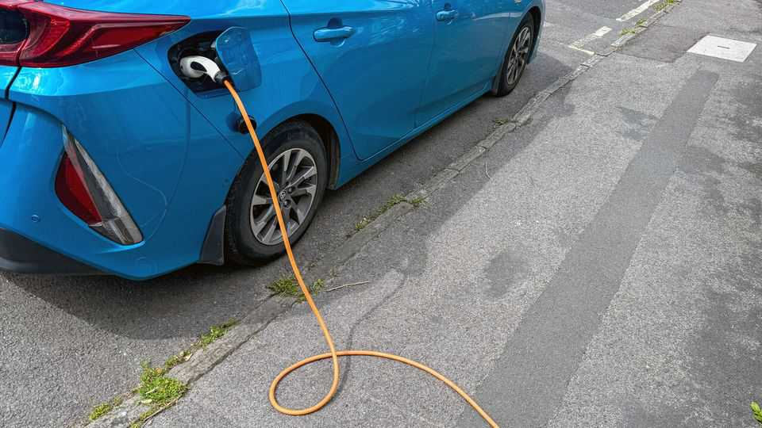
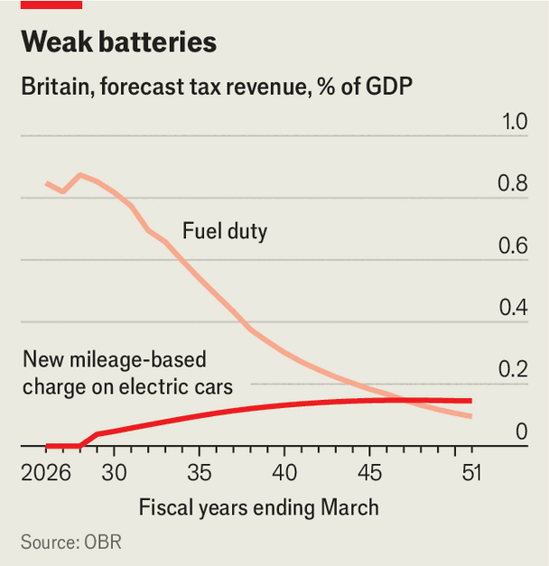

Britain | One honk for Rachel Reeves
Britain will tax electric cars more heavily. Good
Road pricing is a rare good idea from a government averse to tax reform
November 27th 2025

Rachel reeves’s budget on November 26th was an uninspiring finger buffet of immediate giveaways and medium-term tax hikes, which will do little to improve Britain’s fragile public finances or growth prospects. In just one area she showed what budgets should be for, by announcing a bold tax reform that improves the country’s long-term fiscal sustainability. From 2028 the drivers of electric vehicles will be subject to a crude form of road pricing. A levy will be charged at three pence ($0.04) per mile for fully

- **rachel**：/[音标待填写]/ "rachel的中文释义待填写"；文中用来表达xxx意思；补充说明（如有）
- **reeves**：/[音标待填写]/ "reeves的中文释义待填写"；文中用来表达xxx意思；补充说明（如有）
- **budget**：/[音标待填写]/ "budget的中文释义待填写"；文中用来表达xxx意思；补充说明（如有）
- **november**：/[音标待填写]/ "november的中文释义待填写"；文中用来表达xxx意思；补充说明（如有）
- **uninspiring**：/[音标待填写]/ "uninspiring的中文释义待填写"；文中用来表达xxx意思；补充说明（如有）
- **finger**：/[音标待填写]/ "finger的中文释义待填写"；文中用来表达xxx意思；补充说明（如有）
- **buffet**：/[音标待填写]/ "buffet的中文释义待填写"；文中用来表达xxx意思；补充说明（如有）
- **immediate**：/[音标待填写]/ "immediate的中文释义待填写"；文中用来表达xxx意思；补充说明（如有）
- **giveaways**：/[音标待填写]/ "giveaways的中文释义待填写"；文中用来表达xxx意思；补充说明（如有）
- **medium**：/[音标待填写]/ "medium的中文释义待填写"；文中用来表达xxx意思；补充说明（如有）

electric cars and half that for plug-in hybrids. A driver who puts in 8,000 miles a year, as is normal, will pay £240, the Treasury says. Electric vehicles will remain more attractive than those powered by petrol and diesel, which cost drivers some £480 per year in fuel duty. The levy will raise £1.9bn for the Treasury by the end of the decade.

- **electric**：/[音标待填写]/ "electric的中文释义待填写"；文中用来表达xxx意思；补充说明（如有）
- **cars**：/[音标待填写]/ "cars的中文释义待填写"；文中用来表达xxx意思；补充说明（如有）
- **half**：/[音标待填写]/ "half的中文释义待填写"；文中用来表达xxx意思；补充说明（如有）
- **plug**：/[音标待填写]/ "plug的中文释义待填写"；文中用来表达xxx意思；补充说明（如有）
- **hybrids**：/[音标待填写]/ "hybrids的中文释义待填写"；文中用来表达xxx意思；补充说明（如有）
- **driver**：/[音标待填写]/ "driver的中文释义待填写"；文中用来表达xxx意思；补充说明（如有）
- **puts**：/[音标待填写]/ "puts的中文释义待填写"；文中用来表达xxx意思；补充说明（如有）
- **miles**：/[音标待填写]/ "miles的中文释义待填写"；文中用来表达xxx意思；补充说明（如有）
- **normal**：/[音标待填写]/ "normal的中文释义待填写"；文中用来表达xxx意思；补充说明（如有）
- **treasury**：/[音标待填写]/ "treasury的中文释义待填写"；文中用来表达xxx意思；补充说明（如有）

About time too. For years budget wonks have warned that the rise of electric cars and the death of the internal combustion engine would gouge a hole in the public finances. Forecourt taxes account for a big chunk of government revenues, raising £24.4bn in 2024-25. The Office for Budget Responsibility expects revenues to collapse from 0.7% of GDP today to just 0.1% by 2050- 51. The new scheme will fill around a quarter of that shortfall, the watchdog said (vans and lorries will be exempt).

- **about**：/[音标待填写]/ "about的中文释义待填写"；文中用来表达xxx意思；补充说明（如有）
- **budget**：/[音标待填写]/ "budget的中文释义待填写"；文中用来表达xxx意思；补充说明（如有）
- **wonks**：/[音标待填写]/ "wonks的中文释义待填写"；文中用来表达xxx意思；补充说明（如有）
- **warned**：/[音标待填写]/ "warned的中文释义待填写"；文中用来表达xxx意思；补充说明（如有）
- **rise**：/[音标待填写]/ "rise的中文释义待填写"；文中用来表达xxx意思；补充说明（如有）
- **electric**：/[音标待填写]/ "electric的中文释义待填写"；文中用来表达xxx意思；补充说明（如有）
- **cars**：/[音标待填写]/ "cars的中文释义待填写"；文中用来表达xxx意思；补充说明（如有）
- **death**：/[音标待填写]/ "death的中文释义待填写"；文中用来表达xxx意思；补充说明（如有）
- **internal**：/[音标待填写]/ "internal的中文释义待填写"；文中用来表达xxx意思；补充说明（如有）
- **combustion**：/[音标待填写]/ "combustion的中文释义待填写"；文中用来表达xxx意思；补充说明（如有）

That will doubtless change in the years to come; the rate and scope of the levy is sure to increase. But consider it the start of a journey. What matters for now is that the principle that all road users should chip in has been established. It is best to introduce a new tax regime early, while electric cars are still a minority on the roads and their keepers are not too powerful a lobby.

- **doubtless**：/[音标待填写]/ "doubtless的中文释义待填写"；文中用来表达xxx意思；补充说明（如有）
- **change**：/[音标待填写]/ "change的中文释义待填写"；文中用来表达xxx意思；补充说明（如有）
- **rate**：/[音标待填写]/ "rate的中文释义待填写"；文中用来表达xxx意思；补充说明（如有）
- **scope**：/[音标待填写]/ "scope的中文释义待填写"；文中用来表达xxx意思；补充说明（如有）
- **levy**：/[音标待填写]/ "levy的中文释义待填写"；文中用来表达xxx意思；补充说明（如有）
- **sure**：/[音标待填写]/ "sure的中文释义待填写"；文中用来表达xxx意思；补充说明（如有）
- **increase**：/[音标待填写]/ "increase的中文释义待填写"；文中用来表达xxx意思；补充说明（如有）
- **consider**：/[音标待填写]/ "consider的中文释义待填写"；文中用来表达xxx意思；补充说明（如有）
- **start**：/[音标待填写]/ "start的中文释义待填写"；文中用来表达xxx意思；补充说明（如有）
- **journey**：/[音标待填写]/ "journey的中文释义待填写"；文中用来表达xxx意思；补充说明（如有）

Road pricing seems to be popular compared with other forms of motoring tax (Ms Reeves, like many of her predecessors, has again chosen not to increase fuel duty). Fully 71% of the public think that electric-car drivers should pay some tax, with only 14% saying they should pay none at all, according to

- **road**：/[音标待填写]/ "road的中文释义待填写"；文中用来表达xxx意思；补充说明（如有）
- **pricing**：/[音标待填写]/ "pricing的中文释义待填写"；文中用来表达xxx意思；补充说明（如有）
- **seems**：/[音标待填写]/ "seems的中文释义待填写"；文中用来表达xxx意思；补充说明（如有）
- **popular**：/[音标待填写]/ "popular的中文释义待填写"；文中用来表达xxx意思；补充说明（如有）
- **compared**：/[音标待填写]/ "compared的中文释义待填写"；文中用来表达xxx意思；补充说明（如有）
- **forms**：/[音标待填写]/ "forms的中文释义待填写"；文中用来表达xxx意思；补充说明（如有）
- **motoring**：/[音标待填写]/ "motoring的中文释义待填写"；文中用来表达xxx意思；补充说明（如有）
- **reeves**：/[音标待填写]/ "reeves的中文释义待填写"；文中用来表达xxx意思；补充说明（如有）
- **predecessors**：/[音标待填写]/ "predecessors的中文释义待填写"；文中用来表达xxx意思；补充说明（如有）
- **again**：/[音标待填写]/ "again的中文释义待填写"；文中用来表达xxx意思；补充说明（如有）

polling by Stonehaven, a consultancy. Left-leaning voters tend to think that greener cars should have preferential tax treatment, whereas right-leaning ones think they should pay the same as petrol and diesel ones.

- **polling**：/[音标待填写]/ "polling的中文释义待填写"；文中用来表达xxx意思；补充说明（如有）
- **stonehaven**：/[音标待填写]/ "stonehaven的中文释义待填写"；文中用来表达xxx意思；补充说明（如有）
- **consultancy**：/[音标待填写]/ "consultancy的中文释义待填写"；文中用来表达xxx意思；补充说明（如有）
- **left**：/[音标待填写]/ "left的中文释义待填写"；文中用来表达xxx意思；补充说明（如有）
- **leaning**：/[音标待填写]/ "leaning的中文释义待填写"；文中用来表达xxx意思；补充说明（如有）
- **voters**：/[音标待填写]/ "voters的中文释义待填写"；文中用来表达xxx意思；补充说明（如有）
- **tend**：/[音标待填写]/ "tend的中文释义待填写"；文中用来表达xxx意思；补充说明（如有）
- **greener**：/[音标待填写]/ "greener的中文释义待填写"；文中用来表达xxx意思；补充说明（如有）
- **cars**：/[音标待填写]/ "cars的中文释义待填写"；文中用来表达xxx意思；补充说明（如有）
- **preferential**：/[音标待填写]/ "preferential的中文释义待填写"；文中用来表达xxx意思；补充说明（如有）

Opponents of road pricing have previously cited privacy concerns, arguing it would require cars to be tracked by the government. Not so, insists the Treasury: drivers would pay for an estimated year’s driving up front and settle the balance at the end of the year. Drivers’ declarations of mileage would be checked against the records of mot vehicle inspections, as happens in New Zealand. Although in theory drivers could one day opt to share their car’s telemetric data automatically, this will never be mandatory, ministers say.

- **opponents**：/[音标待填写]/ "opponents的中文释义待填写"；文中用来表达xxx意思；补充说明（如有）
- **road**：/[音标待填写]/ "road的中文释义待填写"；文中用来表达xxx意思；补充说明（如有）
- **pricing**：/[音标待填写]/ "pricing的中文释义待填写"；文中用来表达xxx意思；补充说明（如有）
- **previously**：/[音标待填写]/ "previously的中文释义待填写"；文中用来表达xxx意思；补充说明（如有）
- **cited**：/[音标待填写]/ "cited的中文释义待填写"；文中用来表达xxx意思；补充说明（如有）
- **privacy**：/[音标待填写]/ "privacy的中文释义待填写"；文中用来表达xxx意思；补充说明（如有）
- **concerns**：/[音标待填写]/ "concerns的中文释义待填写"；文中用来表达xxx意思；补充说明（如有）
- **arguing**：/[音标待填写]/ "arguing的中文释义待填写"；文中用来表达xxx意思；补充说明（如有）
- **require**：/[音标待填写]/ "require的中文释义待填写"；文中用来表达xxx意思；补充说明（如有）
- **cars**：/[音标待填写]/ "cars的中文释义待填写"；文中用来表达xxx意思；补充说明（如有）

The big risk is that the tax chills car sales. Government targets specify that electric vehicles should account for 80% of overall sales by 2030. The obr reckons that the new levy would result in 440,000 fewer sales over the next five years, although this will be mostly offset by more generous incentives for car purchases announced by Ms Reeves. But if it works, it will be a rare victory: a tax reform that is radical, popular, creates good incentives and is likely to improve the health of the public finances for decades to come. What a pity that this government has had so few of those. ■

- **risk**：/[音标待填写]/ "risk的中文释义待填写"；文中用来表达xxx意思；补充说明（如有）
- **chills**：/[音标待填写]/ "chills的中文释义待填写"；文中用来表达xxx意思；补充说明（如有）
- **sales**：/[音标待填写]/ "sales的中文释义待填写"；文中用来表达xxx意思；补充说明（如有）
- **government**：/[音标待填写]/ "government的中文释义待填写"；文中用来表达xxx意思；补充说明（如有）
- **targets**：/[音标待填写]/ "targets的中文释义待填写"；文中用来表达xxx意思；补充说明（如有）
- **specify**：/[音标待填写]/ "specify的中文释义待填写"；文中用来表达xxx意思；补充说明（如有）
- **electric**：/[音标待填写]/ "electric的中文释义待填写"；文中用来表达xxx意思；补充说明（如有）
- **vehicles**：/[音标待填写]/ "vehicles的中文释义待填写"；文中用来表达xxx意思；补充说明（如有）
- **account**：/[音标待填写]/ "account的中文释义待填写"；文中用来表达xxx意思；补充说明（如有）
- **overall**：/[音标待填写]/ "overall的中文释义待填写"；文中用来表达xxx意思；补充说明（如有）

For more expert analysis of the biggest stories in Britain, sign up to Blighty, our weekly subscriber-only newsletter.

- **expert**：/[音标待填写]/ "expert的中文释义待填写"；文中用来表达xxx意思；补充说明（如有）
- **analysis**：/[音标待填写]/ "analysis的中文释义待填写"；文中用来表达xxx意思；补充说明（如有）
- **biggest**：/[音标待填写]/ "biggest的中文释义待填写"；文中用来表达xxx意思；补充说明（如有）
- **stories**：/[音标待填写]/ "stories的中文释义待填写"；文中用来表达xxx意思；补充说明（如有）
- **britain**：/[音标待填写]/ "britain的中文释义待填写"；文中用来表达xxx意思；补充说明（如有）
- **sign**：/[音标待填写]/ "sign的中文释义待填写"；文中用来表达xxx意思；补充说明（如有）
- **blighty**：/[音标待填写]/ "blighty的中文释义待填写"；文中用来表达xxx意思；补充说明（如有）
- **weekly**：/[音标待填写]/ "weekly的中文释义待填写"；文中用来表达xxx意思；补充说明（如有）
- **subscriber**：/[音标待填写]/ "subscriber的中文释义待填写"；文中用来表达xxx意思；补充说明（如有）
- **newsletter**：/[音标待填写]/ "newsletter的中文释义待填写"；文中用来表达xxx意思；补充说明（如有）
