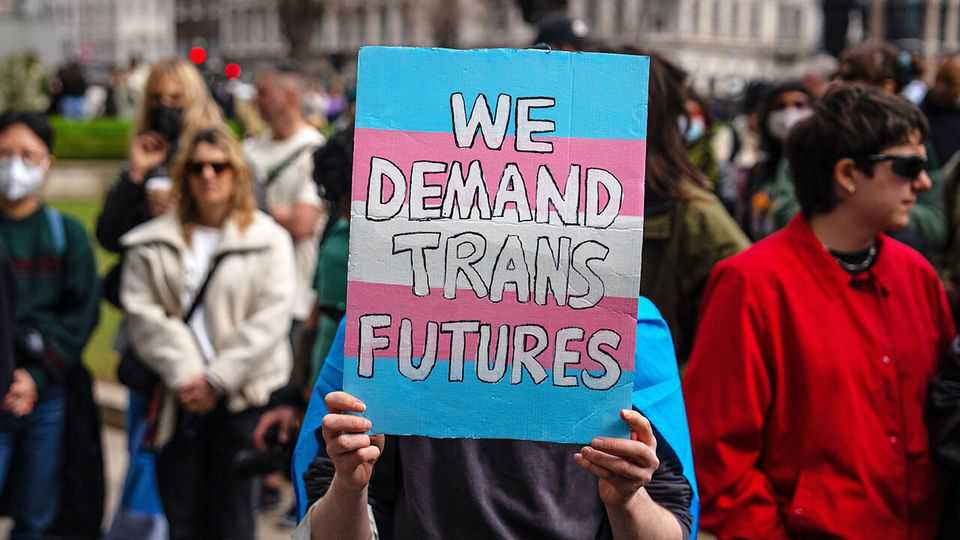

Britain | Gender medicine
A landmark trial of puberty blockers could end up in court
Supporters say the trial is vital; opponents that it is unethical
November 27th 2025

In 2024 Britain banned puberty-blocking drugs for children with gender dysphoria (dissatisfaction with their sex). A review by Hilary Cass, a paediatrician, had concluded that the evidence base for gender medicine in general was “remarkably weak”. She recommended a clinical trial of puberty blockers in particular. On November 22nd that trial, called PATHWAYS, was approved by regulators. Led by Emily Simonoff, a psychiatrist at King’s College London, it

- **britain**：/[音标待填写]/ "britain的中文释义待填写"；文中用来表达xxx意思；补充说明（如有）
- **banned**：/[音标待填写]/ "banned的中文释义待填写"；文中用来表达xxx意思；补充说明（如有）
- **puberty**：/[音标待填写]/ "puberty的中文释义待填写"；文中用来表达xxx意思；补充说明（如有）
- **blocking**：/[音标待填写]/ "blocking的中文释义待填写"；文中用来表达xxx意思；补充说明（如有）
- **drugs**：/[音标待填写]/ "drugs的中文释义待填写"；文中用来表达xxx意思；补充说明（如有）
- **children**：/[音标待填写]/ "children的中文释义待填写"；文中用来表达xxx意思；补充说明（如有）
- **gender**：/[音标待填写]/ "gender的中文释义待填写"；文中用来表达xxx意思；补充说明（如有）
- **dysphoria**：/[音标待填写]/ "dysphoria的中文释义待填写"；文中用来表达xxx意思；补充说明（如有）
- **dissatisfaction**：/[音标待填写]/ "dissatisfaction的中文释义待填写"；文中用来表达xxx意思；补充说明（如有）
- **review**：/[音标待填写]/ "review的中文释义待填写"；文中用来表达xxx意思；补充说明（如有）

aims to recruit 226 children between the ages of ten and 16. Its results would be read around the world. Child gender medicine is controversial and several countries have imposed restrictions (on November 24th New Zealand became the latest to do so). Better evidence would be helpful.

- **aims**：/[音标待填写]/ "aims的中文释义待填写"；文中用来表达xxx意思；补充说明（如有）
- **recruit**：/[音标待填写]/ "recruit的中文释义待填写"；文中用来表达xxx意思；补充说明（如有）
- **children**：/[音标待填写]/ "children的中文释义待填写"；文中用来表达xxx意思；补充说明（如有）
- **ages**：/[音标待填写]/ "ages的中文释义待填写"；文中用来表达xxx意思；补充说明（如有）
- **results**：/[音标待填写]/ "results的中文释义待填写"；文中用来表达xxx意思；补充说明（如有）
- **read**：/[音标待填写]/ "read的中文释义待填写"；文中用来表达xxx意思；补充说明（如有）
- **around**：/[音标待填写]/ "around的中文释义待填写"；文中用来表达xxx意思；补充说明（如有）
- **child**：/[音标待填写]/ "child的中文释义待填写"；文中用来表达xxx意思；补充说明（如有）
- **gender**：/[音标待填写]/ "gender的中文释义待填写"；文中用来表达xxx意思；补充说明（如有）
- **medicine**：/[音标待填写]/ "medicine的中文释义待填写"；文中用来表达xxx意思；补充说明（如有）

Puberty blockers suppress the production of sex hormones like testosterone and oestrogen. Besides forestalling a puberty that may be unwelcome, the hope is that they will buy “time to think” about whether to pursue more radical treatments, such as cross-sex hormones and surgery.

- **puberty**：/[音标待填写]/ "puberty的中文释义待填写"；文中用来表达xxx意思；补充说明（如有）
- **blockers**：/[音标待填写]/ "blockers的中文释义待填写"；文中用来表达xxx意思；补充说明（如有）
- **suppress**：/[音标待填写]/ "suppress的中文释义待填写"；文中用来表达xxx意思；补充说明（如有）
- **production**：/[音标待填写]/ "production的中文释义待填写"；文中用来表达xxx意思；补充说明（如有）
- **hormones**：/[音标待填写]/ "hormones的中文释义待填写"；文中用来表达xxx意思；补充说明（如有）
- **testosterone**：/[音标待填写]/ "testosterone的中文释义待填写"；文中用来表达xxx意思；补充说明（如有）
- **oestrogen**：/[音标待填写]/ "oestrogen的中文释义待填写"；文中用来表达xxx意思；补充说明（如有）
- **besides**：/[音标待填写]/ "besides的中文释义待填写"；文中用来表达xxx意思；补充说明（如有）
- **forestalling**：/[音标待填写]/ "forestalling的中文释义待填写"；文中用来表达xxx意思；补充说明（如有）
- **unwelcome**：/[音标待填写]/ "unwelcome的中文释义待填写"；文中用来表达xxx意思；补充说明（如有）

A trial may seem the best way to decide if blockers actually help with gender dysphoria. But PATHWAYS is controversial. Some supporters of gender medicine think it is unnecessary. Others, including “detransitioners” who regret their gender treatments, some medics (including some who have worked in gender clinics) and Kemi Badenoch, leader of the opposition Conservative Party, think it is unethical.

- **trial**：/[音标待填写]/ "trial的中文释义待填写"；文中用来表达xxx意思；补充说明（如有）
- **seem**：/[音标待填写]/ "seem的中文释义待填写"；文中用来表达xxx意思；补充说明（如有）
- **best**：/[音标待填写]/ "best的中文释义待填写"；文中用来表达xxx意思；补充说明（如有）
- **decide**：/[音标待填写]/ "decide的中文释义待填写"；文中用来表达xxx意思；补充说明（如有）
- **blockers**：/[音标待填写]/ "blockers的中文释义待填写"；文中用来表达xxx意思；补充说明（如有）
- **actually**：/[音标待填写]/ "actually的中文释义待填写"；文中用来表达xxx意思；补充说明（如有）
- **help**：/[音标待填写]/ "help的中文释义待填写"；文中用来表达xxx意思；补充说明（如有）
- **gender**：/[音标待填写]/ "gender的中文释义待填写"；文中用来表达xxx意思；补充说明（如有）
- **dysphoria**：/[音标待填写]/ "dysphoria的中文释义待填写"；文中用来表达xxx意思；补充说明（如有）
- **pathways**：/[音标待填写]/ "pathways的中文释义待填写"；文中用来表达xxx意思；补充说明（如有）

One argument is that it is badly designed. Unlike many trials, it will have no placebo arm. Every child will get puberty blockers, either immediately or after a year. All participants will get psychological therapies as well. Follow-up will be for just two and a half years. All that risks making it hard to discern the effects of the drugs, argues Hannah Ryan, a doctor with experience in analysing clinical evidence. If a trial is unlikely to yield reliable information, says Dr Ryan, it is not ethical.

- **argument**：/[音标待填写]/ "argument的中文释义待填写"；文中用来表达xxx意思；补充说明（如有）
- **designed**：/[音标待填写]/ "designed的中文释义待填写"；文中用来表达xxx意思；补充说明（如有）
- **unlike**：/[音标待填写]/ "unlike的中文释义待填写"；文中用来表达xxx意思；补充说明（如有）
- **trials**：/[音标待填写]/ "trials的中文释义待填写"；文中用来表达xxx意思；补充说明（如有）
- **placebo**：/[音标待填写]/ "placebo的中文释义待填写"；文中用来表达xxx意思；补充说明（如有）
- **every**：/[音标待填写]/ "every的中文释义待填写"；文中用来表达xxx意思；补充说明（如有）
- **child**：/[音标待填写]/ "child的中文释义待填写"；文中用来表达xxx意思；补充说明（如有）
- **puberty**：/[音标待填写]/ "puberty的中文释义待填写"；文中用来表达xxx意思；补充说明（如有）
- **blockers**：/[音标待填写]/ "blockers的中文释义待填写"；文中用来表达xxx意思；补充说明（如有）
- **either**：/[音标待填写]/ "either的中文释义待填写"；文中用来表达xxx意思；补充说明（如有）

Another argument is that the trial is reckless. Clinical trials require researchers to be unsure whether a drug will prove to be helpful or harmful. Yet gender dysphoria often resolves with time. Previous studies have raised the possibility that, rather than buying time to think, puberty blockers may propel children into hormones and surgery. There are worries about bone health and fertility. Animal studies hint at long-term cognitive impairments.

- **another**：/[音标待填写]/ "another的中文释义待填写"；文中用来表达xxx意思；补充说明（如有）
- **argument**：/[音标待填写]/ "argument的中文释义待填写"；文中用来表达xxx意思；补充说明（如有）
- **trial**：/[音标待填写]/ "trial的中文释义待填写"；文中用来表达xxx意思；补充说明（如有）
- **reckless**：/[音标待填写]/ "reckless的中文释义待填写"；文中用来表达xxx意思；补充说明（如有）
- **clinical**：/[音标待填写]/ "clinical的中文释义待填写"；文中用来表达xxx意思；补充说明（如有）
- **trials**：/[音标待填写]/ "trials的中文释义待填写"；文中用来表达xxx意思；补充说明（如有）
- **require**：/[音标待填写]/ "require的中文释义待填写"；文中用来表达xxx意思；补充说明（如有）
- **researchers**：/[音标待填写]/ "researchers的中文释义待填写"；文中用来表达xxx意思；补充说明（如有）
- **unsure**：/[音标待填写]/ "unsure的中文释义待填写"；文中用来表达xxx意思；补充说明（如有）
- **whether**：/[音标待填写]/ "whether的中文释义待填写"；文中用来表达xxx意思；补充说明（如有）

Critics say data could be collected in less risky ways. Thousands of people have already been given puberty blockers. Their health records could be studied. An American report, published on November 19th, suggests more animal studies. Wes Streeting, Britain’s health secretary, maintains that the lack of good evidence means the trial is vital. The arguments may end up before a judge: the trial’s opponents say they will seek a judicial review to halt it. ■

- **critics**：/[音标待填写]/ "critics的中文释义待填写"；文中用来表达xxx意思；补充说明（如有）
- **data**：/[音标待填写]/ "data的中文释义待填写"；文中用来表达xxx意思；补充说明（如有）
- **collected**：/[音标待填写]/ "collected的中文释义待填写"；文中用来表达xxx意思；补充说明（如有）
- **less**：/[音标待填写]/ "less的中文释义待填写"；文中用来表达xxx意思；补充说明（如有）
- **risky**：/[音标待填写]/ "risky的中文释义待填写"；文中用来表达xxx意思；补充说明（如有）
- **thousands**：/[音标待填写]/ "thousands的中文释义待填写"；文中用来表达xxx意思；补充说明（如有）
- **already**：/[音标待填写]/ "already的中文释义待填写"；文中用来表达xxx意思；补充说明（如有）
- **given**：/[音标待填写]/ "given的中文释义待填写"；文中用来表达xxx意思；补充说明（如有）
- **puberty**：/[音标待填写]/ "puberty的中文释义待填写"；文中用来表达xxx意思；补充说明（如有）
- **blockers**：/[音标待填写]/ "blockers的中文释义待填写"；文中用来表达xxx意思；补充说明（如有）

For more expert analysis of the biggest stories in Britain, sign up to Blighty, our weekly subscriber-only newsletter.

- **expert**：/[音标待填写]/ "expert的中文释义待填写"；文中用来表达xxx意思；补充说明（如有）
- **analysis**：/[音标待填写]/ "analysis的中文释义待填写"；文中用来表达xxx意思；补充说明（如有）
- **biggest**：/[音标待填写]/ "biggest的中文释义待填写"；文中用来表达xxx意思；补充说明（如有）
- **stories**：/[音标待填写]/ "stories的中文释义待填写"；文中用来表达xxx意思；补充说明（如有）
- **britain**：/[音标待填写]/ "britain的中文释义待填写"；文中用来表达xxx意思；补充说明（如有）
- **sign**：/[音标待填写]/ "sign的中文释义待填写"；文中用来表达xxx意思；补充说明（如有）
- **blighty**：/[音标待填写]/ "blighty的中文释义待填写"；文中用来表达xxx意思；补充说明（如有）
- **weekly**：/[音标待填写]/ "weekly的中文释义待填写"；文中用来表达xxx意思；补充说明（如有）
- **subscriber**：/[音标待填写]/ "subscriber的中文释义待填写"；文中用来表达xxx意思；补充说明（如有）
- **newsletter**：/[音标待填写]/ "newsletter的中文释义待填写"；文中用来表达xxx意思；补充说明（如有）
