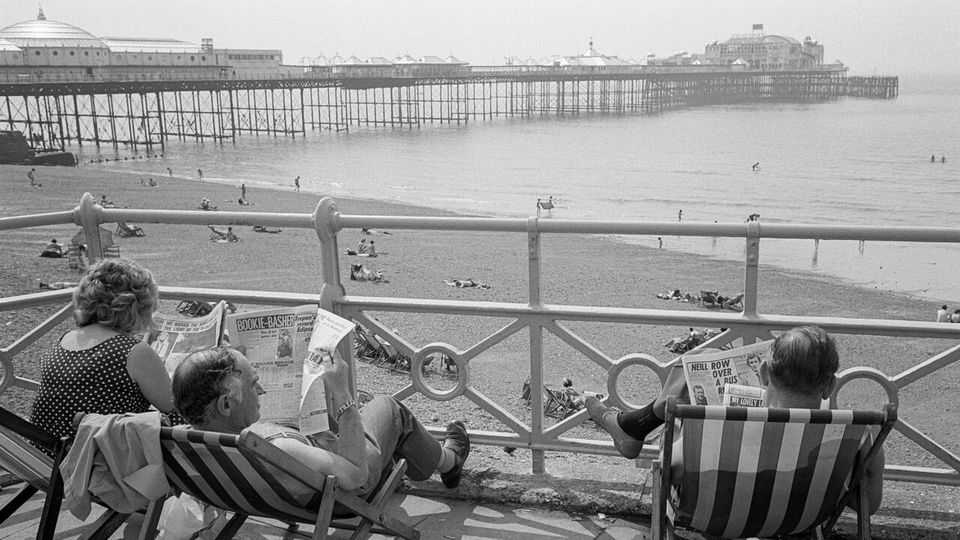

Britain | The Mail and the Telegraph
Who should control British newspapers?
What a £500m merger says about Britain’s media
November 27th 2025

This article was downloaded by zlibrary from [https://www.economist.com//britain/2025/11/27/who-should-control-british-newspapers](https://www.economist.com//britain/2025/11/27/who-should-control-british-newspapers)
LORD ROTHErMERE, owner of the Daily Mail and other titles, is already a viscount. Yet on November 22nd, with his announcement of a £500m ($660m) deal to add the troubled Telegraph newspaper to his media empire, he cast himself as a white knight. If approved, the takeover will end an extraordinary period of limbo for the 170-year-old paper, which has lacked a permanent owner since its parent company fell into receivership in 2023. It also raises a bigger question: who should own Britain’s press, if the choice is between foreign states and domestic moguls?

- **lord**：/[音标待填写]/ "lord的中文释义待填写"；文中用来表达xxx意思；补充说明（如有）
- **rothermere**：/[音标待填写]/ "rothermere的中文释义待填写"；文中用来表达xxx意思；补充说明（如有）
- **owner**：/[音标待填写]/ "owner的中文释义待填写"；文中用来表达xxx意思；补充说明（如有）
- **daily**：/[音标待填写]/ "daily的中文释义待填写"；文中用来表达xxx意思；补充说明（如有）
- **mail**：/[音标待填写]/ "mail的中文释义待填写"；文中用来表达xxx意思；补充说明（如有）
- **titles**：/[音标待填写]/ "titles的中文释义待填写"；文中用来表达xxx意思；补充说明（如有）
- **already**：/[音标待填写]/ "already的中文释义待填写"；文中用来表达xxx意思；补充说明（如有）
- **viscount**：/[音标待填写]/ "viscount的中文释义待填写"；文中用来表达xxx意思；补充说明（如有）
- **november**：/[音标待填写]/ "november的中文释义待填写"；文中用来表达xxx意思；补充说明（如有）
- **announcement**：/[音标待填写]/ "announcement的中文释义待填写"；文中用来表达xxx意思；补充说明（如有）

The Telegraph has framed its own fate as a matter of national sovereignty. The newsroom revolted when RedBird IMI—a joint venture between an American private-equity firm and International Media Investments, which has ties to the UAE’s main ruling family—took temporary ownership. One headline thundered that it would be “unforgivable to allow Abu Dhabi to nationalise” the paper. The next year the Conservative government passed a law barring foreign governments from owning British newspapers, in effect forcing RedBird IMI to sell its stake.

- **telegraph**：/[音标待填写]/ "telegraph的中文释义待填写"；文中用来表达xxx意思；补充说明（如有）
- **framed**：/[音标待填写]/ "framed的中文释义待填写"；文中用来表达xxx意思；补充说明（如有）
- **fate**：/[音标待填写]/ "fate的中文释义待填写"；文中用来表达xxx意思；补充说明（如有）
- **matter**：/[音标待填写]/ "matter的中文释义待填写"；文中用来表达xxx意思；补充说明（如有）
- **national**：/[音标待填写]/ "national的中文释义待填写"；文中用来表达xxx意思；补充说明（如有）
- **sovereignty**：/[音标待填写]/ "sovereignty的中文释义待填写"；文中用来表达xxx意思；补充说明（如有）
- **newsroom**：/[音标待填写]/ "newsroom的中文释义待填写"；文中用来表达xxx意思；补充说明（如有）
- **revolted**：/[音标待填写]/ "revolted的中文释义待填写"；文中用来表达xxx意思；补充说明（如有）
- **redbird**：/[音标待填写]/ "redbird的中文释义待填写"；文中用来表达xxx意思；补充说明（如有）
- **joint**：/[音标待填写]/ "joint的中文释义待填写"；文中用来表达xxx意思；补充说明（如有）

A sale to the Daily Mail and General Trust (DMGT), Lord Rothermere’s publisher, would probably resolve such concerns (while letting the Emiratis, still big investors in British high streets and football clubs, save face). But it also creates a different worry. Around three-quarters of national-newspaper circulation in Britain is already controlled by the DMGT or Rupert Murdoch’s News UK. Allies of the Labour government fret openly about right-wing dominance and how Lord Rothermere, who also owns the i newspaper and the Metro, would wield even greater sway over Britain’s press. Some are now asking Lisa Nandy, the culture secretary, to intervene. She has the power to ask two regulators, the Competition and Markets Authority (CMA) and Ofcom, to scrutinise the deal for its effects on, respectively, economic concentration and media plurality.

- **sale**：/[音标待填写]/ "sale的中文释义待填写"；文中用来表达xxx意思；补充说明（如有）
- **daily**：/[音标待填写]/ "daily的中文释义待填写"；文中用来表达xxx意思；补充说明（如有）
- **mail**：/[音标待填写]/ "mail的中文释义待填写"；文中用来表达xxx意思；补充说明（如有）
- **general**：/[音标待填写]/ "general的中文释义待填写"；文中用来表达xxx意思；补充说明（如有）
- **trust**：/[音标待填写]/ "trust的中文释义待填写"；文中用来表达xxx意思；补充说明（如有）
- **dmgt**：/[音标待填写]/ "dmgt的中文释义待填写"；文中用来表达xxx意思；补充说明（如有）
- **lord**：/[音标待填写]/ "lord的中文释义待填写"；文中用来表达xxx意思；补充说明（如有）
- **rothermere**：/[音标待填写]/ "rothermere的中文释义待填写"；文中用来表达xxx意思；补充说明（如有）
- **publisher**：/[音标待填写]/ "publisher的中文释义待填写"；文中用来表达xxx意思；补充说明（如有）
- **probably**：/[音标待填写]/ "probably的中文释义待填写"；文中用来表达xxx意思；补充说明（如有）

Yet the media landscape has already shifted. “The newspaper sector is a shadow of what it used to be,” says Becket McGrath, a competition lawyer at Euclid Law. According to Ofcom, 71% of Britons now get their news online, compared with only 22% in print. In the digital world, a combined Daily Mail and Telegraph would have less than a quarter of the BBC’s reach, based on minutes spent online. All news sources are dwarfed by social-media platforms. In recent years the coverage of the Telegraph (nickname: the “Torygraph”) has converged with the Daily Mail’s. The acquisition of the i, a politically neutral title, by DMGT has shown that it can preserve editorial independence. How regulators interpret all this remains to be seen.

- **media**：/[音标待填写]/ "media的中文释义待填写"；文中用来表达xxx意思；补充说明（如有）
- **landscape**：/[音标待填写]/ "landscape的中文释义待填写"；文中用来表达xxx意思；补充说明（如有）
- **already**：/[音标待填写]/ "already的中文释义待填写"；文中用来表达xxx意思；补充说明（如有）
- **shifted**：/[音标待填写]/ "shifted的中文释义待填写"；文中用来表达xxx意思；补充说明（如有）
- **newspaper**：/[音标待填写]/ "newspaper的中文释义待填写"；文中用来表达xxx意思；补充说明（如有）
- **sector**：/[音标待填写]/ "sector的中文释义待填写"；文中用来表达xxx意思；补充说明（如有）
- **shadow**：/[音标待填写]/ "shadow的中文释义待填写"；文中用来表达xxx意思；补充说明（如有）
- **becket**：/[音标待填写]/ "becket的中文释义待填写"；文中用来表达xxx意思；补充说明（如有）
- **mcgrath**：/[音标待填写]/ "mcgrath的中文释义待填写"；文中用来表达xxx意思；补充说明（如有）
- **competition**：/[音标待填写]/ "competition的中文释义待填写"；文中用来表达xxx意思；补充说明（如有）

Ultimately the government will have the final say. It faces a dilemma, notes one industry executive. It will not want to bolster two right-leaning papers by allowing them to merge, nor enrage them by blocking the deal. Ms Nandy hopes to allow a “timely sale” and has given DMGT three weeks to submit its case. A full regulatory investigation of some kind is probable.

- **ultimately**：/[音标待填写]/ "ultimately的中文释义待填写"；文中用来表达xxx意思；补充说明（如有）
- **government**：/[音标待填写]/ "government的中文释义待填写"；文中用来表达xxx意思；补充说明（如有）
- **final**：/[音标待填写]/ "final的中文释义待填写"；文中用来表达xxx意思；补充说明（如有）
- **faces**：/[音标待填写]/ "faces的中文释义待填写"；文中用来表达xxx意思；补充说明（如有）
- **dilemma**：/[音标待填写]/ "dilemma的中文释义待填写"；文中用来表达xxx意思；补充说明（如有）
- **notes**：/[音标待填写]/ "notes的中文释义待填写"；文中用来表达xxx意思；补充说明（如有）
- **industry**：/[音标待填写]/ "industry的中文释义待填写"；文中用来表达xxx意思；补充说明（如有）
- **executive**：/[音标待填写]/ "executive的中文释义待填写"；文中用来表达xxx意思；补充说明（如有）
- **want**：/[音标待填写]/ "want的中文释义待填写"；文中用来表达xxx意思；补充说明（如有）
- **bolster**：/[音标待填写]/ "bolster的中文释义待填写"；文中用来表达xxx意思；补充说明（如有）

The Telegraph’s coverage of its own drama has at times seemed parochial. “I should declare an interest here,” wrote one contributor. “My wife’s family bought the Telegraph in the 19th century.” Yet if Lord Rothermere prevails, it will change. DMGT says it intends to accelerate the group’s “international expansion”, which probably means more culture-war fare and royal gossip designed to harvest American clicks, the Daily Mail’s secret sauce. ■

- **telegraph**：/[音标待填写]/ "telegraph的中文释义待填写"；文中用来表达xxx意思；补充说明（如有）
- **coverage**：/[音标待填写]/ "coverage的中文释义待填写"；文中用来表达xxx意思；补充说明（如有）
- **drama**：/[音标待填写]/ "drama的中文释义待填写"；文中用来表达xxx意思；补充说明（如有）
- **seemed**：/[音标待填写]/ "seemed的中文释义待填写"；文中用来表达xxx意思；补充说明（如有）
- **parochial**：/[音标待填写]/ "parochial的中文释义待填写"；文中用来表达xxx意思；补充说明（如有）
- **declare**：/[音标待填写]/ "declare的中文释义待填写"；文中用来表达xxx意思；补充说明（如有）
- **interest**：/[音标待填写]/ "interest的中文释义待填写"；文中用来表达xxx意思；补充说明（如有）
- **here**：/[音标待填写]/ "here的中文释义待填写"；文中用来表达xxx意思；补充说明（如有）
- **wrote**：/[音标待填写]/ "wrote的中文释义待填写"；文中用来表达xxx意思；补充说明（如有）
- **contributor**：/[音标待填写]/ "contributor的中文释义待填写"；文中用来表达xxx意思；补充说明（如有）

For more expert analysis of the biggest stories in Britain, sign up to Blighty, our weekly subscriber-only newsletter.

- **expert**：/[音标待填写]/ "expert的中文释义待填写"；文中用来表达xxx意思；补充说明（如有）
- **analysis**：/[音标待填写]/ "analysis的中文释义待填写"；文中用来表达xxx意思；补充说明（如有）
- **biggest**：/[音标待填写]/ "biggest的中文释义待填写"；文中用来表达xxx意思；补充说明（如有）
- **stories**：/[音标待填写]/ "stories的中文释义待填写"；文中用来表达xxx意思；补充说明（如有）
- **britain**：/[音标待填写]/ "britain的中文释义待填写"；文中用来表达xxx意思；补充说明（如有）
- **sign**：/[音标待填写]/ "sign的中文释义待填写"；文中用来表达xxx意思；补充说明（如有）
- **blighty**：/[音标待填写]/ "blighty的中文释义待填写"；文中用来表达xxx意思；补充说明（如有）
- **weekly**：/[音标待填写]/ "weekly的中文释义待填写"；文中用来表达xxx意思；补充说明（如有）
- **subscriber**：/[音标待填写]/ "subscriber的中文释义待填写"；文中用来表达xxx意思；补充说明（如有）
- **newsletter**：/[音标待填写]/ "newsletter的中文释义待填写"；文中用来表达xxx意思；补充说明（如有）
