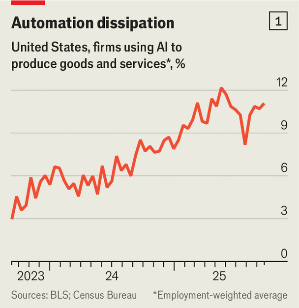
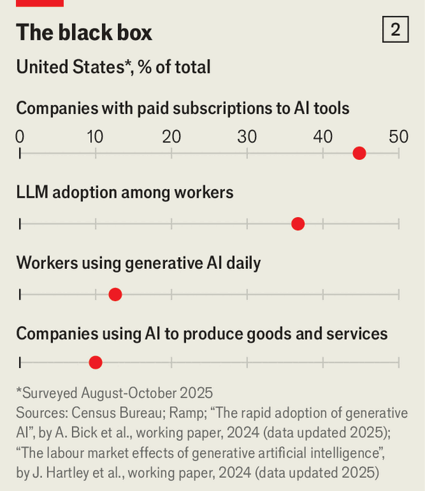
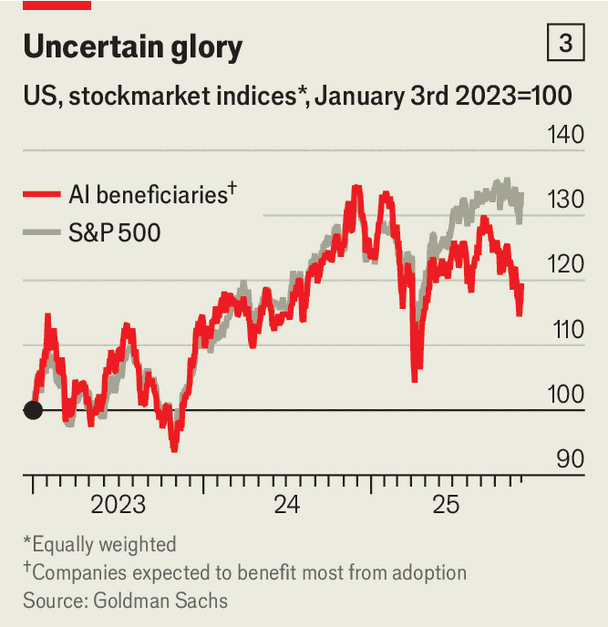

Finance & economics | Generally Paused Technology
Investors expect AI use to soar. That’s not happening
Recent surveys point to flatlining business adoption
November 27th 2025

On November 20th American statisticians released the results of a survey. Buried in the data is a trend with implications for trillions of dollars of spending. Researchers at the Census Bureau ask firms if they have used artificial intelligence “in producing goods and services” in the past two weeks. Recently, we estimate, the employment-weighted share of Americans using AI at work has fallen by a percentage point, and now sits at 11% (see chart 1). Adoption has fallen sharply at the largest businesses, those employing over 250 people. Three years into the generative-AI wave, demand for the technology looks surprisingly flimsy. Whether AI adoption is fast or slow has profound consequences. For the world to reap productivity gains from AI, normal businesses must incorporate the tech into their day-to-day operations. It is also the most important question in determining whether or not the world is in an AI bubble. From today until 2030 big tech firms will spend $5trn on infrastructure to supply AI services. To make those investments worthwhile, they will need on the order of $650bn a year in AI revenues, according to JPMorgan Chase, a bank, up from about $50bn a year today. People paying for AI in their personal lives will probably buy only a fraction of what is ultimately required. Businesses must do the rest.

- **november**：/[音标待填写]/ "november的中文释义待填写"；文中用来表达xxx意思；补充说明（如有）
- **american**：/[音标待填写]/ "american的中文释义待填写"；文中用来表达xxx意思；补充说明（如有）
- **statisticians**：/[音标待填写]/ "statisticians的中文释义待填写"；文中用来表达xxx意思；补充说明（如有）
- **released**：/[音标待填写]/ "released的中文释义待填写"；文中用来表达xxx意思；补充说明（如有）
- **results**：/[音标待填写]/ "results的中文释义待填写"；文中用来表达xxx意思；补充说明（如有）
- **survey**：/[音标待填写]/ "survey的中文释义待填写"；文中用来表达xxx意思；补充说明（如有）
- **buried**：/[音标待填写]/ "buried的中文释义待填写"；文中用来表达xxx意思；补充说明（如有）
- **data**：/[音标待填写]/ "data的中文释义待填写"；文中用来表达xxx意思；补充说明（如有）
- **trend**：/[音标待填写]/ "trend的中文释义待填写"；文中用来表达xxx意思；补充说明（如有）
- **implications**：/[音标待填写]/ "implications的中文释义待填写"；文中用来表达xxx意思；补充说明（如有）

The Census Bureau is just one source. Other researchers are compiling their own estimates of AI adoption; most find that the level is higher than 10% (see chart 2) . Economists argue about why these differences exist. Some believe that the Census Bureau’s survey is too restrictive (it is difficult to know exactly how respondents will interpret “use AI in producing goods and services”). Asking employees about their own use at work might elicit more positive responses than asking managers about their business. The bureau’s fans counter that only the government has the extensive network

- **census**：/[音标待填写]/ "census的中文释义待填写"；文中用来表达xxx意思；补充说明（如有）
- **bureau**：/[音标待填写]/ "bureau的中文释义待填写"；文中用来表达xxx意思；补充说明（如有）
- **just**：/[音标待填写]/ "just的中文释义待填写"；文中用来表达xxx意思；补充说明（如有）
- **source**：/[音标待填写]/ "source的中文释义待填写"；文中用来表达xxx意思；补充说明（如有）
- **researchers**：/[音标待填写]/ "researchers的中文释义待填写"；文中用来表达xxx意思；补充说明（如有）
- **compiling**：/[音标待填写]/ "compiling的中文释义待填写"；文中用来表达xxx意思；补充说明（如有）
- **estimates**：/[音标待填写]/ "estimates的中文释义待填写"；文中用来表达xxx意思；补充说明（如有）
- **adoption**：/[音标待填写]/ "adoption的中文释义待填写"；文中用来表达xxx意思；补充说明（如有）
- **find**：/[音标待填写]/ "find的中文释义待填写"；文中用来表达xxx意思；补充说明（如有）
- **level**：/[音标待填写]/ "level的中文释义待填写"；文中用来表达xxx意思；补充说明（如有）

necessary to sample a truly representative cross-section of American businesses, and not just those in more innovative industries such as coding.

- **necessary**：/[音标待填写]/ "necessary的中文释义待填写"；文中用来表达xxx意思；补充说明（如有）
- **sample**：/[音标待填写]/ "sample的中文释义待填写"；文中用来表达xxx意思；补充说明（如有）
- **truly**：/[音标待填写]/ "truly的中文释义待填写"；文中用来表达xxx意思；补充说明（如有）
- **representative**：/[音标待填写]/ "representative的中文释义待填写"；文中用来表达xxx意思；补充说明（如有）
- **cross**：/[音标待填写]/ "cross的中文释义待填写"；文中用来表达xxx意思；补充说明（如有）
- **section**：/[音标待填写]/ "section的中文释义待填写"；文中用来表达xxx意思；补充说明（如有）
- **american**：/[音标待填写]/ "american的中文释义待填写"；文中用来表达xxx意思；补充说明（如有）
- **businesses**：/[音标待填写]/ "businesses的中文释义待填写"；文中用来表达xxx意思；补充说明（如有）
- **just**：/[音标待填写]/ "just的中文释义待填写"；文中用来表达xxx意思；补充说明（如有）
- **innovative**：/[音标待填写]/ "innovative的中文释义待填写"；文中用来表达xxx意思；补充说明（如有）

Even unofficial surveys point to stagnating corporate adoption. Jon Hartley of Stanford University and colleagues found that in September 37% of Americans used generative AI at work, down from 46% in June. A tracker by Alex Bick of the Federal Reserve Bank of St Louis and colleagues revealed that, in August 2024, 12.1% of working-age adults used generative AI every day at work. A year later 12.6% did. Ramp, a fintech firm, finds that in early 2025 AI use soared at American firms to 40%, before levelling off. The growth in adoption really does seem to be slowing.

- **even**：/[音标待填写]/ "even的中文释义待填写"；文中用来表达xxx意思；补充说明（如有）
- **unofficial**：/[音标待填写]/ "unofficial的中文释义待填写"；文中用来表达xxx意思；补充说明（如有）
- **surveys**：/[音标待填写]/ "surveys的中文释义待填写"；文中用来表达xxx意思；补充说明（如有）
- **point**：/[音标待填写]/ "point的中文释义待填写"；文中用来表达xxx意思；补充说明（如有）
- **stagnating**：/[音标待填写]/ "stagnating的中文释义待填写"；文中用来表达xxx意思；补充说明（如有）
- **corporate**：/[音标待填写]/ "corporate的中文释义待填写"；文中用来表达xxx意思；补充说明（如有）
- **adoption**：/[音标待填写]/ "adoption的中文释义待填写"；文中用来表达xxx意思；补充说明（如有）
- **hartley**：/[音标待填写]/ "hartley的中文释义待填写"；文中用来表达xxx意思；补充说明（如有）
- **stanford**：/[音标待填写]/ "stanford的中文释义待填写"；文中用来表达xxx意思；补充说明（如有）
- **university**：/[音标待填写]/ "university的中文释义待填写"；文中用来表达xxx意思；补充说明（如有）

One possible explanation is economic uncertainty, which has been heightened by trade wars, falling immigration and an uncertain outlook for interest rates. Businesses may be holding off on investment until the fog clears. In addition, history suggests that technology tends to spread in fits and starts. Consider use of the computer within American households,

- **possible**：/[音标待填写]/ "possible的中文释义待填写"；文中用来表达xxx意思；补充说明（如有）
- **explanation**：/[音标待填写]/ "explanation的中文释义待填写"；文中用来表达xxx意思；补充说明（如有）
- **economic**：/[音标待填写]/ "economic的中文释义待填写"；文中用来表达xxx意思；补充说明（如有）
- **uncertainty**：/[音标待填写]/ "uncertainty的中文释义待填写"；文中用来表达xxx意思；补充说明（如有）
- **heightened**：/[音标待填写]/ "heightened的中文释义待填写"；文中用来表达xxx意思；补充说明（如有）
- **trade**：/[音标待填写]/ "trade的中文释义待填写"；文中用来表达xxx意思；补充说明（如有）
- **wars**：/[音标待填写]/ "wars的中文释义待填写"；文中用来表达xxx意思；补充说明（如有）
- **falling**：/[音标待填写]/ "falling的中文释义待填写"；文中用来表达xxx意思；补充说明（如有）
- **immigration**：/[音标待填写]/ "immigration的中文释义待填写"；文中用来表达xxx意思；补充说明（如有）
- **uncertain**：/[音标待填写]/ "uncertain的中文释义待填写"；文中用来表达xxx意思；补充说明（如有）

where the speed of adoption slowed in the late 1980s. This was a mere blip before the 1990s, when they invaded American homes.

- **speed**：/[音标待填写]/ "speed的中文释义待填写"；文中用来表达xxx意思；补充说明（如有）
- **adoption**：/[音标待填写]/ "adoption的中文释义待填写"；文中用来表达xxx意思；补充说明（如有）
- **slowed**：/[音标待填写]/ "slowed的中文释义待填写"；文中用来表达xxx意思；补充说明（如有）
- **late**：/[音标待填写]/ "late的中文释义待填写"；文中用来表达xxx意思；补充说明（如有）
- **mere**：/[音标待填写]/ "mere的中文释义待填写"；文中用来表达xxx意思；补充说明（如有）
- **blip**：/[音标待填写]/ "blip的中文释义待填写"；文中用来表达xxx意思；补充说明（如有）
- **before**：/[音标待填写]/ "before的中文释义待填写"；文中用来表达xxx意思；补充说明（如有）
- **invaded**：/[音标待填写]/ "invaded的中文释义待填写"；文中用来表达xxx意思；补充说明（如有）
- **american**：/[音标待填写]/ "american的中文释义待填写"；文中用来表达xxx意思；补充说明（如有）

There could, however, be less benign explanations for AI’s adoption stagnation. One relates to power dynamics within firms. Almost everyone in senior management sings the praises of AI. In recent earnings calls, nearly two-thirds of executives at S&P 500 companies mentioned AI. At the same time, the people actually responsible for implementing AI may not be as forward-thinking, perhaps because they are worried about the tech putting them out of a job. A survey by Dayforce, a software firm, finds that while 87% of executives use AI on the job, just 57% of managers and 27% of employees do. Perhaps middle managers set up AI initiatives to satisfy their superiors’ demands, only to wind them down quietly at a later date.

- **there**：/[音标待填写]/ "there的中文释义待填写"；文中用来表达xxx意思；补充说明（如有）
- **however**：/[音标待填写]/ "however的中文释义待填写"；文中用来表达xxx意思；补充说明（如有）
- **less**：/[音标待填写]/ "less的中文释义待填写"；文中用来表达xxx意思；补充说明（如有）
- **benign**：/[音标待填写]/ "benign的中文释义待填写"；文中用来表达xxx意思；补充说明（如有）
- **explanations**：/[音标待填写]/ "explanations的中文释义待填写"；文中用来表达xxx意思；补充说明（如有）
- **adoption**：/[音标待填写]/ "adoption的中文释义待填写"；文中用来表达xxx意思；补充说明（如有）
- **stagnation**：/[音标待填写]/ "stagnation的中文释义待填写"；文中用来表达xxx意思；补充说明（如有）
- **relates**：/[音标待填写]/ "relates的中文释义待填写"；文中用来表达xxx意思；补充说明（如有）
- **power**：/[音标待填写]/ "power的中文释义待填写"；文中用来表达xxx意思；补充说明（如有）
- **dynamics**：/[音标待填写]/ "dynamics的中文释义待填写"；文中用来表达xxx意思；补充说明（如有）

Changing perceptions of AI’s usefulness could be another reason for the adoption stagnation. Evidence is mounting that the current generation of models is not able to transform the productivity of most firms. To the extent that existing users of AI come to believe that it has an unimpressive return, potential users may hold off on adopting it. Three bits of evidence could give would-be adopters pause.

- **changing**：/[音标待填写]/ "changing的中文释义待填写"；文中用来表达xxx意思；补充说明（如有）
- **perceptions**：/[音标待填写]/ "perceptions的中文释义待填写"；文中用来表达xxx意思；补充说明（如有）
- **usefulness**：/[音标待填写]/ "usefulness的中文释义待填写"；文中用来表达xxx意思；补充说明（如有）
- **another**：/[音标待填写]/ "another的中文释义待填写"；文中用来表达xxx意思；补充说明（如有）
- **reason**：/[音标待填写]/ "reason的中文释义待填写"；文中用来表达xxx意思；补充说明（如有）
- **adoption**：/[音标待填写]/ "adoption的中文释义待填写"；文中用来表达xxx意思；补充说明（如有）
- **stagnation**：/[音标待填写]/ "stagnation的中文释义待填写"；文中用来表达xxx意思；补充说明（如有）
- **evidence**：/[音标待填写]/ "evidence的中文释义待填写"；文中用来表达xxx意思；补充说明（如有）
- **mounting**：/[音标待填写]/ "mounting的中文释义待填写"；文中用来表达xxx意思；补充说明（如有）
- **current**：/[音标待填写]/ "current的中文释义待填写"；文中用来表达xxx意思；补充说明（如有）

First, evidence from the public markets. Goldman Sachs produces an index of companies with the “largest estimated potential change to baseline earnings from AI adoption via increased productivity”. The bank’s index includes Ford, a carmaker; H&R Block, a tax-preparation firm; and News Corp, a media company—all of which are embracing AI initiatives. For a long time these firms’ share prices tracked the market. Recently, though, the index has trailed (see chart 3). Investors, at least so far, do not see AI adoption translating into improved profitability or growth.

- **evidence**：/[音标待填写]/ "evidence的中文释义待填写"；文中用来表达xxx意思；补充说明（如有）
- **public**：/[音标待填写]/ "public的中文释义待填写"；文中用来表达xxx意思；补充说明（如有）
- **markets**：/[音标待填写]/ "markets的中文释义待填写"；文中用来表达xxx意思；补充说明（如有）
- **goldman**：/[音标待填写]/ "goldman的中文释义待填写"；文中用来表达xxx意思；补充说明（如有）
- **sachs**：/[音标待填写]/ "sachs的中文释义待填写"；文中用来表达xxx意思；补充说明（如有）
- **produces**：/[音标待填写]/ "produces的中文释义待填写"；文中用来表达xxx意思；补充说明（如有）
- **index**：/[音标待填写]/ "index的中文释义待填写"；文中用来表达xxx意思；补充说明（如有）
- **companies**：/[音标待填写]/ "companies的中文释义待填写"；文中用来表达xxx意思；补充说明（如有）
- **largest**：/[音标待填写]/ "largest的中文释义待填写"；文中用来表达xxx意思；补充说明（如有）
- **estimated**：/[音标待填写]/ "estimated的中文释义待填写"；文中用来表达xxx意思；补充说明（如有）

Second, survey evidence. According to a poll of executives by Deloitte, a consultancy, and the Centre for AI, Management and Organisation at Hong Kong University, 45% reported returns from AI initiatives that were below their expectations. Only 10% reported their expectations being exceeded. A study by McKinsey, another consultancy, argued that for most organisations, the use of AI has not yet significantly affected enterprise- wide profits.

- **survey**：/[音标待填写]/ "survey的中文释义待填写"；文中用来表达xxx意思；补充说明（如有）
- **evidence**：/[音标待填写]/ "evidence的中文释义待填写"；文中用来表达xxx意思；补充说明（如有）
- **according**：/[音标待填写]/ "according的中文释义待填写"；文中用来表达xxx意思；补充说明（如有）
- **poll**：/[音标待填写]/ "poll的中文释义待填写"；文中用来表达xxx意思；补充说明（如有）
- **executives**：/[音标待填写]/ "executives的中文释义待填写"；文中用来表达xxx意思；补充说明（如有）
- **deloitte**：/[音标待填写]/ "deloitte的中文释义待填写"；文中用来表达xxx意思；补充说明（如有）
- **consultancy**：/[音标待填写]/ "consultancy的中文释义待填写"；文中用来表达xxx意思；补充说明（如有）
- **centre**：/[音标待填写]/ "centre的中文释义待填写"；文中用来表达xxx意思；补充说明（如有）
- **management**：/[音标待填写]/ "management的中文释义待填写"；文中用来表达xxx意思；补充说明（如有）
- **organisation**：/[音标待填写]/ "organisation的中文释义待填写"；文中用来表达xxx意思；补充说明（如有）

Third, economics research. At least in the short term, introducing AI may reduce productivity in unexpected ways. Efforts to rewire IT systems and workflows may temporarily depress efficiency, before it eventually shoots up—a phenomenon Erik Brynjolfsson of Stanford University has called the “productivity J-curve”. Some wonder if there is another problem that is specific to AI. A paper by Yvonne Chen of ShanghaiTech University and colleagues refers to “genAI’s mediocrity trap”. With the assistance of the tech, people can produce something “good enough”. This helps weaker workers. But the paper finds it can harm the productivity of better ones, who decide to work less hard.

- **third**：/[音标待填写]/ "third的中文释义待填写"；文中用来表达xxx意思；补充说明（如有）
- **economics**：/[音标待填写]/ "economics的中文释义待填写"；文中用来表达xxx意思；补充说明（如有）
- **research**：/[音标待填写]/ "research的中文释义待填写"；文中用来表达xxx意思；补充说明（如有）
- **least**：/[音标待填写]/ "least的中文释义待填写"；文中用来表达xxx意思；补充说明（如有）
- **term**：/[音标待填写]/ "term的中文释义待填写"；文中用来表达xxx意思；补充说明（如有）
- **introducing**：/[音标待填写]/ "introducing的中文释义待填写"；文中用来表达xxx意思；补充说明（如有）
- **reduce**：/[音标待填写]/ "reduce的中文释义待填写"；文中用来表达xxx意思；补充说明（如有）
- **productivity**：/[音标待填写]/ "productivity的中文释义待填写"；文中用来表达xxx意思；补充说明（如有）
- **unexpected**：/[音标待填写]/ "unexpected的中文释义待填写"；文中用来表达xxx意思；补充说明（如有）
- **efforts**：/[音标待填写]/ "efforts的中文释义待填写"；文中用来表达xxx意思；补充说明（如有）

Organisations will learn how to incorporate AI more efficiently, while the models themselves should continue to improve. If evidence mounts of the transformative effect of the tech on workplace efficiency, more companies will come to realise that they cannot do without it. Even if this happens, however, the pause suggests that the economic pay-off from AI will arrive more slowly, more unevenly and at a greater cost than implied by the current investment boom. Until adoption accelerates rapidly, the revenues required to justify $5trn in AI capex will remain out of reach. ■

- **organisations**：/[音标待填写]/ "organisations的中文释义待填写"；文中用来表达xxx意思；补充说明（如有）
- **learn**：/[音标待填写]/ "learn的中文释义待填写"；文中用来表达xxx意思；补充说明（如有）
- **incorporate**：/[音标待填写]/ "incorporate的中文释义待填写"；文中用来表达xxx意思；补充说明（如有）
- **efficiently**：/[音标待填写]/ "efficiently的中文释义待填写"；文中用来表达xxx意思；补充说明（如有）
- **while**：/[音标待填写]/ "while的中文释义待填写"；文中用来表达xxx意思；补充说明（如有）
- **models**：/[音标待填写]/ "models的中文释义待填写"；文中用来表达xxx意思；补充说明（如有）
- **themselves**：/[音标待填写]/ "themselves的中文释义待填写"；文中用来表达xxx意思；补充说明（如有）
- **continue**：/[音标待填写]/ "continue的中文释义待填写"；文中用来表达xxx意思；补充说明（如有）
- **improve**：/[音标待填写]/ "improve的中文释义待填写"；文中用来表达xxx意思；补充说明（如有）
- **evidence**：/[音标待填写]/ "evidence的中文释义待填写"；文中用来表达xxx意思；补充说明（如有）

For more expert analysis of the biggest stories in economics, finance and markets, sign up to Money Talks, our weekly subscriber-only newsletter.

- **expert**：/[音标待填写]/ "expert的中文释义待填写"；文中用来表达xxx意思；补充说明（如有）
- **analysis**：/[音标待填写]/ "analysis的中文释义待填写"；文中用来表达xxx意思；补充说明（如有）
- **biggest**：/[音标待填写]/ "biggest的中文释义待填写"；文中用来表达xxx意思；补充说明（如有）
- **stories**：/[音标待填写]/ "stories的中文释义待填写"；文中用来表达xxx意思；补充说明（如有）
- **economics**：/[音标待填写]/ "economics的中文释义待填写"；文中用来表达xxx意思；补充说明（如有）
- **finance**：/[音标待填写]/ "finance的中文释义待填写"；文中用来表达xxx意思；补充说明（如有）
- **markets**：/[音标待填写]/ "markets的中文释义待填写"；文中用来表达xxx意思；补充说明（如有）
- **sign**：/[音标待填写]/ "sign的中文释义待填写"；文中用来表达xxx意思；补充说明（如有）
- **money**：/[音标待填写]/ "money的中文释义待填写"；文中用来表达xxx意思；补充说明（如有）
- **talks**：/[音标待填写]/ "talks的中文释义待填写"；文中用来表达xxx意思；补充说明（如有）
