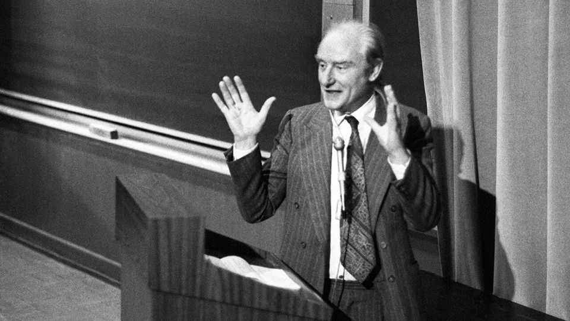
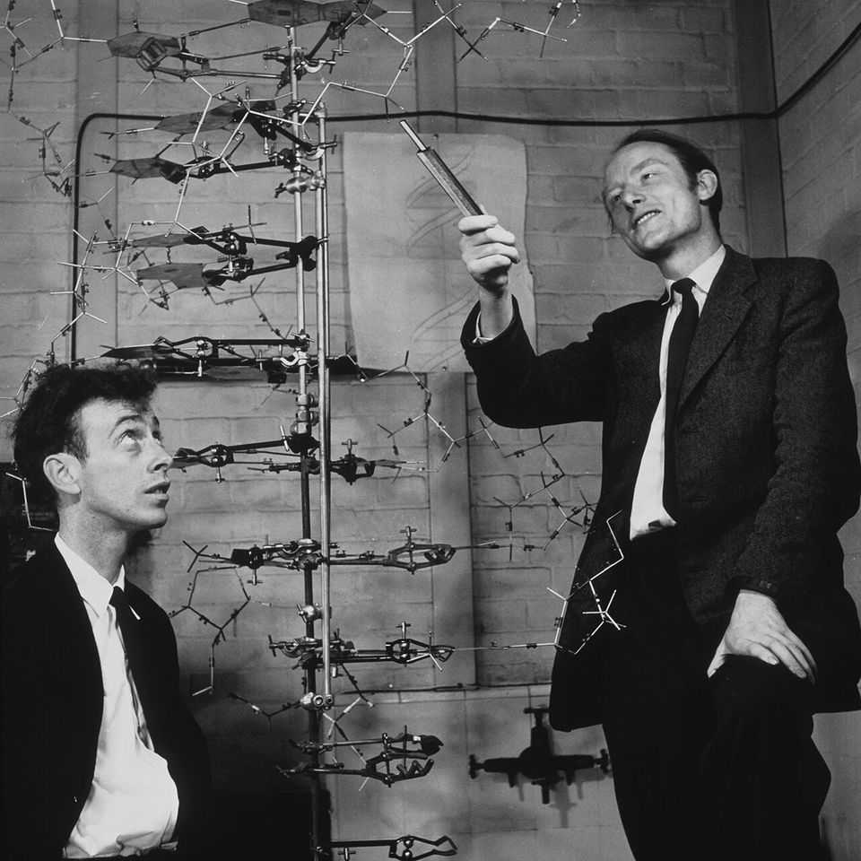

Culture | The history of biology
Francis Crick was an extraordinary scientist—and a flawed man
He was unafraid of getting things wrong or offending his peers
November 27th 2025

IN FEBRUARY 1953, after five weeks of intense work, Francis Crick (pictured) and James Watson solved one of biology’s most fundamental puzzles: the structure of DNA. Their discovery—the double helix—had little to do with Crick’s doctoral thesis at Cambridge, but it was the problem that fascinated him most at the time. Other scientists had been closing in on the structure. Crick was, as one of his contemporaries put it, “the sort of chap who was always doing someone else’s crossword”.

- **february**：/[音标待填写]/ "february的中文释义待填写"；文中用来表达xxx意思；补充说明（如有）
- **after**：/[音标待填写]/ "after的中文释义待填写"；文中用来表达xxx意思；补充说明（如有）
- **five**：/[音标待填写]/ "five的中文释义待填写"；文中用来表达xxx意思；补充说明（如有）
- **weeks**：/[音标待填写]/ "weeks的中文释义待填写"；文中用来表达xxx意思；补充说明（如有）
- **intense**：/[音标待填写]/ "intense的中文释义待填写"；文中用来表达xxx意思；补充说明（如有）
- **francis**：/[音标待填写]/ "francis的中文释义待填写"；文中用来表达xxx意思；补充说明（如有）
- **crick**：/[音标待填写]/ "crick的中文释义待填写"；文中用来表达xxx意思；补充说明（如有）
- **pictured**：/[音标待填写]/ "pictured的中文释义待填写"；文中用来表达xxx意思；补充说明（如有）
- **james**：/[音标待填写]/ "james的中文释义待填写"；文中用来表达xxx意思；补充说明（如有）
- **watson**：/[音标待填写]/ "watson的中文释义待填写"；文中用来表达xxx意思；补充说明（如有）

After the double helix came many more discoveries, often on other scientists’ turf. Crick proposed the mechanism by which DNA was translated into protein and helped crack the genetic code. He contributed to the understanding of collagen’s structure, devised prescient theories of embryonic development and later turned his attention to the neural basis of consciousness. A new biography by Matthew Cobb, a zoologist at the University of Manchester, uses these discoveries to study the mind that produced them, revealing the traits that made Crick one of the 20th century’s greatest scientists.

- **after**：/[音标待填写]/ "after的中文释义待填写"；文中用来表达xxx意思；补充说明（如有）
- **double**：/[音标待填写]/ "double的中文释义待填写"；文中用来表达xxx意思；补充说明（如有）
- **helix**：/[音标待填写]/ "helix的中文释义待填写"；文中用来表达xxx意思；补充说明（如有）
- **came**：/[音标待填写]/ "came的中文释义待填写"；文中用来表达xxx意思；补充说明（如有）
- **discoveries**：/[音标待填写]/ "discoveries的中文释义待填写"；文中用来表达xxx意思；补充说明（如有）
- **often**：/[音标待填写]/ "often的中文释义待填写"；文中用来表达xxx意思；补充说明（如有）
- **scientists**：/[音标待填写]/ "scientists的中文释义待填写"；文中用来表达xxx意思；补充说明（如有）
- **turf**：/[音标待填写]/ "turf的中文释义待填写"；文中用来表达xxx意思；补充说明（如有）
- **crick**：/[音标待填写]/ "crick的中文释义待填写"；文中用来表达xxx意思；补充说明（如有）
- **proposed**：/[音标待填写]/ "proposed的中文释义待填写"；文中用来表达xxx意思；补充说明（如有）

Crick was competitive—sometimes unscrupulously so—and unafraid of offending others. In Britain the race to determine DNA’s structure was centred not around Cambridge, but King’s College London, where Maurice Wilkins and Rosalind Franklin were taking X-rays of DNA fibres. Crick’s and Watson’s success depended in part on data from King’s that they used without permission. (In 1962 Crick, Watson and Wilkins shared the Nobel prize in medicine; Franklin had died in 1958.)

- **crick**：/[音标待填写]/ "crick的中文释义待填写"；文中用来表达xxx意思；补充说明（如有）
- **competitive**：/[音标待填写]/ "competitive的中文释义待填写"；文中用来表达xxx意思；补充说明（如有）
- **sometimes**：/[音标待填写]/ "sometimes的中文释义待填写"；文中用来表达xxx意思；补充说明（如有）
- **unscrupulously**：/[音标待填写]/ "unscrupulously的中文释义待填写"；文中用来表达xxx意思；补充说明（如有）
- **unafraid**：/[音标待填写]/ "unafraid的中文释义待填写"；文中用来表达xxx意思；补充说明（如有）
- **offending**：/[音标待填写]/ "offending的中文释义待填写"；文中用来表达xxx意思；补充说明（如有）
- **others**：/[音标待填写]/ "others的中文释义待填写"；文中用来表达xxx意思；补充说明（如有）
- **britain**：/[音标待填写]/ "britain的中文释义待填写"；文中用来表达xxx意思；补充说明（如有）
- **race**：/[音标待填写]/ "race的中文释义待填写"；文中用来表达xxx意思；补充说明（如有）
- **determine**：/[音标待填写]/ "determine的中文释义待填写"；文中用来表达xxx意思；补充说明（如有）

He excelled at explaining scientific ideas and often did so to the public. Crick’s lectures were famous for their energy and scope; his research papers are still admired for their clarity. Most of his best ideas came from conversations with peers. In Cambridge he bounced hypotheses off Watson and then Sydney Brenner; later in life, after his move to the Salk Institute in San Diego, Christof Koch, a neuroscientist, became his sparring partner. Colleagues reported hearing Crick constantly “prattle away in his loud voice”.

- **excelled**：/[音标待填写]/ "excelled的中文释义待填写"；文中用来表达xxx意思；补充说明（如有）
- **explaining**：/[音标待填写]/ "explaining的中文释义待填写"；文中用来表达xxx意思；补充说明（如有）
- **scientific**：/[音标待填写]/ "scientific的中文释义待填写"；文中用来表达xxx意思；补充说明（如有）
- **ideas**：/[音标待填写]/ "ideas的中文释义待填写"；文中用来表达xxx意思；补充说明（如有）
- **often**：/[音标待填写]/ "often的中文释义待填写"；文中用来表达xxx意思；补充说明（如有）
- **public**：/[音标待填写]/ "public的中文释义待填写"；文中用来表达xxx意思；补充说明（如有）
- **crick**：/[音标待填写]/ "crick的中文释义待填写"；文中用来表达xxx意思；补充说明（如有）
- **lectures**：/[音标待填写]/ "lectures的中文释义待填写"；文中用来表达xxx意思；补充说明（如有）
- **famous**：/[音标待填写]/ "famous的中文释义待填写"；文中用来表达xxx意思；补充说明（如有）
- **energy**：/[音标待填写]/ "energy的中文释义待填写"；文中用来表达xxx意思；补充说明（如有）

In these “mad sessions”, Crick tested ideas to see which survived contact with reality. He was analytical, but his biggest discoveries relied on trial and error and on what he called his “don’t worry method”. A theory, he argued, should not be rejected merely because some evidence failed to fit: data could be flawed and measurements could be wrong. The art was knowing which anomalies to discard—a matter, he thought, of “biological intuition”.

- **sessions**：/[音标待填写]/ "sessions的中文释义待填写"；文中用来表达xxx意思；补充说明（如有）
- **crick**：/[音标待填写]/ "crick的中文释义待填写"；文中用来表达xxx意思；补充说明（如有）
- **tested**：/[音标待填写]/ "tested的中文释义待填写"；文中用来表达xxx意思；补充说明（如有）
- **ideas**：/[音标待填写]/ "ideas的中文释义待填写"；文中用来表达xxx意思；补充说明（如有）
- **survived**：/[音标待填写]/ "survived的中文释义待填写"；文中用来表达xxx意思；补充说明（如有）
- **contact**：/[音标待填写]/ "contact的中文释义待填写"；文中用来表达xxx意思；补充说明（如有）
- **reality**：/[音标待填写]/ "reality的中文释义待填写"；文中用来表达xxx意思；补充说明（如有）
- **analytical**：/[音标待填写]/ "analytical的中文释义待填写"；文中用来表达xxx意思；补充说明（如有）
- **biggest**：/[音标待填写]/ "biggest的中文释义待填写"；文中用来表达xxx意思；补充说明（如有）
- **discoveries**：/[音标待填写]/ "discoveries的中文释义待填写"；文中用来表达xxx意思；补充说明（如有）

Yet Crick was not afraid to be wrong. Before settling on the double helix, he proposed a triple one. He published an incorrect structure of collagen and a mistaken theory about the genetic code. In one paper he argued that life on Earth began from microbes sent by extraterrestrial beings.

- **crick**：/[音标待填写]/ "crick的中文释义待填写"；文中用来表达xxx意思；补充说明（如有）
- **afraid**：/[音标待填写]/ "afraid的中文释义待填写"；文中用来表达xxx意思；补充说明（如有）
- **before**：/[音标待填写]/ "before的中文释义待填写"；文中用来表达xxx意思；补充说明（如有）
- **settling**：/[音标待填写]/ "settling的中文释义待填写"；文中用来表达xxx意思；补充说明（如有）
- **double**：/[音标待填写]/ "double的中文释义待填写"；文中用来表达xxx意思；补充说明（如有）
- **helix**：/[音标待填写]/ "helix的中文释义待填写"；文中用来表达xxx意思；补充说明（如有）
- **proposed**：/[音标待填写]/ "proposed的中文释义待填写"；文中用来表达xxx意思；补充说明（如有）
- **triple**：/[音标待填写]/ "triple的中文释义待填写"；文中用来表达xxx意思；补充说明（如有）
- **published**：/[音标待填写]/ "published的中文释义待填写"；文中用来表达xxx意思；补充说明（如有）
- **incorrect**：/[音标待填写]/ "incorrect的中文释义待填写"；文中用来表达xxx意思；补充说明（如有）

His unconventional career also probably contributed to his success. Crick came to science late, completing his PhD at 37. He preferred theory to experiments, leaving the fiddly, time-consuming lab work to others. He did very little admin or teaching. Unlike most academics, past and present, he had the privilege of spending most of his time reading and thinking.

- **unconventional**：/[音标待填写]/ "unconventional的中文释义待填写"；文中用来表达xxx意思；补充说明（如有）
- **career**：/[音标待填写]/ "career的中文释义待填写"；文中用来表达xxx意思；补充说明（如有）
- **also**：/[音标待填写]/ "also的中文释义待填写"；文中用来表达xxx意思；补充说明（如有）
- **probably**：/[音标待填写]/ "probably的中文释义待填写"；文中用来表达xxx意思；补充说明（如有）
- **contributed**：/[音标待填写]/ "contributed的中文释义待填写"；文中用来表达xxx意思；补充说明（如有）
- **success**：/[音标待填写]/ "success的中文释义待填写"；文中用来表达xxx意思；补充说明（如有）
- **crick**：/[音标待填写]/ "crick的中文释义待填写"；文中用来表达xxx意思；补充说明（如有）
- **came**：/[音标待填写]/ "came的中文释义待填写"；文中用来表达xxx意思；补充说明（如有）
- **science**：/[音标待填写]/ "science的中文释义待填写"；文中用来表达xxx意思；补充说明（如有）
- **late**：/[音标待填写]/ "late的中文释义待填写"；文中用来表达xxx意思；补充说明（如有）

This captivating biography is deeply researched and elegantly written. Crick is painted as an extraordinary mind—bold, curious and combative—and the book offers a glimpse of his colourful personal life, replete with parties, affairs, drugs and feuds. Professor Cobb does not shy away from describing his subject’s flaws: he points, for instance, to Crick’s interest in eugenics. But on the whole he is most interested in Crick’s scientific contributions.

- **captivating**：/[音标待填写]/ "captivating的中文释义待填写"；文中用来表达xxx意思；补充说明（如有）
- **biography**：/[音标待填写]/ "biography的中文释义待填写"；文中用来表达xxx意思；补充说明（如有）
- **deeply**：/[音标待填写]/ "deeply的中文释义待填写"；文中用来表达xxx意思；补充说明（如有）
- **researched**：/[音标待填写]/ "researched的中文释义待填写"；文中用来表达xxx意思；补充说明（如有）
- **elegantly**：/[音标待填写]/ "elegantly的中文释义待填写"；文中用来表达xxx意思；补充说明（如有）
- **written**：/[音标待填写]/ "written的中文释义待填写"；文中用来表达xxx意思；补充说明（如有）
- **crick**：/[音标待填写]/ "crick的中文释义待填写"；文中用来表达xxx意思；补充说明（如有）
- **painted**：/[音标待填写]/ "painted的中文释义待填写"；文中用来表达xxx意思；补充说明（如有）
- **extraordinary**：/[音标待填写]/ "extraordinary的中文释义待填写"；文中用来表达xxx意思；补充说明（如有）
- **mind**：/[音标待填写]/ "mind的中文释义待填写"；文中用来表达xxx意思；补充说明（如有）

Had Crick and Watson not got there first, the structure of DNA would soon have been solved by someone else. But it was Crick’s grasp of the double helix’s implications that propelled biology forward. In the structure he deduced how DNA replicated itself and concluded that the sequence of bases was the source of genetic information. It may have been someone else’s crossword, but science is richer for Crick’s intervention. ■

- **crick**：/[音标待填写]/ "crick的中文释义待填写"；文中用来表达xxx意思；补充说明（如有）
- **watson**：/[音标待填写]/ "watson的中文释义待填写"；文中用来表达xxx意思；补充说明（如有）
- **there**：/[音标待填写]/ "there的中文释义待填写"；文中用来表达xxx意思；补充说明（如有）
- **structure**：/[音标待填写]/ "structure的中文释义待填写"；文中用来表达xxx意思；补充说明（如有）
- **soon**：/[音标待填写]/ "soon的中文释义待填写"；文中用来表达xxx意思；补充说明（如有）
- **solved**：/[音标待填写]/ "solved的中文释义待填写"；文中用来表达xxx意思；补充说明（如有）
- **someone**：/[音标待填写]/ "someone的中文释义待填写"；文中用来表达xxx意思；补充说明（如有）
- **else**：/[音标待填写]/ "else的中文释义待填写"；文中用来表达xxx意思；补充说明（如有）
- **grasp**：/[音标待填写]/ "grasp的中文释义待填写"；文中用来表达xxx意思；补充说明（如有）
- **double**：/[音标待填写]/ "double的中文释义待填写"；文中用来表达xxx意思；补充说明（如有）

For more on the latest books, films, TV shows, albums and controversies, sign up to Plot Twist, our weekly subscriber-only newsletter

- **latest**：/[音标待填写]/ "latest的中文释义待填写"；文中用来表达xxx意思；补充说明（如有）
- **books**：/[音标待填写]/ "books的中文释义待填写"；文中用来表达xxx意思；补充说明（如有）
- **films**：/[音标待填写]/ "films的中文释义待填写"；文中用来表达xxx意思；补充说明（如有）
- **shows**：/[音标待填写]/ "shows的中文释义待填写"；文中用来表达xxx意思；补充说明（如有）
- **albums**：/[音标待填写]/ "albums的中文释义待填写"；文中用来表达xxx意思；补充说明（如有）
- **controversies**：/[音标待填写]/ "controversies的中文释义待填写"；文中用来表达xxx意思；补充说明（如有）
- **sign**：/[音标待填写]/ "sign的中文释义待填写"；文中用来表达xxx意思；补充说明（如有）
- **plot**：/[音标待填写]/ "plot的中文释义待填写"；文中用来表达xxx意思；补充说明（如有）
- **twist**：/[音标待填写]/ "twist的中文释义待填写"；文中用来表达xxx意思；补充说明（如有）
- **weekly**：/[音标待填写]/ "weekly的中文释义待填写"；文中用来表达xxx意思；补充说明（如有）
