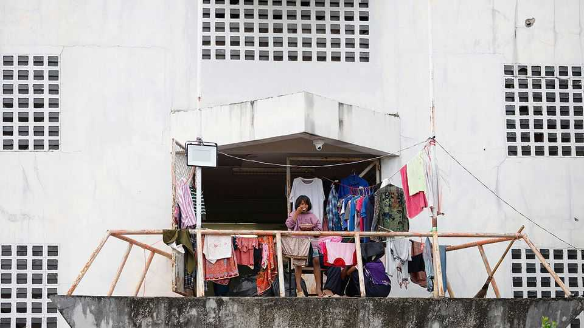

The world this week
Politics
December 11th 2025

Cambodia and Thailand blamed each other for the latest spate of fighting along their disputed border, which has displaced hundreds of thousands of people in the affected area and killed 19 so far. The two countries exchanged artillery fire and Thailand sent fighter jets to attack Cambodian bases in the worst clashes since an agreement to cease hostilities was signed in October. Last month Thailand suspended its participation in the ceasefire, claiming Cambodia was still laying landmines. Japan summoned China’s ambassador to complain about Chinese naval exercises that took place near Okinawa. Tensions are high between the two countries following remarks by Takaichi Sanae, the new Japanese prime minister, that Japan would respond if China attacked Taiwan. Japan also

monitored Russian military aircraft in the area. American bombers flew with Japanese jets in a show of support. South Korea also made an official complaint after Chinese and Russian aircraft entered its air-defence zone.

Hong Kong held elections to its legislature. The government tried to boost turnout with “thank-you cards” that could be used to get shopping discounts. But less than 32% of registered voters cast ballots, barely above a record low in 2021. Only vetted “patriots” were allowed to stand.

Australia’s ban on social media for children aged under 16 came into force. The first prohibition of its kind in the world will be watched closely by other countries considering whether to pass similar measures. The ten biggest platforms, including Instagram and TikTok, are now required to block accounts of the under-16s. Most will use age-inference technology that estimates how old users are from their online activity.

American farmers are to have access to a $12bn government aid package to help them cope with the disruption to food exports caused by the trade wars. The money will be offset by income that the government receives from tariffs.

Donald Trump denounced Europe’s leaders as “weak” and “so politically correct”. He said that mass migration had destroyed their countries, which won’t be “viable” for much longer. Mr Trump’s comments came soon after America published a new national security strategy, which contains the bluntest assessment yet of its divergence from European allies. The document talks of a “stark prospect of civilisational erasure” in Europe, and says America should help the region “correct its current trajectory”.

Volodymyr Zelensky held another meeting with the leaders of Britain, France and Germany, as he shores up European support to resist American pressure for him to concede Ukrainian land to Russia. Mr Trump’s envoys have reportedly told Mr Zelensky to agree to a deal before Christmas. The Ukrainian president did say he was willing to hold an election if America and other allies could guarantee its security at the polls. Mr Zelensky’s five-year term ended last year, which some people in Mr Trump’s circle are using to question whether Ukraine is a democracy.

Lithuania declared a state of emergency over the hundreds of balloons that have been launched from Belarus containing smuggled goods, such as

cigarettes. The balloons have forced Vilnius airport to close for dozens of hours in recent weeks. Lithuania says the floating flotillas form part of a “hybrid attack” by Belarus, Russia’s ally, aimed at disrupting its infrastructure.

Andrej Babis became prime minister of the Czech Republic after an election in October at which his populist-right party got the most votes. Mr Babis was also prime minister from 2017 to 2021 but has since tilted right. His cabinet will include politicians from the pro-Russia SPD and Motorists for Themselves, a party created to oppose the EU’s phasing out of petrol-powered cars.

The French government narrowly won a vital vote in the National Assembly on the social-security budget. Sébastien Lecornu, the prime minister, made concessions to the Socialists to secure their support, such as agreeing to freeze Emmanuel Macron’s pension reforms until 2027.

American federal agents seized an oil tanker off the coast of Venezuela. Pam Bondi, America’s attorney-general, said the vessel had for years broken American sanctions by transporting Iranian and Venezuelan oil, and that the FBI and other federal officers, with support from the military, had served a warrant. The Venezuelan government described America’s action as “theft” and “international piracy”.

No winner has been declared in Honduras’s election, which was held on November 30th, despite the count being all but complete. Nasry Asfura, the conservative candidate, who is supported by Mr Trump, holds a slim lead. His opponent, Salvador Nasralla, has alleged fraud and demanded a full recount. Left-wing politicians in Congress talked of an “electoral coup” and threatened not to validate the result. Meanwhile, the Honduran attorney-general sought the arrest on fraud charges of Juan Orlando Hernández, a former president who was serving time in the United States for conspiring to smuggle drugs until his recent pardon by Mr Trump.

Amid chaotic scenes Brazil’s lower house of Congress voted for a bill that could potentially slash the sentence handed down to Jair Bolsonaro from 27 years’ incarceration to two. Mr Bolsonaro, a former right-wing president, was convicted of conspiring to launch a coup after his election defeat and is being held in a federal jail. The Senate still has to approve the bill and it would be challenged in the Supreme Court.

Less than a week after Mr Trump hosted the presidents of Rwanda and the Democratic Republic of Congo in Washington to sign a peace deal, fighters from M23, a militia backed by Rwanda, took control of Uvira, a key city in eastern Congo. It is the biggest escalation in the long-running conflict for months. Dozens of people have been killed and around 200,000 have fled.

Syria celebrated a year since rebel forces led by Ahmed al-Sharaa ousted Bashar al-Assad, the country’s long-time dictator. In a speech to the nation Mr Sharaa, a former jihadist who is now Syria’s interim president, vowed to build a Syria for all Syrians. Since taking control there have been a number of outbreaks of sectarian violence involving forces loyal to his government.

Yasser Abu Shabab, a militia leader in Gaza backed by Israel, was killed in a gunfight. He was the head of the Popular Forces group and had promised to wrest control of Gaza from Hamas, though his fighters were vastly outnumbered.

Israel carried out air strikes on southern Lebanon less than a day after both countries held their first direct talks in decades. The talks were between civilian envoys. Israel has conducted near-daily strikes on Lebanon since a ceasefire was agreed to in November 2024.

The Christmas tree in Bethlehem was lit for the first time since 2022. The tree stands in front of the Nativity Church in the West Bank town. Many Palestinians attended the ceremony and expressed hope that, as the ceasefire in Gaza has largely held, the new year will usher in better times. Bethlehem’s mayor acknowledged that “It’s been a bad two years.”

This article was downloaded by zlibrary from https://www.economist.com//the-world-this- week/2025/12/11/politics