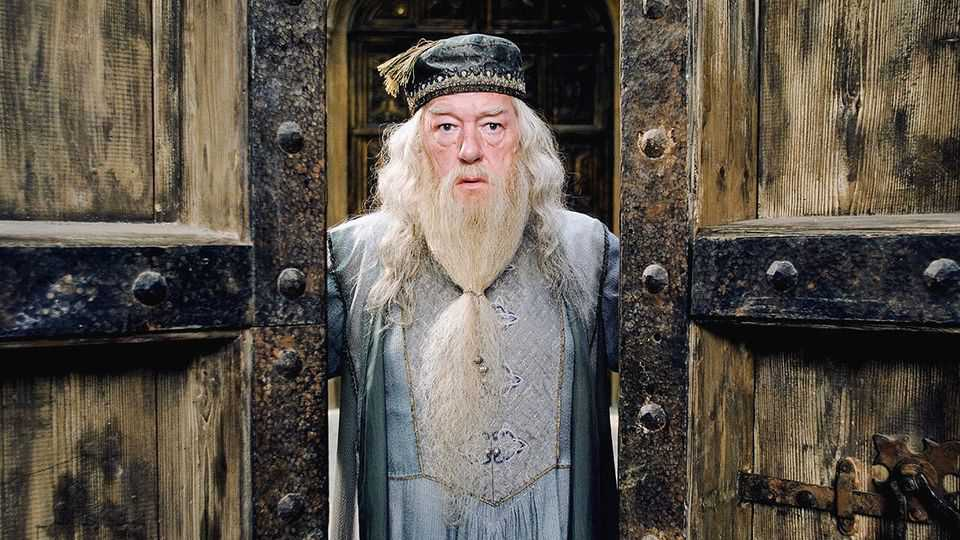

The world this week
Business
December 11th 2025

Hollywood was enthralled as a blockbuster takeover battle began for Warner Bros Discovery. Netflix submitted a friendly proposal valued at $83bn for most of the company, only to see Paramount mount a hostile bid with a $108bn offer for the whole firm. Donald Trump seemed to pour cold water on Netflix’s deal by raising antitrust concerns. Paramount is owned by David Ellison, backed by his father, Larry Ellison, a co-founder of Oracle, who reportedly called the president soon after Netflix made its announcement. For months Paramount had been the front-runner for Warner Bros, which has a huge movie back catalogue, including the Harry Potter films. Oracle’s latest earnings disappointed investors. The software company’s outlook of revenue and profit for the current quarter came in below analysts’

estimates, and it raised the amount it is spending on data centres by $15bn. That stirred up market concerns again about the vast sums being splashed out on AI.

The Federal Reserve lowered its key interest rate by a quarter of a percentage point, to a range of 3.5% to 3.75%. Divisions emerged between those arguing for a cut because of weak job growth and those who wanted to leave rates on hold to curb inflation. It was probably the Fed’s last meeting before Mr Trump chooses a successor to Jerome Powell as chairman. The president is said to favour Kevin Hassett, the head of the National Economic Council, and will make his announcement early next year.

Proving its success in pivoting to other markets to counter America’s tariffs, China’s yearly trade surplus in goods rose above $1trn for the first time. The surplus stood at $1.1trn for the first 11 months of 2025, beating the $992bn total for all of 2024. China’s exports to America may have plunged, but it has tapped other countries for new business. Exports to the EU have increased significantly, causing Emmanuel Macron to complain about “unbearable” imbalances in trade, which is what Mr Trump used to gripe about.

Mr Trump said he would allow Nvidia to sell its H200 chip in China, providing the American government gets a 25% cut of the proceeds (he didn’t say how this would work). The H200 is not as advanced as Nvidia’s more recent Blackwell or forthcoming Rubin chips. Despite Mr Trump’s loosening of export controls China’s government is reportedly discussing ways to limit Chinese firms’ reliance on Nvidia; it instead wants to boost its domestic semiconductor industry.

A federal judge struck down Mr Trump’s ban on new wind-power projects, which he announced on the same day he took office in January. The order was “arbitrary” and not legal, said the judge, who chided the administration for not sufficiently explaining why there had been such a big shift in established policy. The ruling is a victory for the wind-power industry, though it still has to operate under a hostile American government.

In India the government ordered IndiGo, the country’s biggest airline, to reduce the number of its flights by 10% to help stabilise operations. IndiGo has cancelled thousands of flights because of a shortage of pilots and has been criticised for failing to plan for new regulations that extend pilots’ rest time.

The government said it would temporarily relax those rules for IndiGo, to the fury of the pilots’ union.

Guillaume Faury, the chief executive of Airbus, admitted that his company would probably lose the annual competition in orders for planes to Boeing this year for the first time in six years. Boeing has seen strong demand for its 787 jet and has benefited from Mr Trump’s support in the trade wars. Airbus still leads in deliveries of aircraft to customers.

Facing pressure from an activist hedge fund to increase shareholder value, PepsiCo laid out plans to reduce costs and improve its core operating margin. The plan was approved by Elliott Management and avoids a drawn out proxy fight; the fund will now not have a seat on Pepsi’s board.

Unilever completed the divestment of its ice-cream assets in an initial public offering of shares in the business. Magnum Ice Cream ended up with a valuation of $9.2bn after its IPO on the Amsterdam stock exchange, which is less than had been expected. Investors may be unsure about the prospects for a company that sells sweet, high-calorie food given the craze for weight-loss drugs.

SpaceX is planning to launch an IPO, according to reports, possibly in the second half of 2026. The rocket startup apparently wants to raise at least $25bn from the listing, which would make it one of the biggest IPOs ever. The timing of the potential stock offering could change.

This article was downloaded by zlibrary from https://www.economist.com//the-world-this- week/2025/12/11/business