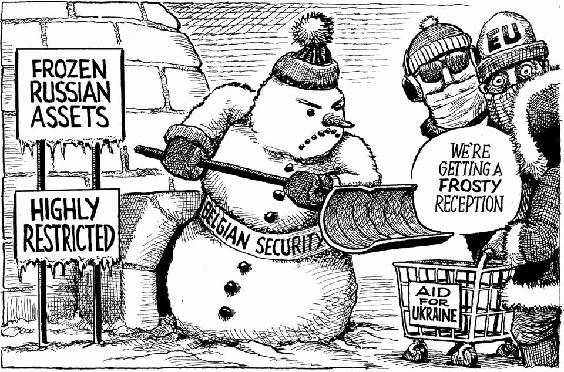

The world this week
The weekly cartoon
December 11th 2025

Dig deeper into the subject of this week’s cartoon: A crisis over using frozen Russian assets to help UkraineEnough dithering. Europe must pay to save UkraineWhat do you do with 191bn frozen euros owned by Russia? [February 2024] The editorial cartoon appears weekly in The Economist. You can see last week’s here. This article was downloaded by zlibrary from https://www.economist.com//the-world-this- week/2025/12/11/the-weekly-cartoon

Leaders

Can anyone stop Europe’s populist right? More reasons for America’s friends to plan for the worst Don’t fear China’s trillion-dollar trade surplus America’s Supreme Court should strike down Donald Trump’s tariffs The battle for Warner Bros is a prelude to the real streaming war