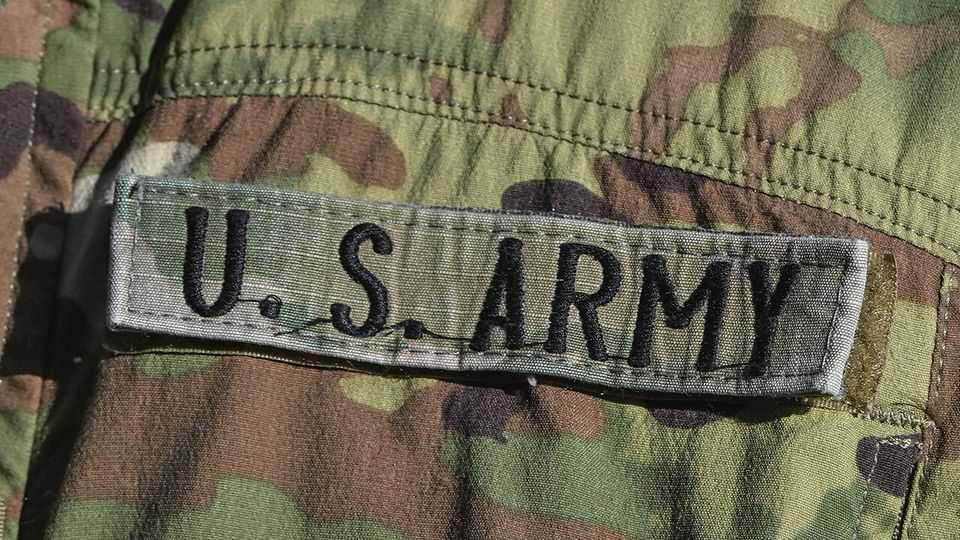

Leaders | The national security strategy
More reasons for America’s friends to plan for the worst
A strategy that scorns Europe, bullies Latin America and is vague on Asia
December 11th 2025

THE WORLD is becoming used to startling news from Washington. The Trump administration’s national security strategy (NSS), abruptly posted on its website in the middle of the night on December 4th/5th, once again left many policymakers, especially in Europe, in a panic. How worried should they be? Unfortunately, the answer is very, for two reasons. First, because America’s foreign policy, although still contested, seems more likely to move in a worse

direction than a better one; and second, because the erratic way in which policy is made means that allies cannot depend on anything that they are told, even by President Donald Trump himself and certainly not by his squabbling courtiers.

The 32-page document gives America’s oldest and closest friends plenty of scope for alarm. It declares the West’s greatest threat to be “mass migration”. To prevent it, the document pledges not just to secure America’s own borders, but also to support populist-right parties in Europe which promise to secure borders there. It fails to mention even the possibility that Russia might be a threat.

On its worst reading, you could see this as an American suggestion that Europe should fall within Russia’s sphere of influence. That is also the logic behind Mr Trump’s latest plans to stop the war in Ukraine by using frozen Russian assets to help revive business ties between Europe, Ukraine and Russia (and make money for American firms). This includes Europe once again buying Russian energy, a dependency the Kremlin exploited in 2022. Europe’s leaders are rightly sceptical.

Other regions also have cause to worry. The NSS announces that America will redeploy troops to ensure that America remains top dog in the western hemisphere, which will go down very badly in Latin America. The continent still resents 20th-century American campaigns of political interference and gunboat diplomacy. Even so, the “Donroe doctrine”, the idea that America must be pre-eminent in its own backyard, has been a feature of its foreign policy since January 20th.

On Asia the picture is more nuanced. The document is much less clear about the threat posed by China than the first Trump administration’s NSS, in 2017. Official thinking today seems to be guided by commerce and a desire to preserve a planned April summit between Mr Trump and Xi Jinping, China’s leader. News that America will allow Nvidia to sell one of its more advanced chips in China suggests that the administration is ready to sacrifice some of its technological edge over China in exchange for goodwill, however fleeting. Fortunately, the NSS renews America’s commitment to deterring attacks on Taiwan, which some had feared was wavering. And yet who can be sure what that reassurance is worth?

The fear among America’s allies is that the administration may indeed be moving in the direction the NSS lays out. Washington is abuzz with speculation that those insiders most supportive of America’s allies will be out in the coming year or so—among them, Marco Rubio, the secretary of state. More radical MAGA figures are ascendant. But there are limits to what hawkish Republicans in Congress will support. And the intelligence agencies and top military brass are likely to resist or slow down changes they see as rash or unwise. The strategy’s slapdash drafting suggests that, unusually for an NSS, it is not the settled view of the administration.

Then there are the views of the boss himself. Asked about the NSS on December 8th, Mr Trump at times appeared unfamiliar with its contents. He is notoriously transactional, and often changes his mind. A document he may not have read is an unreliable indicator of what he will do. But hope is not a strategy. Better for America’s friends to plan for the worst. ■

Subscribers to The Economist can sign up to our Opinion newsletter, which brings together the best of our leaders, columns, guest essays and reader correspondence.

This article was downloaded by zlibrary from https://www.economist.com//leaders/2025/12/11/more-reasons-for-americas-friends-to- plan-for-the-worst