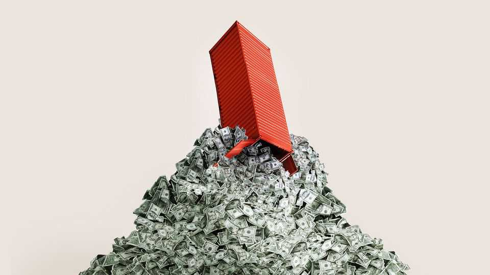
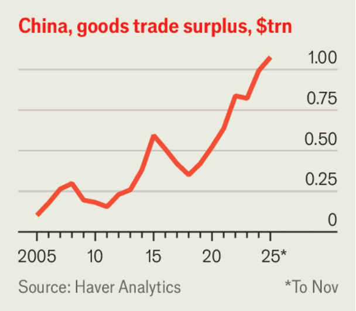

Leaders | The global economy
Don’t fear China’s trillion-dollar trade surplus
It is a problem not for the rest of the world, but for China
December 11th 2025

Last year the gdp of only 19 countries exceeded $1trn. That puts the latest news from China’s customs administration into stark context. On December 8th it reported that the country’s net exports of goods in the first 11 months of the year had already exceeded $1trn, more than any previous surplus. Even as America whacked tariffs on China, its enterprising manufacturers have expanded into alternative markets and discovered roundabout routes past America’s trade barriers.

The size of the surplus is causing anxiety around the world. “The imbalances we see accumulating today are not sustainable,” said Emmanuel Macron, France’s president, on a visit to Beijing this month. A recent report on China’s export muscle by Goldman Sachs was titled “Beggar thy neighbour”. And on December 10th the imf called on China to fix its imbalances. As with many things to do with China’s economy, however, a degree of perspective is just as valuable as a sense of awe. The monster surplus is not as scary as it looks. Moreover, it causes problems not for the rest of the world, but for China itself.

For a start, the trillion-dollar surplus counts only physical goods passing through customs. It does not include services, which would subtract about $180bn from the total. It also fails to capture some transactions between multinational firms and local contract manufacturers in free-trade zones on China’s territory, but outside its customs border.

A broader measure of China’s dealings with the rest of the world is its current- account surplus. This has reached $650bn over the past four quarters (although some analysts have doubts about how it is measured). That is still a big number. But China—trust us—is a big economy. Its surplus amounts to about 3.4% of its GDP. According to the IMF, there were 45 economies with a surplus bigger than that last year. Eight of them are in Mr Macron’s European Union.

The focus on imbalances also misdiagnoses Europe’s true concern, which is the hollowing out of its domestic industry. The real problem is that European manufacturers now struggle to compete with Chinese carmakers and electronics firms. That would be the case even if China spent much more on commodities and other imports and its trade surplus fell to zero.

Furthermore, China’s reluctance to buy foreign things does not extend to foreign assets. In return for its exports, it has bought bonds, extended loans, acquired equities and built factories overseas. These assets represent claims on the future. China is thus selling stuff today in return for stuff in the future. Trade is an exchange. But the exchange does not have to be simultaneous.

China’s eagerness to save was once hard for the world to accommodate. After the global financial crisis of 2007-09, everyone wanted to retreat into their shells and spend less than they earned. Central banks cut interest rates towards zero. But there was not enough demand to go round. In that world, China’s surpluses could be accused of beggaring its neighbours. Its net exports “drained” demand from countries that were suffering from a shortage of spending.

Things are different now. In many big economies, inflation is at or above the central bank’s target. Spending is strong enough to keep unemployment low at home with a bit left over to purchase China’s excess production, too. If central banks are worried about a lack of demand, they have room to cut rates, as America’s Federal Reserve did on December 10th.

Indeed, China’s surplus is more a problem for itself than for the rest of the world. It is the only big country where inflation looks dangerously low. Hiring is weak, consumers lack confidence, and the property market has entered the fifth year of a seemingly intractable slump. The central bank is worried that

lower interest rates will hurt banks’ margins. And the government is reluctant to do whatever it takes to turn things round.

China’s policymakers have instead relied on unexpectedly strong exports to keep growth on track. That could prove to be a mistake. If the trade war spreads to Europe, or the global economy suffers from an ai bust, foreign demand could easily falter. China would then be forced to make a big fiscal push to revive domestic spending.

Its task could be all the harder for having been delayed. The longer gloomy sentiment persists, the less easy it is to dispel. And China could find itself trying to revive the confidence of consumers and homebuyers just as the world economy is wilting. China has become dependent on the spending of foreigners to stabilise its own economy. It is not being anti-social. But it is being unwise. ■

Subscribers to The Economist can sign up to our Opinion newsletter, which brings together the best of our leaders, columns, guest essays and reader correspondence.

This article was downloaded by zlibrary from https://www.economist.com//leaders/2025/12/11/dont-fear-chinas-trillion-dollar-trade- surplus