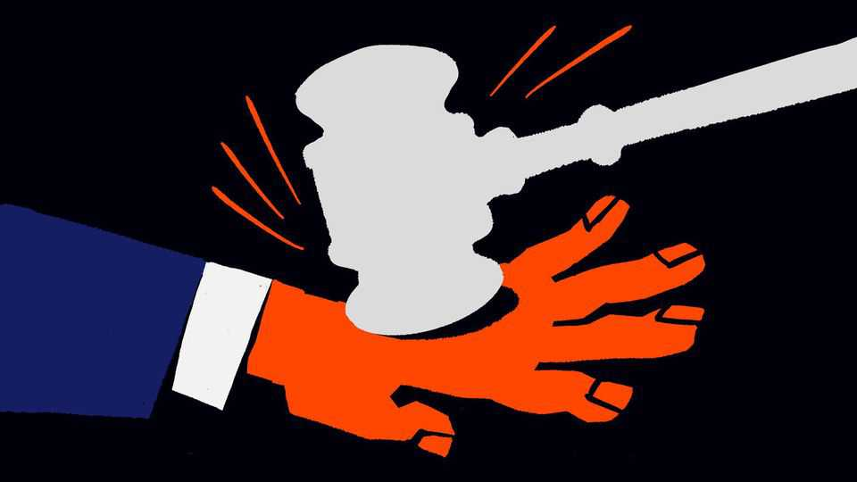

Leaders | A major question
America’s Supreme Court should strike down Donald Trump’s tariffs
The judges’ credibility is at stake
December 11th 2025

America’s trade policy might seem to have settled down since the spring, but it could soon take another dramatic turn. The Supreme Court is expected to rule imminently on the legality of roughly half of President Donald Trump’s tariffs—those imposed under the International Emergency Economic Powers Act (IEEPA) of 1977. By means of this law, the president claims to have the discretion to set tariffs as he pleases, having declared America’s trade deficit and the influx of fentanyl to be national emergencies. Yet three courts have ruled the tariffs illegal. The Supreme Court could concur.

If the tariffs are struck down, the administration will try to use a panoply of other, fiddlier legal authorities in order to tax imports. The trade “deals” Mr Trump has struck—which are not treaties but just agreements made by the White House—would wobble. Tariffs might be lower overall, but uncertainty and complexity would follow. And if, as is likely, the court authorises refunds to importers who were unlawfully charged, America’s economy could receive an unplanned fiscal stimulus of about 0.5% of GDP. Despite all this disruption, though, the judges should rule against Mr Trump.

The case for illegality is strong and straightforward. Under the constitution, the power to levy tariffs belongs to Congress. The administration says IEEPA also grants the president this power in emergencies. Yet the word “tariff” does not appear in the law, which only lets the president “regulate” imports.

Richard Nixon used a similar authority to impose a near-blanket 10% tariff for about four months in 1971. This survived the courts because Congress had, at that time, not adequately specified tariff powers in other laws. The judges who scrutinised the policy denied they were giving the president the carte blanche Mr Trump now claims. Congress then passed the Trade Act of 1974, specifying tariff powers—and imposing on them time limits and procedural requirements, with which Mr Trump would rather not have to bother. But those constrained powers are the ones upon which presidents must rely.

There are further arguments for striking down the tariffs: Mr Trump’s trade- deficit “emergency”, for example, is a sham. Yet the wording of the law is the most important, because it offers a stress test for the integrity of the Supreme Court. The conservative majority on the bench has spent years arguing that vague language cannot be used to smuggle in vast executive powers—that “Congress does not hide elephants in mouseholes.” The more profound the effects of the policy, the clearer Congress’s authorisation of it needs to be.

It was on the basis of this idea, known as the “major-questions doctrine”, that the court struck down Barack Obama’s Clean Power Plan and Joe Biden’s forgiveness of student loans, among other policies. The doctrine protects Congress from an imperial president, who could otherwise veto any attempts by legislators to reclaim powers a White House asserts as its own.

The justices may be tempted to argue that the doctrine does not apply to foreign policy, which is the president’s terrain. Yet that would not be credible.

Mr Trump’s tariffs, including those set by other laws, are a tax of huge domestic significance; they are expected to raise $2.5trn over a decade, which would be paid by American firms, and much of the bill would be passed on to American consumers. If the court carves out an exception for them, the major- questions doctrine will seem to apply only to the power wielded by Democrats. That will be especially damaging given that in recent cases, such as whether the president can sack the heads of independent agencies like the Federal Trade Commission, the court’s jurisprudence favours the administration.

The consequences of striking down the tariffs would be disruptive in the short term, but failing to rein in Mr Trump would be worse. It would concentrate power dangerously in the White House. Allowing a single individual to set taxes on a whim is a recipe for grubby favouritism. And IEEPA could then be used by future administrations in ways that Republicans will not like. Imagine a future Democratic president declaring an emergency over racial injustice, and placing tariffs on products with insufficiently diverse supply chains, or using a climate emergency to impose a carbon border tax.

Optimists say the Supreme Court is one of the few institutions where politics does not outweigh everything. Left-wingers doubt this, seeing conservative jurisprudence as little more than a front for the president’s priorities. This newspaper hopes the optimists are right. If the conservative majority is committed to its principles, it will quash IEEPA tariffs and send Mr Trump back to the drawing board. ■

Subscribers to The Economist can sign up to our Opinion newsletter, which brings together the best of our leaders, columns, guest essays and reader correspondence.

This article was downloaded by zlibrary from https://www.economist.com//leaders/2025/12/11/americas-supreme-court-should-strike- down-donald-trumps-tariffs