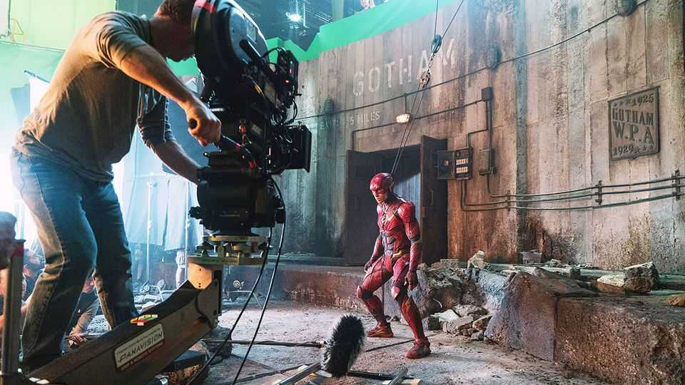

Leaders | Entertainment
The battle for Warner Bros is a prelude to the real streaming war
Professionally made shows face tough competition from independent makers
December 11th 2025

Hollywood has produced another gripping drama. Netflix’s and Paramount’s $100bn battle to buy Warner Bros Discovery has juicy plot ingredients, from an ambitious billionaire to mysterious Saudi investors and even a cameo from the president’s son-in-law. As the studio weighs its options, expect weeks of entertainment.

The sale promises to shake up the streaming wars, in which Hollywood studios are fighting for subscribers. Paramount, a smallish studio, craves scale to compete with the big dogs. Netflix, far in the lead, wants more content for its huge library. But the focus on the streaming wars misses a bigger storyline.

For all the billions lavished by studios on new films and TV shows in recent years, audiences are spending ever more time watching stuff made outside Hollywood, often by amateurs. The most popular source of video distraction in America is not Warner Bros or any of its suitors, but YouTube. The Google- owned platform accounts for 28% of streaming on TVs in America, against Netflix’s 19%. This is before you include the hours spent scrolling on mobile phones.

Hollywood honchos say their business is different from the slapdash online videos made for watching while on the toilet. They are right, but the difference is shrinking. First, consider technology. Social platforms are suited to mobile screens, but their videos are increasingly viewed on TV: Americans spend longer watching YouTube on tv than on their phones. At the same time Hollywood is relying less on cinemas in favour of TV, and moving to even smaller screens. In poor countries where viewers are more likely to watch long-form video on their phones, they offer mobile-only plans.

Second, business models are converging. As streaming platforms seek new audiences, they are moving beyond subscriptions into advertising, once the turf of social media. At the same time, those social platforms are pushing into subscriptions; YouTube’s no-ad plans (which include music) have more than 125m subscribers, around the same as Warner Bros.

The third area of overlap is the most contested: content. Streaming platforms are getting into formats popularised on social media. Amazon Prime Video has a series starring MrBeast, YouTube’s biggest star; Netflix plans to show video podcasts from Spotify; Chinese studios are producing “micro dramas”, two- minute episodes in series 90 episodes long. Meanwhile social platforms are showing more television-like content. YouTube chatshows such as “Chicken Shop Date” are stealing audiences from the traditional man-on-sofa format of late-night TV; and they are now stealing A-list guests, too. Artificial intelligence is helping narrow the gap between professional visual effects and amateur ones, and making things like foreign-language dubbing available to

all. Professional media firms increasingly use social channels for their distribution (you can find Economist videos on TikTok and the like).

This new competitive landscape means that trustbusters should not rule Netflix out of the Warner race, as many in Hollywood argue. It may be dominant in streaming, but under the broader market definition it is a smaller actor. For the same reason, Paramount is stronger than it looks. It may be only a supporting actor in Hollywood, but the Ellison family, who control it and support Donald Trump, have been named by the president as part of a group that will run the promised American version of TikTok. Having a hand in both professional and social media promises to make them powerful, too.

Hollywood says its premium content will prevail in this new war. The bids for Warner, which reflect a high valuation of its back catalogue and intellectual property, suggest the professionals are putting their money where their mouth is. But whoever wins the battle for Warner faces a bigger contest ahead. ■

Subscribers to The Economist can sign up to our Opinion newsletter, which brings together the best of our leaders, columns, guest essays and reader correspondence.

This article was downloaded by zlibrary from https://www.economist.com//leaders/2025/12/11/the-battle-for-warner-bros-is-a-prelude- to-the-real-streaming-war

Letters Has repression in Iran been curtailed?