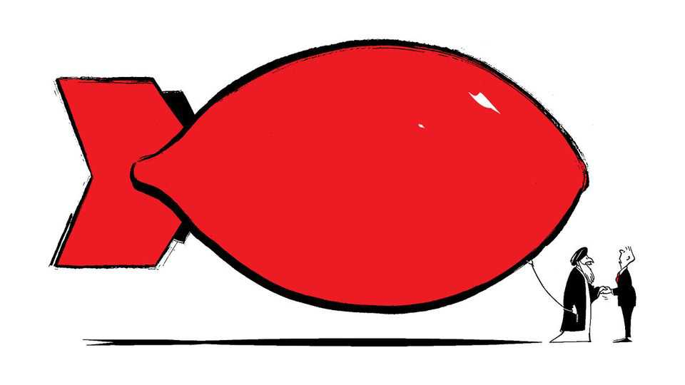
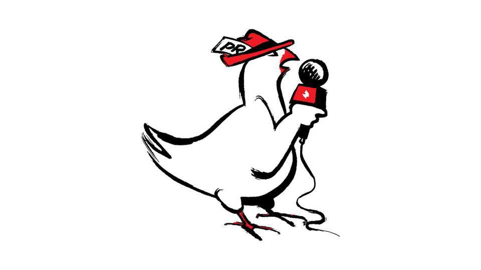

Letters | A selection of correspondence
Has repression in Iran been curtailed?
Also this week, Germany and China, child care, quantum computing, carrier pigeons, trees, smiling at work
December 11th 2025

Letters are welcome via email to letters@economist.comFind out more about how we process your letter Your briefing on Iran claimed that the morality police have curbed their efforts, and that the country’s leaders want a “fair and balanced deal” with America (“Emollient mullahs”, November 29th). You seem to want the West

to heed these overtures and resume negotiations. Unfortunately, the version of Iran that the regime wants you to see is far from the truth on the ground.

Repression has not been curtailed. Executions in Iran in 2025 are at the highest level since the purge of communists in the 1980s. Arrests of journalists and critics have if anything increased since the 12-day war with Israel. And misogynistic, patriarchal laws continue to be passed in parliament.

Contrary to your claim that Iran feels defeated, regime insiders genuinely believe that they won the war, and that Iran’s missiles forced Israel into a ceasefire. Those close to the government claim in private that the symbolic attack on an American base in Qatar took out a key radar installation that will hinder future Israeli operations. In the false belief that the next Iran-Israel war will look like the last one, the regime is already busy producing missiles, dispersing assets and making contingency plans for the death of key commanders. A country that believes it can win a war will not seek peace.

Ali Khamenei and his clan have never been serious about negotiations, or opening up to the world. Even after the Joint Comprehensive Plan of Action with the West, orders were passed down that the deal should not “bear fruit”. Donald Trump’s withdrawal from the JCPOA was a gift to the Iranian hardliners, and they have since used the North Korean negotiating strategy of pretending to negotiate in good faith, while deliberately making sure no deal is ever reached.

Taking Abbas Araghchi at his word ignores the truth that the foreign minister and the government hold no true power. All decisions are made in the leader’s household. The regime presents a false front to the world in the hope of buying legitimacy, attention, and more time to repress the Iranian people and loot Iran’s riches.

Yasin KayLondon

I enjoyed your Drum Tower episode on Germany’s China policy (November 18th). You wondered if there was a German term for “counter-strategies against de-risking”. May I suggest Risikominderungsgegenstrategien? One may quibble that de-risking and risk mitigation are not entirely the same. But Germany will never be able to shed China-related risks entirely. Even in a hypothetical scenario of complete decoupling there would be the risk of

missing out on the Chinese market. So, risk mitigation/Risikominderung essentially captures the idea of de-risking quite well.

Prof. Dr Björn AlpermannChair of contemporary Chinese studiesUniversity of WürzburgWürzburg, Germany

As the leader of the non-profit association of for-profit child-care providers, I was disappointed with your article on private equity and child care in America (”Pay to play”, November 22nd). You placed a large focus on one of our providers, KinderCare. After one year at the company, Connecticut employees’ salary rises to $19.35 an hour and will increase in the new year. They offer their employees in Connecticut, and nationally, a comprehensive benefits-package of health, dental and vision insurance, a retirement plan, continuing education benefits and discounted child care.

In the spirit of comparison, note that KinderCare’s tuition costs nearly $500 less per month per infant than the competitor you cite in Greenwich. Additionally, 30% of KinderCare’s students are served by the state government’s subsidy program, Care4Kids. Finally, it is worth pointing out that KinderCare does not even operate in Greenwich, which is one of the state’s most affluent communities, and probably has higher salary rates as a result.

We are proud that nationwide, one-third of our providers exceed baseline provider-to-child ratio requirements and nine in ten of our providers exceed licencing requirements for safety. Such factors matter to parents as they search for the right child-care options.

It is no secret that our providers draw funding from diverse sources: family investments, bank loans, public investments, and long-standing or new private equity. These investments enable growth, innovation and family choice.

Radha MohanExecutive directorEarly Care and Education ConsortiumWashington, DC

You reported that Britain is well positioned to take a lead on quantum computing globally because of its strong research base and vibrant startup community (“Quantum reap”, November 22nd). Britain has also been pioneering a unique government-funded national laboratory, the National

Quantum Computing Centre, which is nurturing seven firms developing quantum-computing testbeds across various hardware technologies.

Quantum computing is still perceived to be at a relatively nascent stage, so firms might be reluctant to invest in the technology because of the uncertain returns. Our pilot study of the NQCC testbeds showed that formulating a common vision of quantum computing and building a business ecosystem are essential for scaling up. The government, acting as a customer through the NQCC programme, offers a unique opportunity to de-risk the technology’s development. This programme could demonstrate how quantum computing can address grand challenges such as climate resilience and financial stability. This framing will facilitate co-ordination and align incentives among firms to develop quantum-computing applications.

Once the “proof of concept” is demonstrated, it will catalyse private-sector innovation. This will enable Britain to accelerate the benefits of quantum computing to enhance society and contribute to economic growth. The time for Britain to lead is now.

Chander VeluProfessor of innovation and economics University of Cambridge

If we can’t trust the BBC to report the news, who can we trust (Letters, November 22nd)? When Paul Reuter started his news agency in the 1850s he used 45 pigeons to convey news and share prices between Brussels and Aachen, to fill the gap between the endpoints of the telegraph service. During the war a pigeon named Gustav was in the service of the RAF. On D-Day he was loaned to Montague Taylor, a Reuters correspondent accompanying the allied invasion.

Under radio silence it was Gustav who brought the news of the first allied landings. The message strapped to his leg read: “We are just 20 miles or so off the beaches. First assault troops landed 0750…no interference from enemy gunfire on beach. Passage uneventful…Formations Lightnings, Typhoons, Fortresses crossing since 0545. No enemy aircraft seen.” Gustav’s message from the English Channel was relayed to London and then on to a delighted American president.

ROBIN LAURANCEOxford

Your discussion of Indonesia’s fiscal policy mentioned that the government plans to spend more than half of the Saldo Anggaran Lebih, or accumulated budget surplus (”Raiding the rainy-day pot”, November 8th). The placement of SAL in state-owned banks (Himbara) is not the same as spending those funds. It merely represents a placement of state cash balances from the central bank (Bank Indonesia) to commercial banks ensuring that the overall level of SAL remains unchanged.

The move has been carried out prudently with the aim of stimulating credit growth. The government also affirms that the shift will not undermine the availability of funds required for budget execution toward the end of the 2025 fiscal year. The government can withdraw these funds whenever needed.

Deni SurjantoroHead of the bureau of communicationIndonesia Ministry of FinanceJakarta

The Free exchange column on “tree murders” (November 15th) among America’s coastal gentry reminded me that even the humblest trees fare no better. The Sahara’s solitary Tree of Ténéré survived centuries of caravans, drought and shifting dunes only to be struck by a passing truck. Britain’s Sycamore Gap tree fell to two vandals with a chainsaw.

Zubin AibaraBülach, Switzerland

Regarding Bartleby’s question of whether retail workers should be instructed to interact with customers (November 15th), many years ago I worked as an executive at a large international retailer. On a visit to a new store in Russia I asked the local manager why none of our people, at any level, smiled at customers. She replied that if you smile, people think you are an idiot.

Tony WilliamsBeaconsfield, Buckinghamshire

This article was downloaded by zlibrary from [https://www.economist.com//letters/2025/12/11/has-repression-in-iran-been-curtailed](https://www.economist.com//letters/2025/12/11/has-repression-in-iran-been-curtailed)

By Invitation

It’s time Europe got to grips with the MAGA challenge, writes Mark Leonard