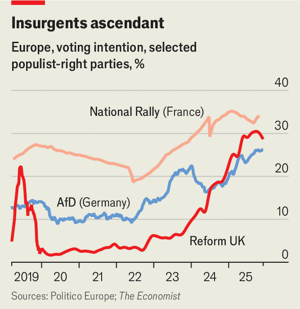

Briefing | Growing without restraint
The Alternative for Germany is the leading party in some German polls
Despite retaining its far-right positions
December 11th 2025

YOU DO NOT need a short back and sides, a razor-sharp side parting and half a tub of hair gel to join “Generation Germany”, the youth wing of the populist-right Alternative for Germany (AfD) party, but it certainly helps. In late November these haircuts abounded in Giessen, a student town near Frankfurt, at an event to mark the group’s founding. And if the description seems to exclude women, that is apt, for very few were there.

The youth branches of German political parties are always dominated by purists. But Generation Germany goes further. Speaker after speaker takes to the stage to urge the “mass remigration” of foreigners away from Germany. A race-baiting story about a violent Muslim boy in a school playground wins the day’s biggest cheer. Another speaker tosses out Hitler Youth slogans. Stalls outside the conference hall, meanwhile, offer visitors a diet of far-right red meat, from maps celebrating the Reconquista of Spain to “Defender Protein”, an “unwoke” brand of protein powder.

The whiff of extremism in Giessen highlights a puzzle. In many parts of Europe populist-right parties have moderated as they have grown, shedding unpopular policies and personnel. The AfD, which is polling around 25%, as much or more than any other party, is certainly professionalising. Generation Germany takes over from a rowdier outfit the party had struggled to control. “We’ve long since outgrown our infancy, and must act and behave accordingly,” says Sebastian Münzenmaier, an MP and one of the chief architects of the AfD’s smartening-up. In Giessen your correspondent hears nothing but praise for the party’s leadership from the disciplined young delegates he meets. The speech of Alice Weidel, the party’s co-chair and best- known leader, is received with a hearty cheer.

But, adds Mr Münzenmaier, “professionalising structures, organisation and strategy doesn’t mean watering down our positions.” In substance the AfD is, if anything, growing more radical. In May Germany’s domestic intelligence agency formally labelled it extremist, a decision on hold while the party appeals. Björn Höcke, its leader in the east German state of Thuringia and its most outspoken firebrand, has twice been convicted of knowingly using a Nazi slogan. Party leaders have been forced to make peace with him and the voters he attracts, especially in east Germany. Senior figures in the AfD who were uncomfortable with this have quit or been forced out—several have given lachrymose interviews lamenting their failure to keep the extremists at bay. By accident or design, the party now has figures like Ms Weidel, a former banker at Goldman Sachs, who can attract more moderate voters, as well as the likes of Mr Höcke. The two “look like a division of labour to me, not a disagreement on substance,” says Kai Arzheimer of the University of Mainz.

At any rate, all strands within the party are united by its focus on “migration and nativism”, says Anna-Sophie Heinze at the University of Trier. Party leaders insist that their ever shriller talk of remigration is merely a call to follow the law in the case of Germany’s many failed asylum-seekers. Yet to attend the party’s events and to read its literature is to observe a political movement high on racial fury, raging against the multicultural society Germany has become. A speaker in Giessen urges deportation on such a scale that “the runways glow red hot”. Ms Weidel may not use this language, but nor does she curb it.

Beyond this, however, tensions on policy are easy to find. Small-state Eurosceptic liberalism, present at the AfD’s creation as an anti-euro outfit in

2013, remains dominant. Its manifesto this year promised big, regressive tax cuts. It opposes the government’s heavy, debt-funded spending on defence. But this wing of the party, more or less represented by Ms Weidel, coexists with a “welfarist” strain, especially in its eastern branches, that rails against globalisation and financiers. The AfD promises to raise the “pension level”— the proportion of an average salary an average worker can expect in retirement —to a ruinous 70%, up from 48% today, itself a level that most economists regard as unsustainable. The German Economic Institute estimated that the AfD’s election promises would raise the deficit by four percentage points.

“At the moment the party can live with these contradictions, but in a few years it may start to matter,” says Reiner Becker of Philipps University in Marburg. It helps that Donald Trump has all but endorsed the AfD. “It feels good to know that the most powerful country in the world backs Christian values, fighting Marxism, globalism and wokeism,” says Beatrix von Storch, the deputy leader of the AfD’s MPs.

The AfD won 21% of the vote in February’s federal election. It is now neck- and-neck with the CDU/CSU, the biggest party in the governing coalition and hitherto the main force on the right. Its base is the 10-12% of radical-right voters, but it also won lots of defectors from almost every political party bar the Greens and the hard left. The AfD has eaten into conservative support in the wealthy south and hurt the Social Democrats in the post-industrial west.

Its staunchest support comes from middle-aged men, typically without a university degree and living in a small town. It has started to make inroads with younger male voters; it struggles to attract women but has begun to close the gap. Ominously for mainstream parties, a growing share of the AfD’s voters seem to back the party from conviction rather than desperation: 61% of AfD voters in February said their decision was “very easy”, a higher share than any other party. “We have changed from a party of protest to one of hope,” says Maximilian Krah, an AfD MP.

There is plenty more scope for growth. A recent paper by Julius Kölzer at Humboldt University and colleagues finds that the AfD does well in places “where manufacturing levels are historically high and industrial decline is looming”, a description that applies to large parts of western Germany. Industrial production is tanking, the economy is flat and American tariffs and Chinese oversupply threaten to devastate local exporters. An important test

will come in March, when Baden-Württemberg, a rich manufacturing state in the south-west, goes to the polls. The AfD hopes to run the CDU a close second. In later elections in the eastern states of Saxony-Anhalt and Mecklenburg-Vorpommern, it is aiming for an outright majority.

Yet beyond the east the AfD will have to persuade other parties to work with it if it is to win power. Thus far they have all kept it behind a “firewall”, refusing to join it in government at the state or federal level. The firewall extends to the business world and civil society, too. An association of family businesses recently declared its willingness to speak to the AfD. So furious was the backlash that it soon retreated.

Can the firewall last? The AfD argues that it leads to wan coalitions of the mushy centre—a view shared by some on the centre-right and in business. The bigger the AfD grows, the more incoherent the coalitions needed to keep it from power. But the commitment of most of the CDU to the EU, NATO and Ukraine would make formal collaboration with the AfD wrenching, even if agreement could be found on cutting taxes or welfare rolls. Were the CDU to ally with the AfD in an eastern state, it might lose millions of votes in the west.

Unlike many other parties on Europe’s populist right in Europe, the AfD still inspires a backlash. In state elections it often falls short of expectations as voters, especially older ones, vote tactically against it. The event in Giessen drew 30,000 protesters. The AfD is mobilising more and more Germans—for it, and against it. ■

This article was downloaded by zlibrary from https://www.economist.com//briefing/2025/12/11/the-alternative-for-germany-is-the- leading-party-in-some-german-polls