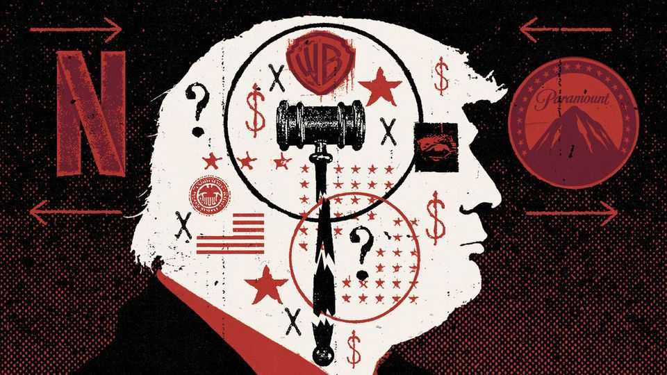

United States | The war over independence
The Supreme Court is handing Donald Trump more power
What overturning one case of dismissal means for the presidency
December 11th 2025

As an indicator of the condition of antitrust regulation in the United States, the timing could not have been better. On December 8th the Supreme Court heard arguments about the fate of Humphrey’s Executor, a New Deal-era precedent that limits the president’s ability to fire members of the Federal Trade Commission (FTC) and, by extension, many other independent agencies. Three days before, Netflix, a media giant, announced that it was to acquire most of Warner Bros Discovery, another media giant, in a deal valued at

$83bn. That was swiftly followed by a hostile $108bn bid for all of Warner Bros Discovery by Paramount Skydance, which is much smaller than Netflix.

Given the power of regulators like the FTC to make or break such deals, in the past Netflix and Paramount Skydance would have competed by means of arguments about the law, market power and shareholder value. The people they would have tried to persuade would have been technocrats, largely independent of the administration. Now, the man who will ultimately decide who buys Warner Bros is the president of the United States. “I’ll be involved in that decision,” said Donald Trump at an event at the Kennedy Centre on December 7th. Nobody doubts it.

Mr Trump’s sway over this deal will come with a ruling in Trump v Slaughter, a case that seems bound to cement his control over who runs the FTC. In March Mr Trump fired Rebecca Slaughter, one of five FTC commissioners, whose service was “inconsistent with the administration’s priorities”. By 90- year-old precedent, this ought to be illegal. In 1935 the Supreme Court ruled that Franklin D. Roosevelt’s firing of an FTC commissioner, William Humphrey, had been illegal (Humphrey died while the case was being decided). In the original ruling, Justice George Sutherland wrote that commissioners may be removed only for cause, lest the “mere will” of the president “thwart” Congress’s aims when it established the oversight body.

America has had agencies of various sorts that operate independently of the president since its founding. Christine Chabot, a law professor at Marquette University, identifies two from America’s early history: the Sinking Fund Commission (Alexander Hamilton’s programme to manage the national debt) and the Revolutionary War Debt Commission. Congress gave and gives organisations freedom from presidential meddling to ensure they operate impartially and follow expert advice, she says. At least that’s the theory.

Today’s Supreme Court is more sympathetic to the “unitary executive theory”, a conservative vision that emerged in the 1980s. The late Justice Antonin Scalia was a proponent, arguing that Article II of the constitution grants “all of the executive power” to the president. In this view, supreme executive power derives from a mandate from the masses. At the hearing for Trump v Slaughter, John Sauer, the solicitor general, argued that Humphrey’s Executor has tempted Congress “to erect at the heart of our government a headless fourth branch insulated from political accountability and democratic control.”

He warned that without change, a future Congress could make entire departments, like the Department of Labour, unanswerable to the president.

Defending the idea of independent expertise, Justice Elena Kagan noted that undoing the precedent would instantly put two dozen other independent agencies under direct control of the president. Regulating everything from nuclear power to credit cards to transport would become political, and the idea of technocratic expertise in any part of government would vanish. “Once you’re down this road,” she said, “it’s a little bit hard to see how you stop.” Even legislative courts, like the Tax Court, which resolves disputes between taxpayers and the government, could be deemed to be part of the “executive branch” with their employees subject to instant political dismissal.

In the short run, the consequences of Humphrey’s Executor being overturned will be slight. This is because the president has already been acting as though it never existed. Andrew Ferguson, who became chairman of the FTC when Mr Trump took office, has given up the pretence of independence, and has taken to referring to his body as the “Trump-Vance FTC”. Ms Slaughter is hardly the only person the president has summarily fired. Others he has deemed to be executive-branch employees and dismissed include the heads of the National Labour Relations Board and Consumer Product Safety Commission; the president and half the board of the Kennedy Centre; and even the Librarian of Congress.

Yet in the longer run, the sanctioning of such power creates huge risks. “It opens up the possibility of outright corruption,” says William Kovacic, a Republican who served as a commissioner and then chairman of the FTC under George W. Bush and Barack Obama. Vastly consequential negotiations over antitrust power will now be “based not on substantive policy considerations, but on the preferences of the head of state, who’s quite fond of being given things”, he says. Big regulatory decisions were of course always somewhat political, Mr Kovacic acknowledges. But they were not made straightforwardly on “the commands of political overseers who say, reward my friends and punish my enemies”.

The obvious result of making regulation so nakedly political is that businesses respond by finding ways to butter up the president rather than building a case that their deals serve the public interest. An excellent example of how this might work is the proposed deal over Warner Bros Discovery. Mr Trump

insists he is impartial. “None of them are particularly great friends of mine,” he said on December 8th. He gestured at antitrust rules by saying he would look at “what percentage of market they have”. But outsiders cannot help but note that Jared Kushner, the president’s son-in-law, is organising the financing of Paramount Skydance’s bid, and the investors include a number of sovereign-wealth funds from countries that are on cordial terms with Mr Trump.

There is already “a pervading sense that being a friend of the president or knowing who to pay off is the key to success in US business”, says Timothy Wu, a former adviser to the FTC, who helped write President Joe Biden’s antitrust policy. Ms Slaughter recently recounted how, watching Mr Trump’s inauguration in January, she realised that nearly every big tech CEO present was from a company in litigation with the FTC. Max Stier, president of the Partnership for Public Service, points out that not only regulatory decision- making is at stake from unitary executive theory. All civil servants could be fired without any legal protections at all.

Perhaps the most astonishing part? The decision cannot be undone, at least by Congress. The Supreme Court is poised to hand Mr Trump a right to fire agency heads that is grounded in the constitution. Courts will still be able to rule particular actions illegal and perhaps reverse them. To punish presidential overreach, Congress has but two options: withholding funding and, if that does not work, impeachment and trial. They were powers, historians note, that England’s parliament established over the monarch after the 17th-century civil war. ■

Stay on top of American politics with The US in brief, our daily newsletter with fast analysis of the most important political news, and Checks and Balance, a weekly note from our Lexington columnist that examines the state of American democracy and the issues that matter to voters.

This article was downloaded by zlibrary from https://www.economist.com//united- states/2025/12/10/the-supreme-court-is-handing-donald-trump-more-power