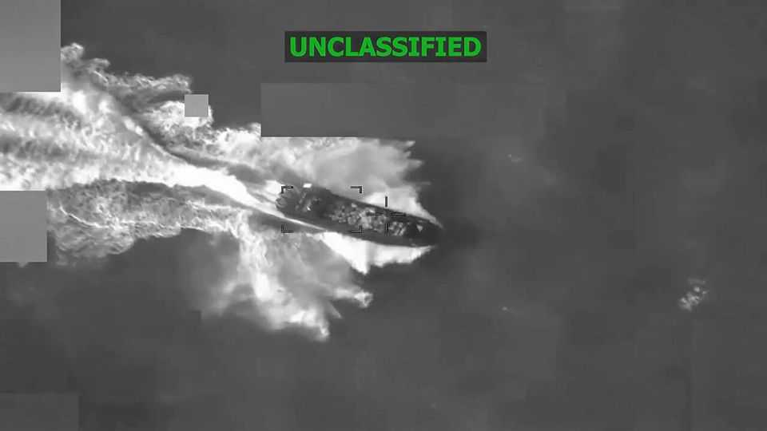

United States | Spies and narcos
How much does America know about its boat-strike targets?
Controversies about the lethal strikes touch on intelligence operations
December 11th 2025

The boxy beige building nestled on the tip of Florida’s Key West could easily be mistaken for a shoddy beach resort. Encircled by palm trees and poles bearing flags of the world, its true function is hinted at only by the uniformed military personnel milling around: making sense of intelligence about drug smugglers. The building is home of the Joint Interagency Task Force South (JIATF-S), an intelligence group that monitors narco-trafficking across the Caribbean and Latin America.

The task force has kept a low profile for much of its 36-year existence. The Trump administration’s bombing of suspected drug boats has lifted its veil. A campaign claiming at least 87 lives is prompting bipartisan inquiries, animated by questions about whether a war crime was committed against shipwreck survivors on September 2nd. Nearly all of the controversies roiling Washington touch on the intelligence operations that support the campaign. How much do America’s spies really know about who is being killed?

JIATF-S is a linchpin of America’s anti-drug spying apparatus. Comprising US Navy, coast guard and federal law enforcement detachments, it fuses diverse strands of intelligence into a coherent picture. Its ground-based radars and surveillance aircraft hoover up signals-intelligence (SIG-INT) such as radio chatter, to locate vessels suspected of ferrying drugs. Tip-offs from human intelligence , mostly gleaned by the CIA and DEA, are also fed through.

One question spooks seek to answer is who is aboard suspect vessels. “We knew exactly who was in that boat, we knew exactly what they were doing and we knew exactly who they represented,” Pete Hegseth, the secretary of war, claimed after the September 2nd strike. Allies have their doubts, though. In November it was reported that Britain suspended its intelligence-sharing agreement with JIATF-S, apparently concerned that it was being used to violate international law.

It is unlikely that America possesses specific information on who exactly is in all of the boats, say intelligence officials familiar with past operations. That would present a nearly impossible technical hurdle. Besides, for years agencies typically identified passengers only after a boat was stopped. “I don’t ever recall having names until a boat was interdicted and boarded,” says John Feeley, a former American ambassador who specialised in counter-narcotics. “They’re not trying to figure out the identity of the people on the boats,” says a former senior CIA official. “It’s a very circumstantial case.”

In the age of drone surveillance and pervasive SIG-INT, presidents often decide how much evidence is required to launch a lethal strike. The drug-boat attacks are redolent of the controversial “signature strikes” carried out by America along the Afghanistan-Pakistan border starting around 2007. Then, American forces did not always know whom they were killing, but attacked based on a target’s “pattern of life”, jargon for behaviour judged to mirror that

of a known enemy combatant. In 2013, facing criticism over reports of high civilian casualties, Barack Obama demanded that agencies only strike if there was “near certainty” that no civilians would be killed or injured. The Trump administration is unlikely to be so careful.

Years of drug-interdiction missions mean American officials have mapped most of the smugglers’ ruses, routes and vessels. Traffickers are generally easy to spot. A boat zipping along the Caribbean isthmus with multiple 300- horsepower engines rigged to its stern would make for a rather unusual fishing vessel, after all. Such signs are probably a “good enough” intelligence threshold for many in the current administration, worries a former Pentagon official who worked on counter-narcotics.

Democratic and Republican lawmakers alike are growing impatient. On December 9th Mr Hegseth, accompanied by the secretary of state and chairman of the joint chiefs of staff, briefed congressional leaders in the “Gang of Eight”—members who can receive the most sensitive intelligence— about the killing of survivors on the September 2nd strike. That seems to have created little consensus. Most lawmakers are calling for the release of the full video. Mr Hegseth has warned that may compromise intelligence-gathering methods. For a campaign supposedly built on clear intelligence, the picture of the facts only seems to be getting blurrier.■

Stay on top of American politics with The US in brief, our daily newsletter with fast analysis of the most important political news, and Checks and Balance, a weekly note from our Lexington columnist that examines the state of American democracy and the issues that matter to voters.

This article was downloaded by zlibrary from https://www.economist.com//united- states/2025/12/11/how-much-does-america-know-about-its-boat-strike-targets