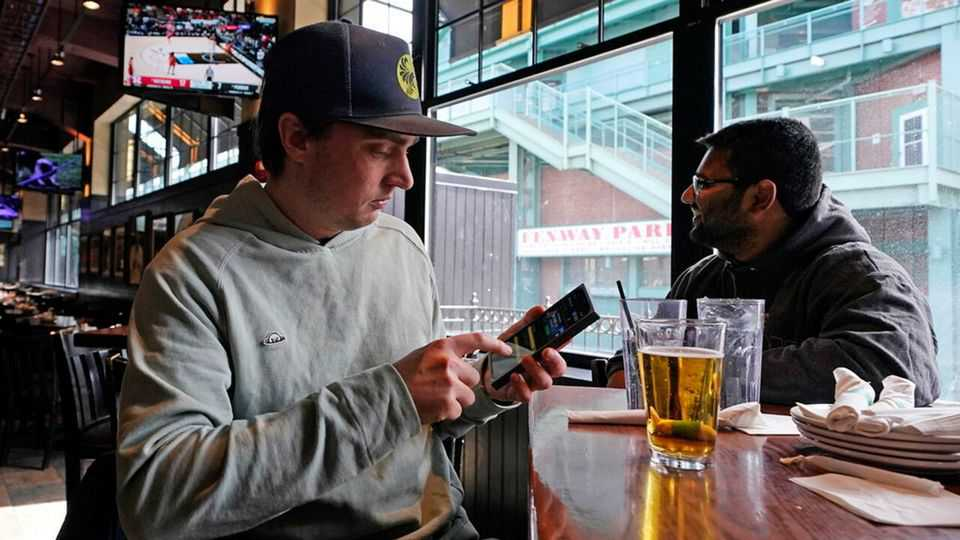
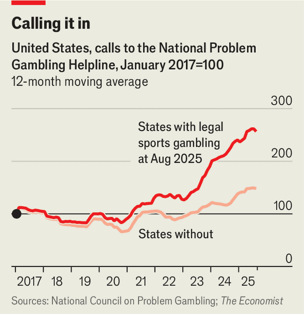
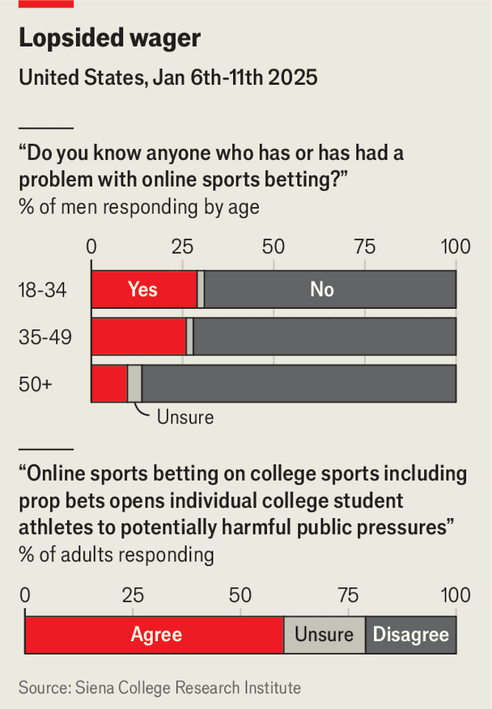

United States | Point of contact
College campuses have become a front line in America’s sports- betting boom
The fun is undeniable, but so is the toll it is taking on young men
December 11th 2025

WATCHING SPORTS in America has changed. Pancho O’Malley’s, a bar in Narragansett, Rhode Island, offers a glimpse of the past. On a rainy Saturday afternoon the crowd is mostly older men watching their local University of Rhode Island (URI) basketball team face in-state rival Providence College. During commercial breaks they saunter over to a lottery machine to buy tickets.

A few minutes down the road the bar at Boon Street Market thumps with a younger, again mostly male crowd. Rows of flatscreens broadcast the game, but here the action is not only on the televisions. Phones light up with notifications from sports-betting apps, alerting students to the fate of their wagers—and to new promotions. A 22-year-old shrugs when asked whether he worries about getting hooked. “First off, we already are,” he says. “But second off, no, because for the most part I make money on this.” He offers up his betting history: “I’m up on DraftKings right now, want to see my stat sheet?”

Sports betting has boomed since 2018, when the Supreme Court ruled that a federal prohibition against it was unconstitutional. Since then 39 states have legalised the activity (on December 1st Missouri became the latest to do so). The effects have been intense on college campuses, where sport is like ambient noise and clusters of young men are living away from home for the first time. Universities also play host to a multi-billion dollar college-sports industry that turns student-athletes themselves into the subjects of enormous wagers. What could go wrong?

Staples of the young male media diet such as College Game Day, ESPN’s popular pre-game show broadcast live from campuses each Saturday during the football season, now weave gambling odds into their segments. Other corners of the manosphere, such as Barstool Sports, the “Pat McAfee Show” and Theo Von, form partnerships with sports-betting firms and offer promo codes. A survey conducted in 2023 by the National Collegiate Athletic Association (NCAA), the governing body of college sport, found that 60% of college students have gambled on sport. The share is even higher for those living on campus. Young women bet ocasionally. Young men are far more likely to wager routinely.

Legalisation has virtues. It has brought a vast illicit gambling economy into the open where it is subject to oversight and taxation. But the costs are hard to ignore. The NCAA survey found that 16% of 18-to-22 year olds engage in problematic sports gambling. A poll conducted by Siena University in January found that a quarter of men who have gambled on sports say a friend or family member has expressed concern about their betting habits. Some 28% of 18-to- 34-year-old men who use sports-betting apps said that they have had trouble meeting a financial obligation because of a lost bet.

At Pennsylvania State University, which has 64,000 undergraduate students, Stephanie Stama, an assistant director at the student psychological services centre, reports that “it is increasingly common for us to hear that students have lost a significant amount of money” in sports betting and that it “is interfering with basic needs like eating and sleeping”. An 18-year-old student at URI confesses that he can no longer feel enjoyment when watching sports without the high from betting.

Timothy Fong, a professor of psychiatry at the University of California, Los Angeles sees a similar pattern. Every one of his clients of late has been an 18-

to-24-year-old man seeking help for a sports-betting or cryptocurrency addiction. The financial wreckage can be severe, too. John Simonian, a personal-bankruptcy lawyer in Rhode Island, says he never used to see young men filing for bankruptcy, “but now it’s not surprising”. Sports betting, he notices in young clients’ bank statements, is often one part of the equation.

Institutions have offered an uneven and clunky response. Between 2021 and 2023 a handful of universities joined up with sports-betting firms directly, receiving cash for sponsorship and naming rights. Most have since ended the agreements. But in America there is the added complication that many campuses are filled with both bettors and those being bet on. March Madness, the annual basketball tournament played by college athletes, is by some accounts the most-bet-on event in the country, with more than twice as much wagered on it as the Super Bowl.

As online sports betting has ballooned, the NCAA has had to build a sprawling enforcement operation to police the integrity of games and stem harassment of students by gamblers. This requires working with the gambling operators to identify suspicious wagers. “We’re unlikely bedfellows,” says an official. But, “they have what we need…they know who’s placed the bet.”

The risks are not hypothetical. On November 7th the NCAA announced that it had uncovered three separate betting scandals in men’s basketball where athletes intentionally played poorly in games in which they or a friend had placed wagers. And there is petty opportunism, too. NCAA officials mention a team bus driver who noticed injured players boarding and used that insider information to profit.

Student-athletes now face a torrent of abuse from losing gamblers. Last year the NCAA recorded 740 instances of harassment directly attributed to sports gambling, with thousands more suspected cases. Charlie Baker, the head of the NCAA and former Republican governor of Massachusetts, has lobbied state governments to ban prop bets on student athletes, meaning wagers on individual performances, in an effort to relieve these pressure points.

Regulation of America’s new betting ecosystem is more permissive and less consistent than in some other rich Western countries. But even if the rules were tighter, determined gamblers can usually find a way, including wagering on prediction markets. Though betting on local teams is technically illegal in the state, at a bar near URI’s campus a 22-year-old complains of losing money on the school’s basketball team. “But I’m making back $1,200 tonight with some UFC bets,” he adds, confidently describing his three-leg parlay. All three legs struck out. For a young man used to wagering hundreds of dollars every single day, there is always tomorrow. ■

Stay on top of American politics with The US in brief, our daily newsletter with fast analysis of the most important political news, and Checks and Balance, a weekly note from our Lexington columnist that examines the state of American democracy and the issues that matter to voters.

This article was downloaded by zlibrary from https://www.economist.com//united- states/2025/12/08/college-campuses-have-become-a-front-line-in-americas-sports-betting- boom