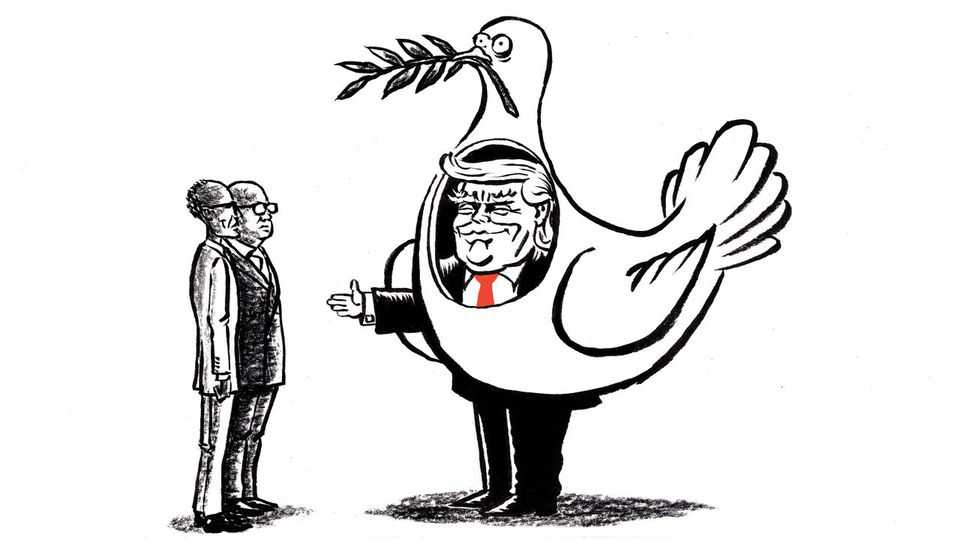

United States | Lexington
All hail “The President of Peace”
But hold the prizes until Donald Trump actually delivers on his new branding
December 11th 2025

The words “United States Institute of Peace” are carved into the stone, so in contrast the new raised silver letters spelling “Donald J. Trump” look pasted on. But the aides to Mr Trump who slapped his name on the institute’s building earlier this month had the right idea, pragmatically and metaphorically: pragmatically, because anything that excites Mr Trump to keep chasing his self-image as a peacemaker is useful; and metaphorically, because, though Mr Trump may not in the end bring peace for our time, he is certainly bringing an Institute of Peace for his time—a performance space for

gestures at peace, bereft of the seldom-celebrated bureaucrats who used to labour towards its realisation.

Indeed, the story of the Institute of Peace, at the north-west corner of the National Mall in Washington, is shaping up as the story of Mr Trump’s diplomacy. It is a tale of reasonable concerns over how things had long been done coupled with radical, often clumsy or cruel attempts to transform them, driven by an egotism so insatiable and insistent that it could, possibly, result in some good. If it does not, Mr Trump has no hope of being remembered as a peacemaker as successful as Jimmy Carter, let alone as the “President of Peace”, as his new National Security Strategy tries to brand him. And a future president will have little trouble, with a flathead screwdriver and some elbow grease, popping those silver letters back off the façade.

For months the building stood vacant, after an armed standoff in March with Elon Musk’s DOGE wrecking crew ended in the dismissal of all but a handful of the institute’s 300 staff. But on December 4th, a day after his name materialised on the building, Mr Trump hosted leaders there from Africa’s Great Lakes region for the signing of what he called “a historic agreement that will end one of the longest-running conflicts anywhere in the world”. Presidents Paul Kagame of Rwanda and Félix Tshisekedi of the Democratic Republic of Congo affirmed a deal for economic co-operation signed by their foreign ministers at the White House in June.

That Rwandan-backed rebels in eastern Congo are not party to the pact and that violence still rages there did not cloud Mr Trump’s view that he had “ended” the conflict. Nor did the two leaders’ silence about each other in their own remarks, or their failure to shake hands after signing. “Everybody’s going to make a lot of money,” Mr Trump said, in the signature promise of his peacemaking. He noted that for his efforts America would receive spoils of peace in the form of critical minerals. Then he luxuriated in the tongue-bath of praise from foreign leaders that has become the embarrassing ritual at every such public event he convenes.

Pleased to see his name on the building, Mr Trump called it “brand new”, though it is 14 years old. Maybe he does not know much about the institute: how veterans of war led Congress to create it during the administration of Ronald Reagan as an independent organisation, with a board appointed by the president and approved by the Senate; how the institute’s area-experts came to

function not only as analysts but as arms-length intermediaries for the American government in conflict zones such as Iraq, Colombia and the Horn of Africa; how even close Republican allies of Mr Trump used to praise its work.

Did Mr Trump notice the five stone doves on the atrium wall, memorialising staff members who died in the line of duty? Even if he did, he would have been right still to think the institute, like any federal programme, merited scrutiny for waste. Yet he probably did not know, as George Foote, the institute’s lawyer who is suing the administration to reverse the DOGE assault, likes to say, that the organisation’s budget, at about $55m, was “one- half of 1% of 1%” of the $900bn defence budget, which DOGE hardly glanced at. Had he known that, the President of Peace might have wondered about Mr Musk’s priorities, or his moral seriousness.

One can hope that Mr Trump noticed the words from Eleanor Roosevelt inscribed above the doves. “It isn’t enough to talk about peace, one must believe in it,” they read. “And it isn’t enough to believe in it. One must work at it.” Mr Trump boasted at the institute of having “ended” eight wars in less than a year. “Such an exciting thing to do,” he said. This claim, also made in the National Security Strategy, is so self-satirising that it demeans his real accomplishments. The administration’s list of conflicts in which he has achieved “unprecedented peace” includes not just the continued killing in Congo, but two areas of tension—between Serbia and Kosovo and Egypt and Ethiopia—where there was no violence.

The list also includes a ceasefire between India and Pakistan in which India says Mr Trump had no role. It includes a ceasefire on the border of Cambodia and Thailand, where fighting resumed on December 8th. And it includes the ceasefire Mr Trump brokered in Gaza, which remains, well, Gaza. Israel continues to fight Hamas there. The list does not yet include Ukraine. Mr Trump’s avidity to add it has inclined him to reward the aggressor and sacrifice stability in Europe for a pantomime of peace.

Mr Trump pursues peace in much the way he has waged war in places such as Yemen and Iran: loudly, dramatically and quickly, with little evidence of sustained attention. This wham-bam-thank-me-ma’am approach may pause, but cannot end, the world’s conflicts. He will also have to do the hard work Mrs Roosevelt had in mind. Maybe he will. It is ground for hope that his name

is on the Institute of Peace rather than the “Department of War”, and the world can rest easy on one point: he will not be satiated by the creepy trophy that FIFA, football’s grovelling—sorry, governing—body, lavished on him as its inaugural “peace prize” on Dec 5th. But the Nobel Committee would be wise, for now, to keep dangling its own prize just beyond his grasp. ■

Subscribers to The Economist can sign up to our Opinion newsletter, which brings together the best of our leaders, columns, guest essays and reader correspondence.

This article was downloaded by zlibrary from https://www.economist.com//united- states/2025/12/11/all-hail-the-president-of-peace

The Americas

José Antonio Kast is Chile’s probable next president. How will he govern? How the “Donroe Doctrine” is changing Puerto Rico MAGA’s man in LatAm