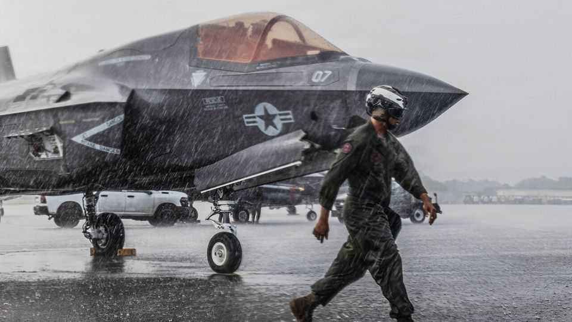

The Americas | Good Morning, Puerto Rico
How the “Donroe Doctrine” is changing Puerto Rico
The island is central to efforts by the United States to project power throughout its hemisphere
December 11th 2025

Bomba drums and reggaeton are classic elements of Puerto Rico’s soundscape. Now, in Ceiba, on the eastern end of the main island, there’s something new in the mix: the howl of F-35 fighter jets. Roosevelt Roads, a United States naval base that was shut down in 2004, is being revived. Outside an aircraft hangar young soldiers wander towards a supplies trailer plastered with “We go where you go!” Aircraft sit on the

tarmac. Ten F-35Bs have been sent to the base as part of a wider build-up in the Caribbean.

Since September the United States has carried out 22 strikes on small boats in the southern Caribbean and eastern Pacific, killing 87 people. The Pentagon says the boats and their crews are legitimate targets as they are being used to run drugs to the United States, but the strikes are almost certainly illegal. American armed forces are also running a pressure campaign against Nicolás Maduro, Venezuela’s unelected leader, buzzing his coast with bombers while Donald Trump speaks regularly and vaguely of striking “the land” as a natural extension of the maritime strikes. On December 8th he told Politico that land strikes would happen “very soon”.

Puerto Rico is at the heart of this build-up. The island provides support to the F-35Bs, AC-130 gunships and MQ-9 “Reaper” drones which operate alongside six destroyers, two cruisers and the world’s most advanced aircraft- carrier: the USS Gerald R. Ford. If the United States does strike Venezuela, Puerto Rico will be pivotal. Caracas, Venezuela’s capital, lies about 800km (500 miles) to the south.

Since 1898, when it seized Puerto Rico from Spain, the United States has maintained a military presence on the island. In the 1990s Roosevelt Roads served as a launch-point for operations in Haiti. Its revival is “much more explicitly about power projection and military dominance”, says Henry Ziemer of the Centre for Strategic and International Studies in Washington.

New supply contracts run until 2028. The Trump administration’s recent National Security Strategy makes clear its more muscular approach, including reallocating forces to the region from elsewhere. It states plainly that the purpose of these forces, as well as crushing “narco-terrorists”, is to deny America’s competitors the ability to control assets or territory in “our Hemisphere”.

This new military presence started from a very low base. In June, before the build-up began, the United States had 2,400 active-duty troops stationed in Latin America and the Caribbean (including Puerto Rico and the US Virgin Islands), no permanently assigned Navy vessels and a handful of aircraft scattered across the region. Now, on Puerto Rico and the US Virgin Islands

alone there are scores of aircraft, tens of ships offshore, and some 15,000 troops.

Many locals are comfortable with the troops’ arrival. They “eat and put petrol in their vehicles”, says Samuel Rivera Báez, Ceiba’s mayor. “It will be good for business,” says Lilly Robles, a hairdresser who has struggled in Ceiba’s depressed economy. Food vans have arrived at Roosevelt Roads, selling pizzas and empanadas.

A few are against it, irritated by what they see as American imperialism or worried about environmental harm. Land on Vieques, an island off Ceiba, is still contaminated after decades of military training exercises. Sonia Santiago, the founder of Mothers Against War, a local advocacy group, says she doesn’t want Puerto Rico used as a springboard for conflict.

Jenniffer González-Colón, Puerto Rico’s right-wing governor, supports the build-up. She notes that she has been pushing for a counter-narcotics strategy for the Caribbean for some time. “This means two things: security and investment,” she says. She welcomes the fact that American forces are now protecting citizens in Puerto Rico from drug cartels.

Many Caribbean leaders, fed up with the violence caused by drug gangs, share her enthusiasm. Of drug-traffickers, Trinidad & Tobago’s prime minister has said that “The US military should kill them all violently.” In November the Dominican Republic signed an agreement granting American forces access to two military sites for refuelling and logistics.

How Puerto Rico and its neighbours ultimately feel about the build-up will depend on its results. Yariel Ramos of the Department of Homeland Security says gangsters are already deterred from the stretch between Puerto Rico and Venezuela which used to be their “playground”. But they are adapting, finding new ways to move drugs. For now, the drumbeat of war sits uneasily with the island’s usual one. ■

Sign up to El Boletín, our subscriber-only newsletter on Latin America, to understand the forces shaping a fascinating and complex region.

This article was downloaded by zlibrary from https://www.economist.com//the- americas/2025/12/10/how-the-donroe-doctrine-is-changing-puerto-rico