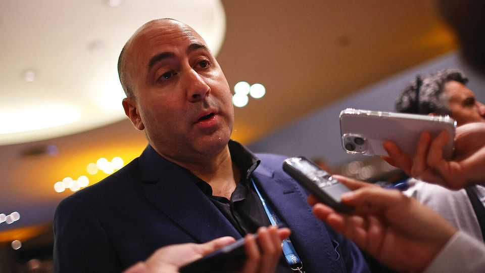

The Americas | Chainsaw politics
MAGA’s man in LatAm
Fernando Cerimedo has run right-wing campaigns across Latin America, forging close ties with MAGA and Donald Trump
December 11th 2025

In the run-up to the presidential election in Honduras, the conservative candidate, Nasry Asfura, trailed in the polls by more than five points. He needed a jolt. On November 26th, four days before the vote, he got one: a surprise endorsement from President Donald Trump. As The Economist went to press Mr Asfura was ahead by 44,000 votes and his main opponent was calling for a recount. If his lead holds, Mr Asfura can thank his campaign manager, an Argentine called Fernando Cerimedo (pictured). A political operator unknown to most

people in Honduras or beyond, he is becoming prominent in the network of strategists and fixers that surrounds Mr Trump. He says he co-ordinated Mr Trump’s Truth Social post endorsing Mr Asfura with Dick Morris, a friend and strategist who works on Latin America. He believes it gave Mr Asfura’s campaign the boost it needed.

The 44-year-old Mr Cerimedo’s first brush with prominence was in Brazil in 2022. He hosted a live-stream entitled “Brazil Was Stolen” days after Jair Bolsonaro, a right-wing populist, lost re-election to Luiz Inácio Lula da Silva, known as Lula. In it he alleged that old voting machines had been fiddled with to swing votes to Lula. This echoed claims Mr Bolsonaro made after he failed to win the presidency in the first round in 2018. Mr Bolsonaro’s claims about voting machines eventually led to him being barred from running from public office. Mr Cerimedo was investigated by Brazilian police but never charged.

His foray into right-wing Latin American politics was just getting started. He already had a political-marketing agency back in Buenos Aires, Numen; an associated “training academy”; and a news website, La Derecha Diario (The Daily Right), promoting right-wing and libertarian ideologies. He says his wife pushed him to get involved with the presidential campaign of an up-and- coming conservative legislator, Javier Milei, whose biting criticism of the Peronist establishment and its extravagant public spending was turning heads. He began working on digital-media strategy with Santiago Caputo, who remains one of Mr Milei’s top advisers. Mr Cerimedo claims it was he who encouraged Mr Milei to bring a chainsaw on stage at rallies as a symbol of his plans to slash spending.

In the run-up to that election, with Mr Milei trailing in the polls and at risk of not reaching the second-round, an unexpected interview request came in from The Tucker Carlson Show, the conservative American commentator’s podcast. “Fernando immediately was like, ‘Dude, I’m on it,’” says Damian Merlo, a consultant in Miami who passed on Mr Carlson’s request and later joined Mr Milei’s campaign (he also works closely with El Salvador’s president, Nayib Bukele). “He called me back five minutes later. He said, ‘We’re on.’”

The Carlson interview gave Mr Milei a timely boost. It also made him an international sensation, and caught the attention of Mr Trump. “The Milei interview was big. We couldn’t believe it,” says Mr Merlo. Mr Cerimedo has since parted ways with Mr Milei after falling out with his inner circle, but the

Argentine president has built a strong relationship with Mr Trump. American backing was crucial to halting a run on the peso in the run-up to Argentina’s midterm elections in October.

The list of places in Latin America untouched by Mr Cerimedo’s hand is shrinking. In 2022 he worked on the campaign to defeat the attempt to install a controversial left-wing constitution in Chile. Among the graduates of his Numen Academy is Catalina Paz, the daughter of Bolivia’s new president, Rodrigo Paz. She now advises her father’s government. Mr Cerimedo worked on media strategy for that campaign, too, helping Mr Paz pull a victory out of the turmoil of Bolivian politics, turning the country away from the left-wing MAS for the first time in two decades. Mr Cerimedo continues to work with Mr Paz as a senior adviser, shuttling between Bolivia, Honduras and his home in Buenos Aires.

The Latin American left calls him the “prince of darkness”. Mr Cerimedo claims that he neither uses “troll farms” nor runs smear campaigns using “bot” accounts. Instead, he says, he merely monitors online conversations and then uses that information to influence public opinion with tailored messaging.

He credits his success in part to his business partner, Brad Parscale, Mr Trump’s former campaign manager, who manages the technical side of Numen. Mr Cerimedo rejects accusations of shady operations and invites journalists into his modern Buenos Aires office in the Puerto Madero district. “He’s not shy about it because he’s not doing anything illegal and there’s nothing wrong,” said Mr Merlo.

Even Mr Cerimedo has his limits. He says he was not involved in Mr Trump’s pardon of Juan Orlando Hernández, a former president of Honduras. Mr Hernández was serving a 45-year jail sentence in the United States for drug- trafficking when he was released on December 1st. “The pardon was a surprise,” he says, adding that the Asfura campaign felt it might hurt his chances. Sometimes Mr Trump shocks even his most dedicated servants. ■

Sign up to El Boletín, our subscriber-only newsletter on Latin America, to understand the forces shaping a fascinating and complex region.

This article was downloaded by zlibrary from https://www.economist.com//the- americas/2025/12/09/magas-man-in-latam

Asia

Why many Asian megacities are miserable places Fighting between Thailand and Cambodia breaks out again Australia’s hard right is resurgent How did one airline bring Indian aviation to its knees?