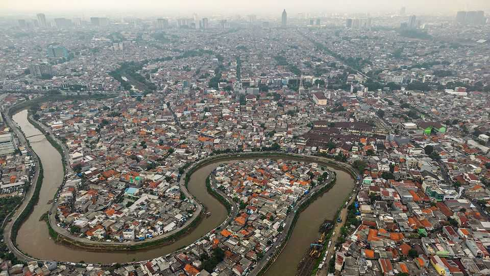
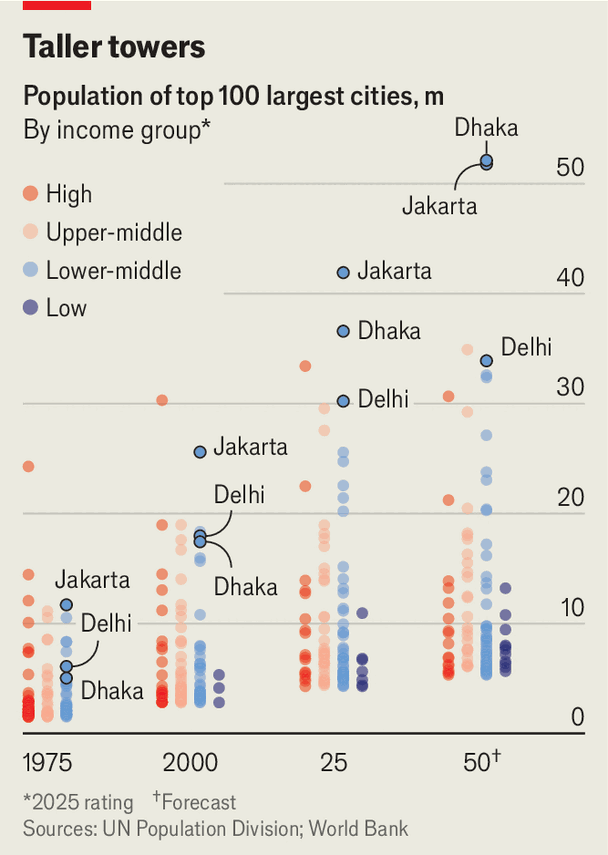
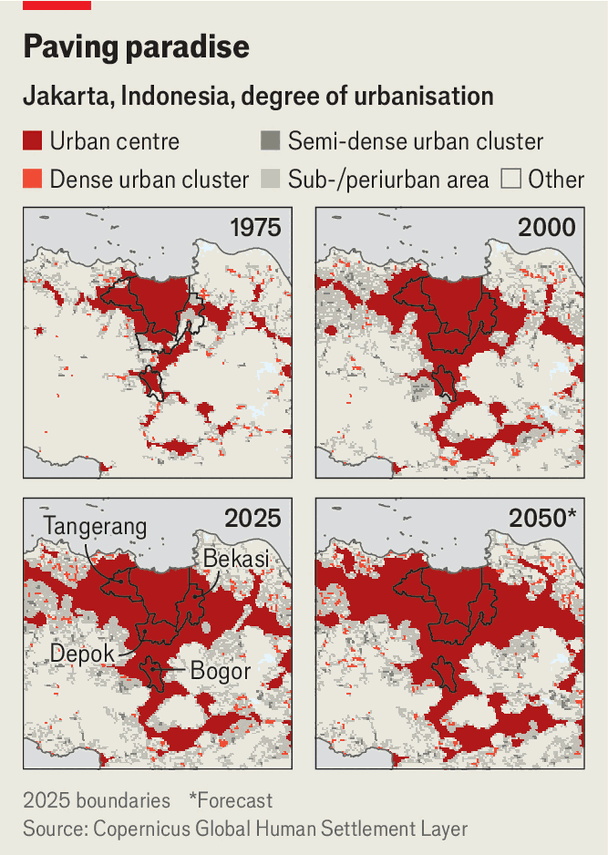

Asia | Agglomerate this!
Why many Asian megacities are miserable places
And why Shanghai and Tokyo are not
December 11th 2025

FOR SEVEN decades Tokyo was considered the world’s most populous city. That was 15 years too long, according to data released last month by the UN. Until recently the organisation’s statisticians accepted national governments’ definitions of where their cities began and ended; their latest report accepts the reality of urban sprawl. By their new measures, Jakarta (pictured), Indonesia’s capital, jumps to the top of the board with 42m people, about as many as Canada. Dhaka, capital of Bangladesh, with 37m, has also pulled ahead of

Tokyo, with 33m. Delhi and Shanghai, with around 30m people each, fill out the top five.

The UN’s latest figures highlight tremendous urbanisation. These days 45% of humanity lives in cities (with at least 50,000 people); another 36% inhabit towns (with at least 5,000). The data also show that much of the growth is happening in middle-income Asia. Only one of the world’s ten biggest cities lies outside that continent. And only seven of the world’s 33 “megacities” (boasting over 10m people) are in rich countries. By 2050 Jakarta and Dhaka will between them add another 25m people, nearly as many as live in Australia.

These migrations should help make people better off. “Dhaka changed my life and secured my kids’ education,” says Clinton Chakma, who found a job as a waiter after migrating from a farm in 2022. Yet there is also a huge risk: that as Asia’s cities expand, squalor, pollution and gridlock increasingly undercut the economic boost they provide. “People move to cities to be part of the labour market,” says Alain Bertaud of New York University. But if the labour market does not work “you build a poverty trap”.

Jakarta, Dhaka and Delhi already rank among the world’s worst cities to live in, according to the Economist Intelligence Unit, our sister company. Jakarta ranks 132nd out of 173 cities; Delhi is 145th. Dhaka comes third from last, with only Damascus and Libya’s Tripoli behind. If Asian countries are to break out of the middle-income trap, they must solve the problems that plague their cities. The best way of doing that is not through piecemeal projects, but by taking a hard look at the dysfunctional ways urban areas are governed.

Jakarta—nobody’s idea of a lovely city—is as good a place as any to see all this on the ground. After years of expansion it now encompasses the neighbouring cities of Bogor, Depok, Tangerang and Bekasi (see map). Yet there is far too little co-ordination among these neighbouring authorities. A settlement as populous as some countries is governed as coherently as a clowder of cats.

The cost of this fragmented governance is perhaps best seen in Jakarta’s notorious traffic. It is the world’s 12th-most congested place (Dhaka ranks third and Delhi seventh). Unable to afford housing near their workplaces, many Jakartans live in far-flung suburbs. A vastly inadequate public transport system encourages them to travel by two-wheelers or in cars, which jams up the roads and causes air pollution. All this cuts productivity. The government of Jakarta reckons traffic jams cost its economy $6bn each year.

In 2019 Jakarta got its first metro line. But it stops abruptly at the city’s official administrative boundary, short of commuter neighbourhoods. There is an urgent need for co-ordination within the agglomeration, says Adhika Ajie, the head of research and innovation at Jakarta’s city government. “Otherwise it’s useless.” Good luck with that. “Throughout my time there was very little conversation with other mayors of surrounding cities,” says a former official in the city administration.

Similar problems affect megacities elsewhere in Asia. Dhaka has enveloped satellite cites with which it has little co-ordination. But it also suffers from being run by two municipal corporations, a national development authority, several ministries and dozens of different agencies which are individually responsible for things such as water, sewage and transport. A mayor of Dhaka North City Corporation once complained that he lacked the authority to deal with 80% of the problems that affect his city, including traffic and flooding.

Parts of India, now home to five “megacities”, are in the same boat. Governance in Delhi is split between municipal bodies, a state government, the national government and several bodies created to oversee matters such as housing, planning and the metro rail. The Kolkata metropolitan area (the world’s ninth-largest) contains no fewer than 423 different governing entities, according to the World Bank.

How do successful cities do it? One model is Shanghai, which is run by the central government as a province rather than a city. It exercises strong, centralised authority over all major urban functions, from planning to transport. But China’s governance model is unique: pressure on leaders comes not from voters but from bosses in Beijing. Party leaders cannot afford to let areas of the city grow unruly.

A better model is Tokyo. The Tokyo Metropolitan Government (TMG) is responsible for big-ticket public services such as water, sewage and public hospitals. Beneath it sit 23 wards and a host of peripheral cities and towns. Each municipality has its own elected mayor and assembly, responsible for services such as schools, waste management and community planning. The TMG co-ordinates between them. It is a sensible split that clearly delineates authority while also making sure that decision-making is joined up.

Like the megacities of middle-income Asia, Tokyo has no single government body for the greater metropolitan area, which includes parts of the neighbouring prefectures of Kanagawa, Chiba and Saitama. But the national government plays an important role in co-ordinating between them. And a dense metro and commuter-rail network ties the region together. Over 90% of people in the greater Tokyo area live within a 20-minute walk of a station.

It helps, of course, that Tokyo is richer than other Asian megacities. When it became a city of 20m in 1965, Japan’s GDP per person was $9,500 (at 2011 prices). When Dhaka hit that number in 2005, per person income in Bangladesh was $1,900. Yet making Jakarta, Dhaka, Delhi and other Asian megacities more liveable can start with changes to governance, not with huge investments. Overhauling power structures is harder than splurging on big projects. But the potential pay-offs are mega. ■

This article was downloaded by zlibrary from https://www.economist.com//asia/2025/12/11/why-many-asian-megacities-are-miserable- places