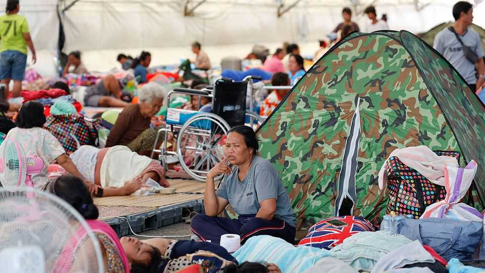
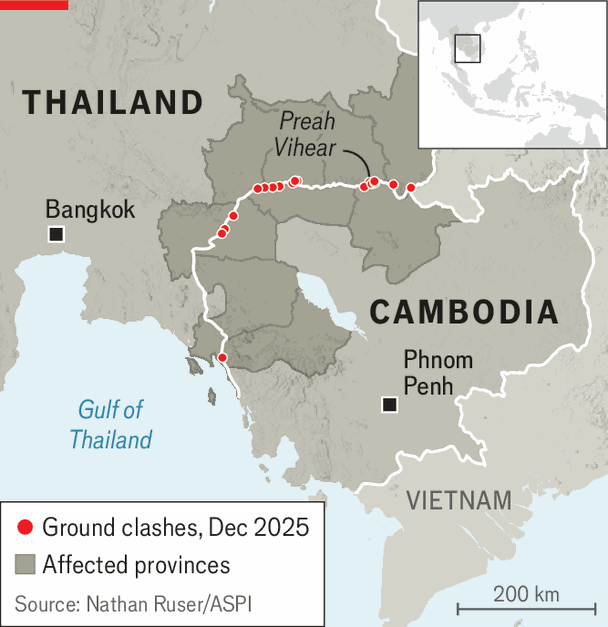

Asia | So much for Trump the peacemaker
Fighting between Thailand and Cambodia breaks out again
Hundreds of thousands of refugees are back on the move
December 11th 2025

IN LATE OCTOBER President Donald Trump oversaw the signing of a peace deal that he said would save “millions of lives”. He convened the leaders of Cambodia and Thailand on the sidelines of a regional summit in Kuala Lumpur, Malaysia’s capital. He watched, beaming, as the two men signed an agreement cementing a truce they had struck months earlier. The idea was to prevent a repeat of the conflagration that took place in July, when the two countries spent five days fighting in their disputed borderlands. Those battles left several dozen people dead and forced some 300,000 civilians to flee.

Yet the Kuala Lumpur Peace Accord—as Mr Trump grandiosely called it— was only ever a rickety ceasefire. And it fell apart completely on December 8th, when Thailand sent F-16 fighter jets to strike Cambodian targets. By December 10th renewed fighting along the border had killed at least 19 people and injured more than a hundred. Hundreds of thousands of refugees are once again on the move. On December 9th Mr Trump said he would call each side to ask them to knock it off.

Thailand claims its air strikes on December 8th were retaliation for Cambodian attacks in border areas a day earlier. Cambodia says Thailand fired first. It is difficult to know whom to believe. But leaders on both sides face pressure not to look weak before their rival. Their border dispute has smouldered for generations.

Tensions rose anew last month when Thai soldiers were injured by a landmine in the border areas. Cambodia says these are leftovers from its long civil war with the Khmers Rouges. But a team of neutral observers, drawn from neighbouring countries and charged with policing the peace agreement, said the mines had been freshly laid. On December 8th Anutin Charnvirakul, Thailand’s prime minister, told reporters in Bangkok that no one should ask his country to exercise restraint. “We’re long past that point,” he said. “If you want things to stop, tell the aggressor to stop.”

Mr Trump may not see things that way. When the fighting first flared up in July, he called the leaders of both countries and threatened to raise tariffs on each to intolerable levels unless they both backed down immediately. That worked, for a time. But these tactics have clearly done nothing to deal with the underlying causes of the dispute. Indeed, Mr Trump may have emboldened Cambodia by ignoring the increasing evidence of its aggression against Thailand (an old American ally). In the wake of the conflict in July Cambodia’s prime minister, Hun Manet, nominated Mr Trump for the Nobel peace prize.

This is not to say that Thailand bears no responsibility for this week’s renewed fighting. Of the two it has by far the more powerful army. And it now appears ready to take the fight much further than it did in July. “The objective of the army is to cripple Cambodia’s military capability for a long time to come,” Thailand’s top general said on December 8th. He said this was necessary “for the safety of our children and grandchildren”.

A big military success would be popular in Thailand. Its army is a powerful player in politics; its generals back Mr Anutin’s government. They would like to see him win big in a general election expected in early 2026. They may even be gambling that a lasting victory could reshape how Mr Trump sees the two countries. Everyone knows the president prefers winners. ■

This article was downloaded by zlibrary from https://www.economist.com//asia/2025/12/08/fighting-between-thailand-and-cambodia- breaks-out-again