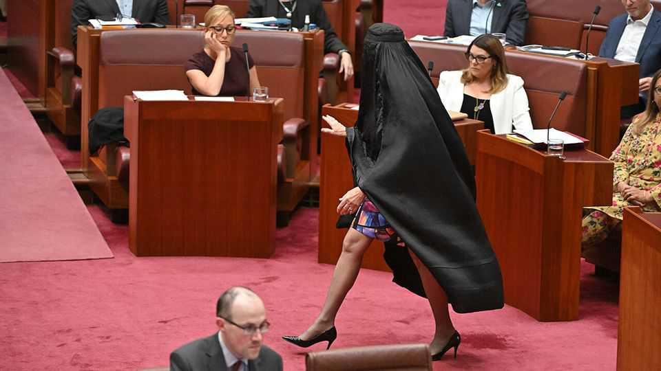
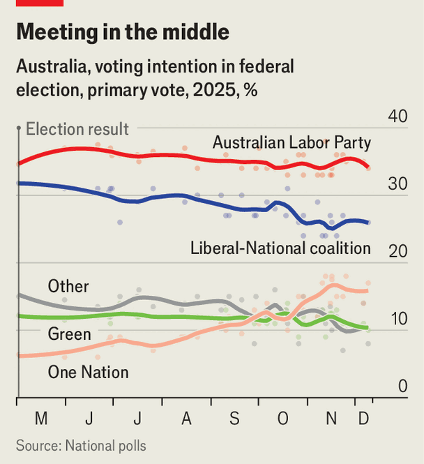

Asia | Dodgy outfits
Australia’s hard right is resurgent
It includes actual Nazis
December 11th 2025

Late last month proceedings in Australia’s upper house were suspended for 90 minutes after Pauline Hanson, a populist-right senator, marched into the chamber wearing a burqa. It is the second time in a decade that Ms Hanson has donned the Muslim garment (which covers the body from head to toe, with a mesh for the eyes) in parliament. On both occasions, the stunt aimed to publicise her long-running campaign to have such face-coverings banned in public places. This time round the caper landed her a week’s suspension from the Senate as well as widespread condemnation from fellow politicians and community leaders, who accused her of vilifying Australia’s Muslims. They

argued that, whatever one thinks of it, only a tiny number of Muslim women in the country actually wear a full veil.

Yet Ms Hanson—whose maiden parliamentary speech three decades ago railed against Aboriginal rights and warned that Australia was at risk of being “swamped by Asians”—is doubtless feeling optimistic. Her party, One Nation, has enjoyed only limited electoral success since it was founded in 1997. Now there are strong indications that it is gaining mainstream appeal. Some polls suggest that almost one in six Australians would vote for it if an election were held today, up from only about one in 20 in June (see chart).

High living costs have been making many Australians anxious about immigration. But the growing draw of Ms Hanson’s party also relates to dysfunction and infighting inside Australia’s centre-right opposition, which is making it harder for more sophisticated diagnoses of Australia’s problems to be heard. The Liberal-National coalition, Australia’s main opposition, has been shedding conservative voters to One Nation.

Lately the coalition has started losing politicians to One Nation, too. Barnaby Joyce—a former leader of the Nationals and a one-time deputy prime minister of Australia—has defected from his party. On December 8th he confirmed he would be joining the one led by Ms Hanson. Mr Joyce is going to run for One Nation in the Senate at the next election in 2028. That will doubtless boost the party’s ability to raise funding and will probably help it reach further into rural parts of New South Wales (Mr Joyce’s home state, which is also Australia’s most populous).

One Nation’s growing popularity comes against a worrying wider backdrop: all sorts of hard-right groups, some of which are extremely irksome, have grown stronger. In recent months angry rallies, collectively dubbed the “March for Australia”, have taken place across big cities. These events have jostled neo-Nazi and other extremist groups together with mainstream outfits that favour slashing immigration and making Australia somewhat less multicultural.

The mood at these rallies has often been grim. On the day of the event in Brisbane, Indian diaspora groups advised members of their community to stay indoors. In Melbourne demonstrators trashed an Aboriginal protest site known as Camp Sovereignty. In November a neo-Nazi group staged a protest outside the New South Wales state parliament in Sydney. Men clad in black unfurled a banner that read “Abolish the Jewish lobby”. Local media named and shamed the participants; one of them, a South African citizen, had his visa cancelled and was ordered to leave the country.

State and federal authorities in Australia have responded to these trends in knee-jerk ways. In 2023 the state of Victoria, grasping for an answer, outlawed the “Roman” (fascist) salute. But Mario Peucker, who researches the radical right at Victoria University in Melbourne, argues that such prohibitions do not present much of an obstacle to increasingly sophisticated operators among the far right.

The radical group that protested in Sydney has said it plans to register a “White Australia Party” (the racist “White Australia” policy largely kept non- Europeans out of the country until the 1970s, when a policy of multiculturalism was adopted, transforming the country’s demography). The Australian Electoral Commission says there is no rule to stop this. Such a party would be unlikely to win a parliamentary seat, but its participation in

elections would doubtless provide much media coverage, boosting recruitment for far-right groups.

Today, one in three people in Australia was born overseas—millions of them in Asia, Africa and the Middle East. So Ms Hanson’s dressing-up games do not reflect the concerns of middle Australia. Moreover, the country’s system of preferential voting would seem to present a big obstacle to the One Nation party ever forming a government, even if its fortunes continue to improve. That contrasts with Britain’s first-past-the-post system, whereby the prospect of a once fringe party such as Reform UK one day taking office is starting to look very real.

Yet it is becoming ever more clear that the ideology of “White Australia” still appeals to a sizeable number of Aussies. Officials sound worried about violence: the head of Australia’s spy agency says that the majority of terror threats it investigated last year involved racist or nationalist ideologies. This is hardly the time for Australia’s squabbling centrists to be needlessly giving up ground. ■

This article was downloaded by zlibrary from [https://www.economist.com//asia/2025/12/11/australias-hard-right-is-resurgent](https://www.economist.com//asia/2025/12/11/australias-hard-right-is-resurgent)