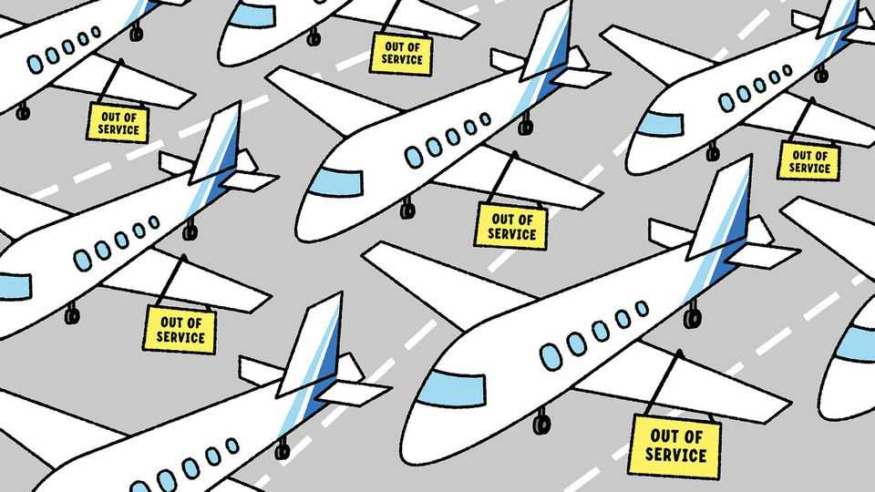

Asia | Banyan
How did one airline bring Indian aviation to its knees?
The blame is widely shared
December 11th 2025

AN INDIAN WEDDING reception can be a tedious affair. A typical example finds the bride and groom sitting on—or standing next to—a pair of gaudy thrones. Guests queue up to hand over presents and have their photos taken. There is often no booze, no dancing, no revelry. At a reception in the southern city of Hubli on December 3rd, there were no newly-weds either. Stuck hundreds of miles away in India’s east, the couple appeared virtually instead.

The experience of Medha Kshirsagar and Sangram Das—forced to attend their own reception by video call—is one of the lighter stories to emerge from the vast and unprecedented disruption that has struck Indian aviation in recent days. Problems that began at the start of the month with delays and a handful of cancellations peaked on December 5th when IndiGo, India’s biggest airline by every possible measure, cancelled more than half its roughly 2,300 daily flights, including all departures from Delhi airport, the country’s busiest.

An operational meltdown at one airline should not be a national crisis. Nor would it have become one in any other big economy, where no single carrier controls more than a fifth of the market. Yet IndiGo holds a 66% share of the market for domestic flights in India (in America, by contrast, Delta, United, Southwest and American Airlines hold a 68% share combined). Indeed, IndiGo is the only carrier on a staggering 60% of India’s 1,000-odd domestic routes. When Southwest faced a similar crisis in America three years ago, other airlines were able to pick up the slack quite easily. But when IndiGo flights stopped running, it was as if Indian aviation as a whole had suddenly gone down.

The blame for this sorry episode lies with the airline, which failed to prepare for new regulations, first advertised two years ago, that increased rest periods for pilots. IndiGo’s dominance is built on highly optimised operations, including super-tight schedules. But it had granted itself too little wriggle room to accommodate the new rules, which came into force last month. The result is that small disruptions of the sort that commonly buffet air travel created knock-on effects that ended up growing vast enough to make IndiGo’s entire network come apart.

Yet the blame for letting Indian aviation become so dominated by a single airline is widely shared. Making money out of aviation is especially difficult in India. High taxes on fuel swallow profits. The growing heft of airport operators—one firm controls half of India’s privately operated airports—risks driving costs up further. An imperfect bankruptcy law drives teetering airlines out of business, even when they might be saved.

One week on, Indigo’s operations are just about limping back to normal. Yet its millions of furious passengers are unable to show their displeasure by choosing alternatives. Air India, the flag carrier, has 27% of the market; it is the only other airline of any size. But it, too, has plenty of problems. They

include delayed aircraft deliveries that have prevented it from expanding its network and a suboptimal safety culture: only last month it flew a plane that did not have a valid certificate of airworthiness.

Nor, alas, do Indian travellers have many better options than taking to the air. India has one of the world’s most comprehensive rail networks; the railway minister says that some 80% of trains run on time. So perhaps Banyan is just unlucky in only ever booking the other 20%. But even when the trains run to schedule, the experience can be unpleasant. Stations are chaotic and grimy; the majority of trains are trundlers; many services sell out far in advance.

India has invested in expanding its road network. In recent years hundreds of miles of motorways have opened, as well as dual carriageways and many more rural roads. But these are marred by unlicensed drivers, baffling signage, potholes and frequent obstructions such as stopped vehicles and stray animals. India’s roads still rank among the world’s most dangerous.

Improving transport infrastructure has long been a priority for Narendra Modi, the prime minister. His government has indeed boosted connectivity. But now it needs to go beyond providing hardware such as flashy airports, roads and new train carriages. India’s travellers deserve new software, too: enforcement of road-traffic rules, a modernised rail service—and much more competition in aviation. It is not asking a lot to expect to make an appearance at your own wedding reception.■

Subscribers to The Economist can sign up to our Opinion newsletter, which brings together the best of our leaders, columns, guest essays and reader correspondence.

This article was downloaded by zlibrary from https://www.economist.com//asia/2025/12/11/how-did-one-airline-bring-indian-aviation- to-its-knees

China

The meaning of China’s record-high trade surplus Hedging against Trump, Canada reconsiders ties with China Why do so many Chinese still smoke? China knows how to punish countries that offend it