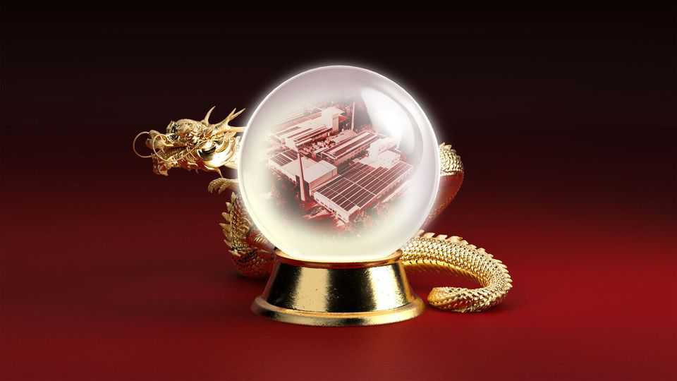
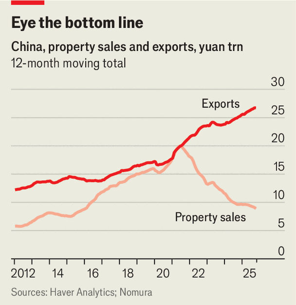

China | Not so self-reliant
The meaning of China’s record-high trade surplus
The country is too complacent about its export dependence
December 11th 2025

When people in China talk about the “two meetings”, they mean the annual gatherings of the country’s legislature and its advisory body in March. But another pair of meetings this month could prove more important for China’s economy. The just-concluded Central Economic Work Conference (CEWC), a yearly gathering of leaders, has set the direction for economic policy in 2026. Meanwhile, in a meeting on December 10th, Vanke, once China’s second- biggest property developer, pleaded with its creditors for an extra year to repay a bond that will soon fall due. The Vanke meeting is another sign that

China’s property slump, the source of much economic trouble, is far from over. But the conference in Beijing suggested that China’s leaders have other things on their minds.

One of their preoccupations is technological self-reliance. By that yardstick, the past year has been a success. DeepSeek, an artificial-intelligence firm based in entrepreneurial Zhejiang province, has shown that China can compete with America’s best models despite constraints on its computing power. And ten years after the launch of its “Made in China 2025” initiative, the country comfortably exceeded its goals for localising electric-vehicle-making and the renewable-energy industry.

Where China is not self-reliant it has also become more secure. It has turned its dominance in rare earths—critical elements used in powerful magnets and other manufacturing components—into an effective economic weapon. That will help it deter further Western attempts to cut it off from advanced semiconductors and other technological inputs it still cannot make itself. America’s government, for its part, now seems more inclined to loosen controls than tighten them. On December 8th President Donald Trump said he would allow China to buy Nvidia’s H200 chips—not quite state-of-the-art but far more powerful than anything China has been sold before. China’s “hard power” in economics, science and technology has “significantly improved”, boasted the Communist Party’s Politburo at a meeting on the same day.

China’s growing technological sophistication has also contributed to the surprising resilience of its exports. According to China’s customs administration, its trade surplus in goods in the first 11 months of the year exceeded $1trn, more than the 12-month total for any previous year. Such a bumper surplus seemed unlikely in the spring when Mr Trump raised tariffs on some Chinese goods to more than 145%.

But even as China’s exports to America fell, its sales to the rest of the world more than made up the difference. Chinese firms found new markets to replace America. And they found new, more roundabout routes to reach America, circumventing the highest tariffs along the way. As much as 70% of China’s extra sales this year to the Association of South-East Asian Nations represent indirect exports from China to America via third countries, according to Goldman Sachs, a bank.

China’s surplus cannot, however, be chalked up only to the tenacity of its exporters. It also reflects the weakness of China’s own spending. Imports shrank in dollar terms in the first 11 months of this year, compared with a year earlier. China’s investment spending is flagging, especially in construction, which tends to be import-intensive, notes Adam Wolfe of Absolute Strategy Research, a consultancy.

Sales of new flats have fallen by half since their peak in 2021, even as exports have risen by a third (see chart). Falling home values have also dented the wealth of households, damaging their confidence and depressing their

consumption. The housing downturn over the past four years may have wiped out 100trn yuan ($14trn) in property wealth, reckons Larry Hu of Macquarie, a bank. As a result, deflation has become entrenched. Figures released on December 10th showed factory-gate prices fell year on year for a 38th month in a row.

Falling prices at home make Chinese goods more competitive abroad, points out Mr Wolfe. Deflationary pressure has also forced China’s central bank to keep interest rates lower than elsewhere in the world. That in turn has ensured that the yuan stays relatively cheap, giving China’s exports a further edge. China’s exchange rate, adjusted for inflation and weighted to reflect China’s trade patterns, is 10% below its average of the past ten years.

The country’s export strength is then, in part, a product of its domestic weakness. It is also, indirectly, a cause of it. Export momentum has helped China’s economy stay within reach of its growth target of “around 5%” this year, even without a stronger fiscal stimulus or a more decisive effort to end the property slump. Leaders have not done whatever it takes to revive the property market, because they have not needed to, argues Mr Hu. “Housing may not bottom out until policymakers can no longer rely on exports to drive growth,” he writes.

In the meantime policymakers have settled for more piecemeal measures. The Ministry of Finance has allowed local governments to sell more bonds and use the proceeds to buy land or unsold properties from developers. Zhengzhou, the capital of Henan province, has experimented with a scheme to purchase small flats from households who commit to buy pricier new homes instead. But local-government finances are stretched. Only the central government has the fiscal firepower to carry out such schemes on the scale required.

Likewise, China’s attempts to lift consumer spending this year have been innovative but incremental. The government has expanded subsidies for households that are willing to trade in old cars, appliances or electronics for new ones. They have rolled out childbirth subsidies, a year of free pre-school, and vouchers to help the disabled elderly buy care. They have also subsidised consumer loans. But none of these initiatives has been big enough to turn sentiment around.

At its recent meeting the Politburo cited the need for a “countercyclical” response to a slowing economy, points out Lu Ting of Nomura, a bank. This phrase was missing from its comments in July. But the Politburo did not say, as it did last year, that the response should be “extraordinary”. At the CEWC, China’s leaders merely said that the “necessary fiscal deficit” should be maintained.

Stabilising the property market would be expensive, which is one reason why the central government will wait until it has no choice. But allowing house prices to decline and deflation to linger also has costs. The more prices fall, the heavier debts weigh. The longer deflation lasts, the harder it becomes to imagine an alternative. China could lapse into the “deflationary mindset” that haunted Japan for decades.

Nor can China count on exporting its way out of trouble for ever. Interest rates elsewhere are falling. The yuan is already facing pressure to rise. Further European tariffs or an American tech bust would sap foreign demand. China would then have no choice but to stimulate domestic spending. By then it might be even harder to revive it.

China’s leaders are keenly pursuing homegrown alternatives to foreign tech. But there are other measures of self-reliance. The Politburo says domestic demand should be the “main driver” of the economy. But in the past year China has relied more on overseas spending to drive growth. China’s leaders are wary of depending on foreigners to sell the country stuff. But they seem curiously content to depend on foreigners buying theirs. ■

Subscribers can sign up to Drum Tower, our new weekly newsletter, to understand what the world makes of China—and what China makes of the world.

This article was downloaded by zlibrary from https://www.economist.com//china/2025/12/10/the-meaning-of-chinas-record-high-trade- surplus