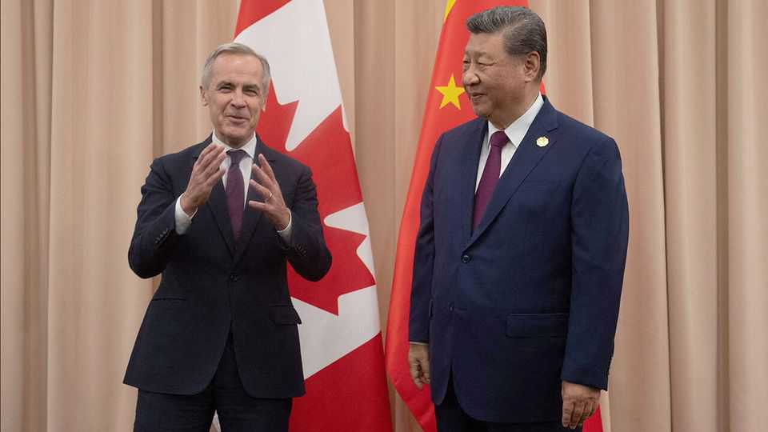
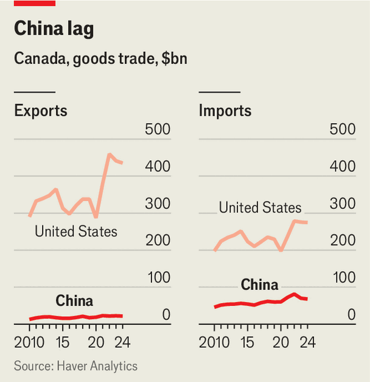

China | Weighing the threat
Hedging against Trump, Canada reconsiders ties with China
How far it can go will depend on America
December 11th 2025

The last time people cared what Canada thought of China was half a century ago. Fighting in Vietnam, America did not want Canada to recognise “Red China”, in preference to Taiwan. But Canada saw relations with the People’s Republic as important for its own and the world’s interests. Sensing that breaking from America’s position would not seriously damage North American ties, Canada formally recognised China in 1970. Other countries followed suit. Fifty-five years on, Canada—like other middle powers—is

pondering its approach once more. How far can it deviate from the position of its southern neighbour, without seriously annoying it?

Canada’s relationship with China frosted over in 2018, when Canada arrested Meng Wanzhou, an executive of Huawei, a Chinese telecoms firm, on behalf of America. In apparent retaliation, China detained two Canadians, Michael Spavor and Michael Kovrig. All three were freed in 2021, but ties remained severely strained. In April, when campaigning in parliamentary elections, Canada’s prime minister, Mark Carney (whose party won a new term), named China as Canada’s biggest geopolitical threat. But the mood changed in October when Mr Carney shook hands with China’s president, Xi Jinping, on the sidelines of a meeting of Asia-Pacific leaders in South Korea. Both sides used terms like “turning point”. Mr Carney accepted Mr Xi’s invitation to visit China.

Canada is now mulling how to re-engage. “Four months ago, there was no serious discussion...Those who were advocating for stronger interactions with China were marginalised,” says Paul Evans of the University of British Columbia. “Boom. That’s changing.”

There are two main reasons. One is President Donald Trump, who eroded Canada’s reflexive trust in America by slapping 25% tariffs on Canada’s goods and saying the country should become America’s 51st state. His high- handedness prompted Canadian cafés to rename Americanos “Canadianos” and grocers to promote “Buy Canadian” campaigns. A Pew survey conducted between February and April found that 34% of Canadians viewed Americans favourably, down 20 percentage points from 2024. Meanwhile, Canadian sentiment towards China has moved in the other direction. A survey carried out in September by the Angus Reid Institute, a pollster, found that 27% of Canadians viewed China favourably, up from 16% earlier this year.

The second cause of change is Mr Carney. He became prime minister in March, after nine years of Justin Trudeau. China sees this as a good time to reset. Both men belong to the Liberal Party, but Mr Carney was in London heading Britain’s central bank during the rupture in 2018. To China, this means his hands are clean.

The meeting in South Korea gave a green light to Chinese officials to engage with Canadians again. When Canada’s then minister of agriculture visited

China last year he could not secure official meetings, says a person familiar with the trip. This year, around the time of the Xi-Carney handshake, the current minister was able to meet senior officials in China. One month later, a Chinese business delegation flew to Toronto to “implement the important consensus reached by our leaders”.

Chinese state media have played up Mr Carney’s comment that “the centre of gravity in the global economy is shifting” (away from America). But China is mindful that Canada’s options are limited. They remain “constrained by the reality of its long-term reliance on the United States”, Su Xiaohui of a government think-tank wrote in July. Some online commenters agree. “Canadian politicians are just whining for attention,” one wrote. “As soon as the Americans toss them a sweetener, they’ll be friendly and grovelling again.”

But Canada is keen to find wriggle room. Its trade in goods with America was worth $762bn in 2024, far more than the $86bn with its second-biggest trade partner, China (see chart). To reduce exposure to America, Canada wants to double exports to other markets by 2035. With China, there is room for growth: it takes only about 4% of Canada’s exports.

America will still complicate matters. Late in 2024, taking its cue from the Biden administration, Canada imposed 100% tariffs on electric vehicles (EVs) made in China. China retaliated with tariffs on canola (rapeseed)—Canada’s biggest export to China in 2024—as well as seafood and pork. It has offered to

drop tariffs on agricultural products if Canada does the same for EVs. But the Trump administration would worry about this. It would represent a major breakthrough for Chinese EV makers, who are currently in effect blocked from America and Canada.

Canada may begin by looking for progress in areas that are less politically fraught, such as co-operation in tackling transnational crime and boosting people-to-people exchanges. China looks eager: in November, it finally ended a pandemic-era restriction on tour groups to Canada. At least as political ties warm, more Chinese can experience Canada’s biting winter. ■

Subscribers can sign up to Drum Tower, our new weekly newsletter, to understand what the world makes of China—and what China makes of the world.

This article was downloaded by zlibrary from https://www.economist.com//china/2025/12/11/hedging-against-trump-canada-reconsiders- ties-with-china