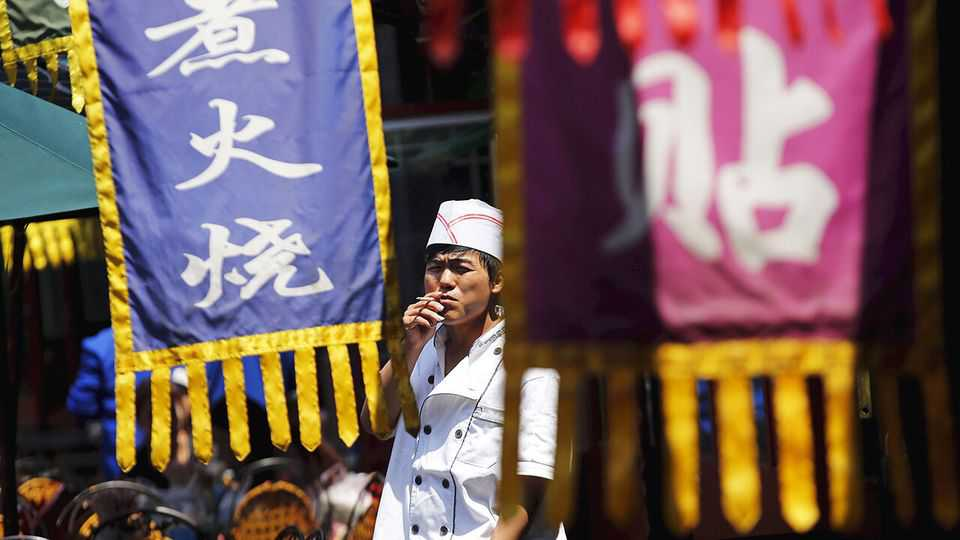

China | A persistent craving
Why do so many Chinese still smoke?
One reason: China’s tobacco industry has massive clout
December 11th 2025

Does Xi Jinping still smoke? China’s leader had a penchant for a puff as a young man, and his predecessors Mao Zedong and Deng Xiaoping kept up the habit. Mr Xi is said to have kicked it; a former boss of the World Health Organisation (WHO) has even praised him for doing so. Some analysts wonder, however. Many Chinese struggle with the temptation. In a population of 1.4bn, some 300m are smokers. Most are male: nearly half of adult Chinese men smoke

compared with just under 2% of women. Together they get through 40% of the world’s tobacco. According to the WHO, Chinese consumption of it has declined by just 4% since 2000, compared with 13% globally.

That works well for the state-owned giant, China National Tobacco Corporation (CNTC). Most of the tobacco smoked in China is grown in China, and CNTC dominates the entire supply chain. The firm made some 2.4trn cigarettes in 2023. Compared with prices in the rich world, they can sell for a song: the cheapest pack of 20 typically costs 15 yuan ($2).

The habit exacts a heavy toll. Every year, as many as 2.6m Chinese die early from smoking-related illnesses (roughly as many as inhabitants of Chicago). They account for 23% of all annual deaths; in America the comparable figure is 10%. Tobacco Atlas, an online resource produced by Johns Hopkins University and Vital Strategies, a public-health NGO, reckons that smoking costs China roughly $300bn a year in treatment and lost productivity.

Mr Xi has made some effort to tackle the problem. In 2015 China expanded bans on tobacco advertising to cover billboards and public transport. The following year it unveiled “Healthy China 2030”, a plan that called for the number of smokers to fall to less than 20% of adults by that year (the rate has declined from 24.4% in 2015 to 22.9% today). But at the central level, anti- smoking fervour has fizzled, says Geoffrey Fong of the University of Waterloo in Canada. Local administrations have pitched in. Beijing, Shanghai and Shenzhen are among 250 or so cities that have banned smoking in government offices, hospitals and schools. But enforcement is patchy.

Social behaviour is slow to change. Men in rural China socialise with a smoke. Even doctors greet patients with tea and ciggies. And large packs are still thought to make nice gifts with their pictures of pandas and the Forbidden City (no gruesome photographs of disease-afflicted body parts).

But the biggest problem is the tobacco industry’s clout. Since 2000 tobacco taxes have accounted for almost 7% of central-government revenue. A good way to reduce smoking, experts agree, would be to tax cigarettes more. But the government demurs: too steep a fall in demand could mean a smaller tax take, too. The last time it tried, in 2015, the price of cigarettes rose, but not as much as intended: to prevent a surge, CNTC cut its margins. And pricing, as it

happens, is controlled by China’s tobacco regulator whose head is the boss of CNTC. The organisations share an office.

Indeed, in recent years, price rises have been outpaced by rising incomes. Cigarettes have become even more affordable. More government willpower is needed. ■

Subscribers can sign up to Drum Tower, our new weekly newsletter, to understand what the world makes of China—and what China makes of the world.

This article was downloaded by zlibrary from [https://www.economist.com//china/2025/12/11/why-do-so-many-chinese-still-smoke](https://www.economist.com//china/2025/12/11/why-do-so-many-chinese-still-smoke)