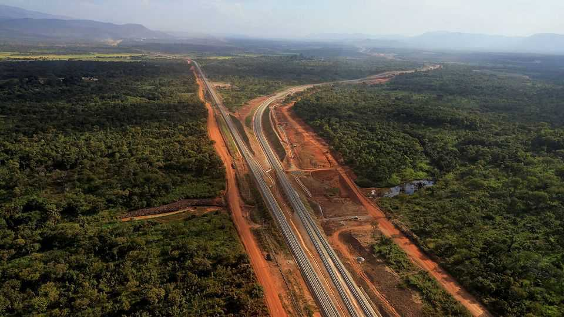
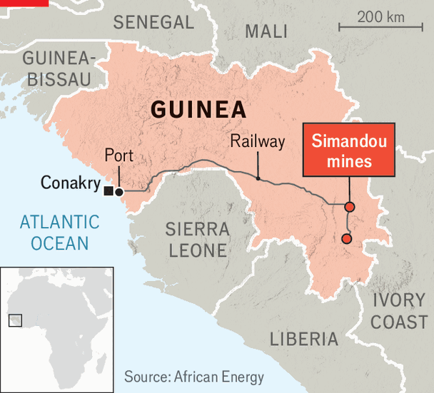
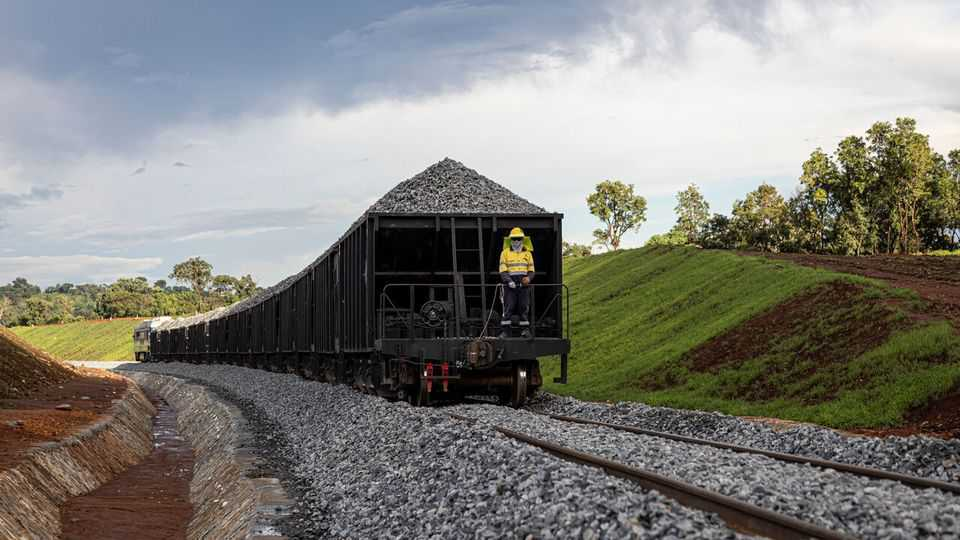
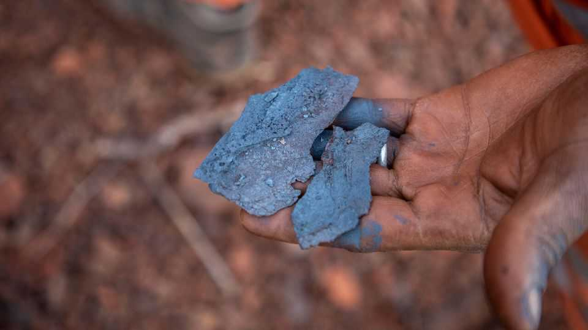
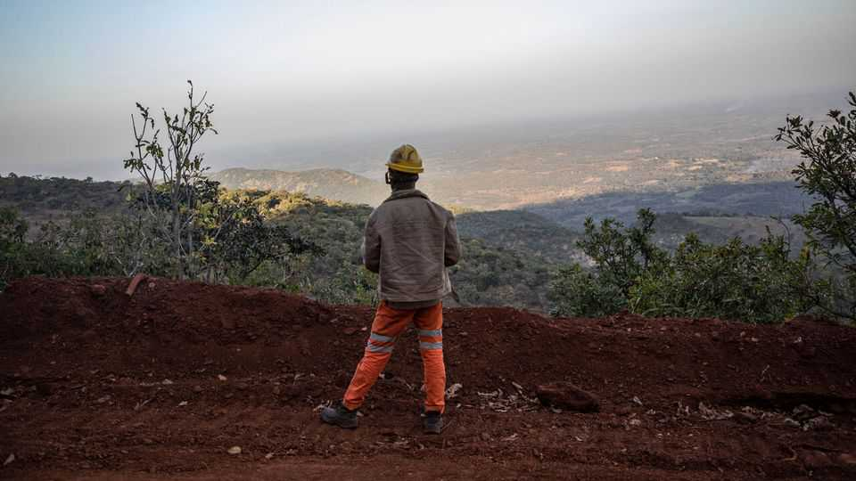
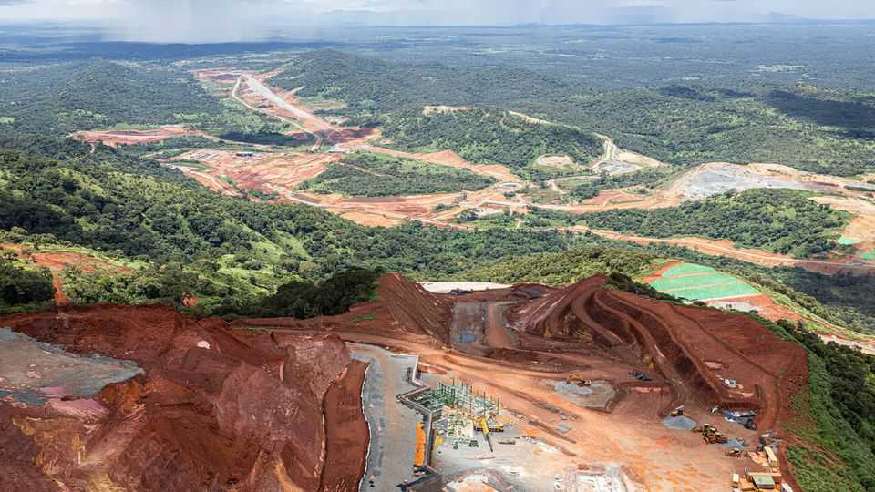

Middle East & Africa | The promise of Simandou
A giant iron-ore mine could bring Guinea riches or ruin
It all depends on how the country’s junta uses the windfall
December 11th 2025

Underneath a ridge in the southern highlands of Guinea, a west African country of 14m people, lies one of the world’s biggest deposits of iron ore. Mining of the 3bn-tonne deposit, which would be worth some $315bn at current market prices, has been on hold for nearly 30 years. On December 3rd the first batch of ore at last left the country’s shores, on a ship bound for steel mills in China.

Simandou, as the mine is known, has the potential to shake up the global iron- ore market by shifting dominance from Australia to China, which owns a big stake in the project. It could prove transformative for Guinea, which wants to use the revenue to overhaul everything from roads to education. Most immediately, it bolsters the country’s military junta and its leader, General Mamady Doumbouya, who wants to legitimise his rule in a presidential election on December 28th.

For decades it looked as though Simandou’s riches might never be dug up. Rio Tinto, an Anglo-Australian miner, first won exploration rights in 1997. Besides bribery scandals and political instability, including two coups d’état, the project was long stymied by its high upfront costs.

The mine sits in a remote part of the highlands. The dirt tracks that lead to it are frequently rendered unnavigable by torrential rains and thick fog. Tapping the site required the construction of a 620km railway and a new seaport. Because the waters off Guinea are too shallow for big ships, small boats have to ferry the ore 20km from shore to a larger vessel waiting in deeper water. To carry construction material to the site, lorries had to travel around 20 days along poor roads from Conakry, the capital, 900km away, with hijacking a constant threat. All this pushed the bill above $20bn, making Simandou the world’s costliest mining project.

These costs are now split between Rio Tinto, which owns a quarter of the project, China’s Chinalco, and a separate Chinese-Singaporean consortium, wcs. China’s government is widely considered to have pushed the project over the line. As the world’s biggest buyer of iron ore, it is keen to see prices fall. Some analysts expect the boost to supply from Simandou to make iron-ore prices drop from around $100 a tonne now to as low as $70 over the next couple of years. At Rio Tinto, Chinese involvement led to a realisation that the project would proceed with or without the firm, so staying involved was considered strategically important. “You don’t always measure value in just your raw profit,” says Chris Aitchison, the managing director of the Rio- Chinalco consortium.

For their part, Guinean officials are keen to stress that China, whose vice- premier, Liu Guozhong, attended a commissioning ceremony in November, is just one of many partners in the mine. Simandou combines “the speed of the Chinese players and the standards that we like with the Western players”, says Djiba Diakité, General Doumbouya’s chief of staff.

Guinean officials hope that the experience of building Simandou has prepared them for their next big test: managing the windfall. Posters advertising “Simandou 2040”, the government’s plan to invest its share of revenues from the project, are plastered all over Conakry ahead of the election, often next to images of General Doumbouya in uniform. “We have the opportunity to change the size of our economy, the life of our people,” says Bouna Sylla, the mines minister.

If things go to plan, Mr Sylla could well be right. By 2030 Simandou is expected to ship 120m tonnes of iron ore, adding about 6% to the internationally traded supply. It could also push up Guinea’s exports by about $12bn a year, which would nearly double its existing trade. The imf reckons that if production ramps up, GDP could be 26% higher by 2030 than it would have been without the project. s&p Global, a ratings agency, published its first rating of Guinea’s government bonds in September.

But the newfound riches also bring big risks. Officials worry about “Dutch disease”. Guinea’s mining sector already accounts for one-fifth of gdp and more than 90% of exports. A large increase in iron-ore exports could strengthen the currency, hurting other exports. Without big policy changes, the imf expects the mine to have virtually no impact on the poverty rate, which was around 43% in 2024. There is also the question of what to do with Simandou’s 50,000-strong construction workforce once the mine is complete.

Much rests on how the Simandou revenues are spent. Guinea’s junta has plans to invest $200bn over the next 15 years to provide jobs and diversify its economy. It wants to use a combination of debt, iron-ore revenues and private- sector cash to fund hundreds of infrastructure projects, set up a sovereign wealth fund and improve schools (half the population cannot read or write). The money must not “go to the pocket”, says Mr Sylla, noting the obvious potential for corruption.

Mr Diakité says that the investment plan will also foster upstream industries, such as processing ore into pellets. The government has been forcing miners to invest in processing plants or risk losing their licence to operate, as happened to an Emirati firm in August. Guinean officials insist Rio Tinto has also agreed to build such a pellet plant. Rio says it has committed only to considering the idea. A dispute could see Rio’s investment stranded.

By standing in the election, General Doumbouya has broken his promise to leave power after grabbing it in a coup in 2021. The junta has excluded opposition parties from the ballot and cracked down on the press. Asked why the general cannot accept a fair election, Mr Diakité says Guinea is putting “economic and social development” ahead of political rights.

Despite the fearsome military presence in Conakry, General Doumbouya’s grip on power is not yet absolute. He seized the presidency as a young military officer. Divisions in the armed forces remain a risk to his rule. An electoral mandate should help quell would-be challengers. But as Simandou’s output increases, the prize for holding power in Guinea has never been bigger. Resource rushes have a history of triggering conflict in Africa. And Simandou may be about to produce one of the biggest rushes of all. ■

Sign up to Analysing Africa, a weekly newsletter that keeps you in the loop about the world’s youngest—and least understood—continent.

This article was downloaded by zlibrary from https://www.economist.com//middle-east- and-africa/2025/12/07/a-giant-iron-ore-mine-could-bring-guinea-riches-or-ruin

