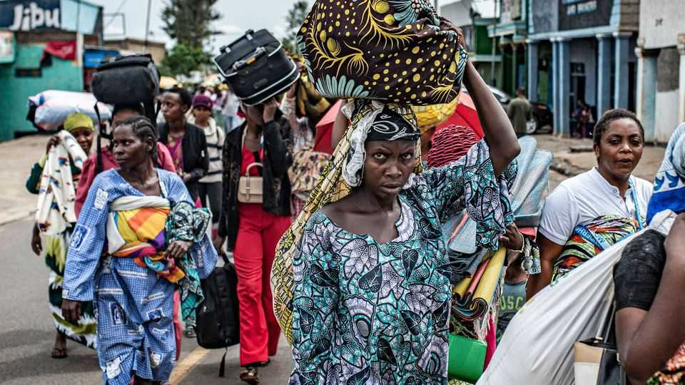
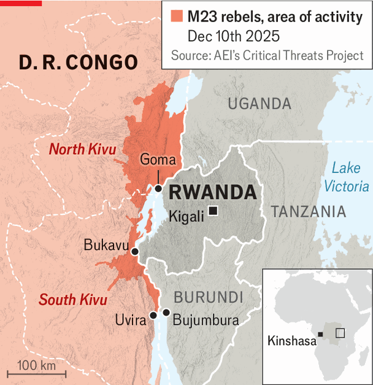

Middle East & Africa | A peace deal without peace
Donald Trump has not ended conflict between Congo and Rwanda
But making money may not require making peace
December 11th 2025

As far as Donald Trump was concerned, it was a day of peacemaking in Washington, DC. On December 4th he hosted the leaders of Rwanda and the Democratic Republic of Congo to celebrate deals involving their countries and America. “They’ve spent a lot of time killing each other, and now they’re going to spend a lot of time hugging,” Mr Trump said. He claimed that the “Washington Accords” would end “one of the longest-running conflicts anywhere in the world”.

The cuddly talk did not appear to resonate with Paul Kagame, Rwanda’s president, and Félix Tshisekedi, his Congolese counterpart. They studiously avoided each other’s eye and did not shake hands, let alone hug. Nor does it seem to have impressed M23, a militia group backed by Rwanda. As Mr Trump made his remarks, it was continuing its advance in the conflict he had just declared resolved.

What, then, was the point of the meeting? The leaders signed a peace accord agreed to in June, which compels Rwanda to stop supporting M23 and withdraw its troops from eastern Congo. Congo is supposed to smash the Forces Démocratiques de la Libération du Rwanda, a militia that Rwanda’s government considers an existential threat, because it is mainly composed of the ethnic Hutus who committed a genocide against Mr Kagame’s fellow Tutsis in 1994. Mr Trump also struck bilateral deals with Congo and Rwanda that are supposed to improve access for American buyers of minerals from both countries and pave the way for American investors in mining. In another deal, Congo and Rwanda agreed to strengthen cross-border supply chains and infrastructure.

The peace deal looks like a sham. Fighting in eastern Congo has continued unabated since the meeting, pitting Congolese troops, pro-government militias and Burundian soldiers against M23 and Rwandan soldiers. More than 200,000 people have fled since December 2nd, according to the UN. Dozens have been killed. On December 10th, M23 took control of Uvira, a city on the border with Burundi (see map). That cuts the Congolese army’s resupply link through Bujumbura airport across the border and cements Rwandan control over eastern Congo.

The bilateral deals matter more. Mr Trump has given each party something they want. Mr Kagame looks set to receive new American investment without first having to loosen his grip on eastern Congo: he sees his influence there as a key part of his legacy. Mr Tshisekedi, whose hold on power was shaken by M23’s advance, gets American support for his presidency, as well as potential investors in mines and new buyers for Congo’s minerals.

If America ends up with a stake in the economic integration of the Great Lakes region, that may give it an incentive to ensure that the peace deal is honoured, too. Yet for now, stopping the conflict looks less important to the signatories than the various economic deals. ■

Sign up to the Analysing Africa, a weekly newsletter that keeps you in the loop about the world’s youngest—and least understood—continent.

This article was downloaded by zlibrary from https://www.economist.com//middle-east- and-africa/2025/12/11/donald-trump-has-not-ended-conflict-between-congo-and-rwanda