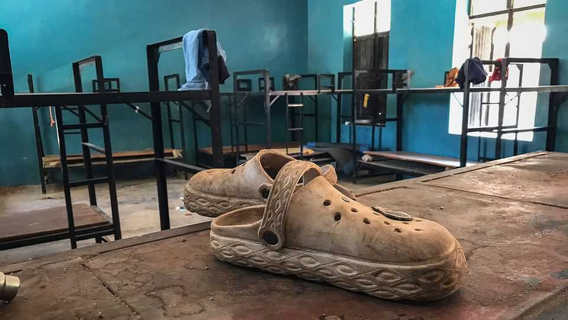
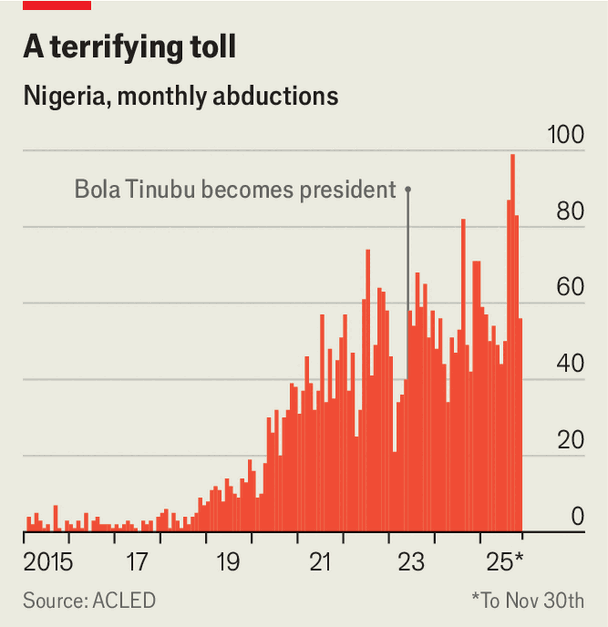

Middle East & Africa | Sorry states
Nigeria’s kidnapping crisis
Donald Trump’s ire has drawn attention to appalling security failures
December 11th 2025

For nearly three weeks Chukwuelota Mmadubueze, a trader in Kwna village in north-western Nigeria, was trapped in agonising limbo. On November 21st gunmen burst into St Mary’s, the local high school, and abducted almost half of its 600 or so students and staff, including his son. “They packed our children like cows into the bush,” he says. For days Mr Mmadubueze’s wife was so sick with worry she could not eat. On December 8th, a hundred children were freed. “I thank God my son was among them,” he says. The fate of another 165 captives remains unknown.

Abductions, while hardly unusual in Nigeria, have become more widespread in recent years (see chart). The kidnapping at St Mary’s in Niger state was the third such incident in a single week: three days earlier two people were killed and 38 abducted in an attack on a church in neighbouring Kwara state. The assault on St Mary’s involved even more victims than the notorious “Chibok Girls” kidnapping by jihadists in north-eastern Nigeria in 2014, which sparked a global outcry.

For the government of Bola Tinubu, Nigeria’s president, the latest spate of abductions is particularly concerning. On October 31st President Donald

Trump threatened military intervention should Mr Tinubu fail to stop the alleged persecution of Christians by “Islamic Terrorists”. Nigeria has been labelled a “Country of Particular Concern”, which could pave the way for American sanctions and aid cuts.

The prospect has sent shockwaves through Nigeria’s political class. Officials are scrambling to repair the country’s relationship with America, its most important partner. Mr Tinubu has issued a flurry of orders to tackle insecurity. A new defence minister, a former army chief with a background in counter- insurgency, was appointed on December 2nd.

The government claims Nigeria’s security forces have killed some 13,500 “terrorists” and arrested 17,000 others since Mr Tinubu took office in 2023. But few experts reckon security in Nigeria has improved on his watch. During the 12 months to October, when violence shot up, the number of abductions and conflict-induced fatalities fell slightly, estimates Beacon Security and Intelligence, a consultancy in the capital, Abuja. Yet some 10,000 people were killed, and many more abducted, in just the first two years of Mr Tinubu’s term, according to Amnesty International, a rights group. (The government disputes the figure.) “The state is not in control of the one million square kilometres of territory that Nigeria is supposed to be,” says Cheta Nwanze, a Nigerian security expert.

Contrary to Mr Trump’s claim, the vast majority of abductions and killings in Nigeria are not religiously motivated. In the north-west the main culprits are criminal gangs known as bandits, who raid villages, loot cattle and extort civilians. It is unclear who kidnapped Mr Mmadubueze’s son, but many suspect the motive was financial. Though the government claims to have “rescued” the students, they were almost certainly freed because of ransom payments. Mr Trump’s threats may have created an incentive for armed groups, notes Mr Nwanze, since a government facing international censure may be more likely to pay up. That could also explain the recent targeting of Christians.

To contain the crisis, Mr Tinubu has promised to hire more police officers, among other things. Encouragingly, he also plans to allow states to establish their own police forces. Nigeria’s federal security forces are overstretched and often unable to respond promptly. “Nigeria cannot make significant headway

in security provision unless it adopts and embraces state policing,” argues Fola Aina of the School of Oriental and African Studies in London.

Some of Nigeria’s foreign partners, notably France and Russia, have pledged more intelligence co-operation and military aid. America, too, has softened its stance. A Nigerian delegation to Washington said on November 24th that it had reached an agreement to strengthen Nigeria’s security partnership with America.

All of that is welcome. Yet a lasting solution to the country’s conflicts will involve taking on the entrenched political and business interests which benefit from them, such as the elites who collude with bandits to smuggle gold from illegal mines in the north-west. That is something foreign armies can do little to help. ■

Sign up to the Analysing Africa, a weekly newsletter that keeps you in the loop about the world’s youngest—and least understood—continent.

This article was downloaded by zlibrary from https://www.economist.com//middle-east- and-africa/2025/12/11/nigerias-kidnapping-crisis