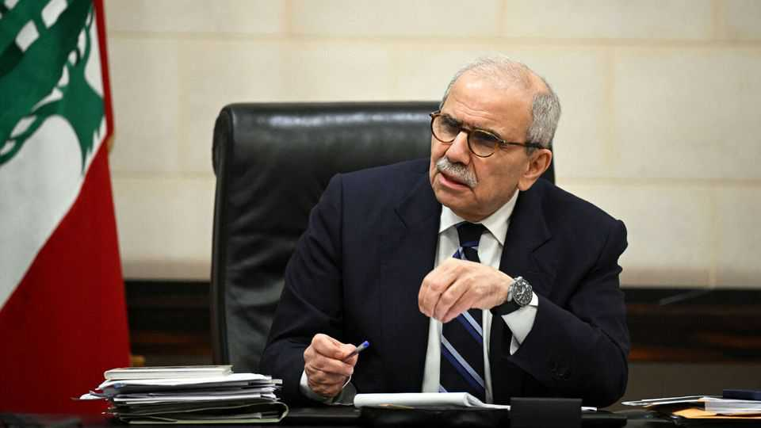

Middle East & Africa | No time like sometime
A window of opportunity for reform in Lebanon is closing
Elections are looming, war drums are beating and the prime minister will soon be a lame duck
December 11th 2025

IN HIS first speech after being named prime minister, Nawaf Salam promised to build a new Lebanon. He set two main goals. One was to assert the authority of the state, a polite way of saying the government needed to disarm Hizbullah, a Shia militia. The other was to rescue an economy mired in financial crisis since 2019.

Almost a year later the old Lebanon looks stubbornly durable. Mr Salam has done a commendable job pushing urgent reforms. His problem is that everyone else has a different timetable. Israel wants him to move faster on Hizbullah, while Joseph Aoun, the Lebanese president, seems to be in less of a hurry. MPs have their eyes on elections scheduled for the spring. The prime minister may be turfed out in a few months with his job unfinished.

The Lebanese army has tried to confiscate Hizbullah’s weapons near the border with Israel. General Nicolas Tabet, who oversees the region, said last month that his men had grabbed more than 500 rocket launchers and seized almost 200 tunnels. The army says it has blown up so many arms caches that it ran out of explosives.

These are not trivial steps in a country where Hizbullah has long been stronger than the army. But Israeli and Lebanese sources agree that the group’s most sophisticated weapons are no longer in the south. Critics fear that Hizbullah is making a show of handing over part of its arsenal in the hope of holding on to the rest.

In a recent interview in Qatar Mr Salam argued that Hizbullah would eventually submit. The ceasefire it accepted last year, which ended a year-long war with Israel, said that the Lebanese state should have a monopoly on arms. Yet neither the prime minister nor anyone else in Lebanon can explain what happens if Hizbullah ignores that edict. Israel is losing patience. In November the defence minister threatened to escalate its current bombing of Lebanon.

Last month Tom Barrack, who serves as Donald Trump’s roving ambassador to the Levant, urged Mr Aoun to call Binyamin Netanyahu, the Israeli prime minister, to forestall another war. The Lebanese president did not go that far, but on December 3rd he sent Simon Karam, a former ambassador to America, to negotiate with an Israeli envoy—the first direct talks in decades between the two countries.

The threat of war has receded for now. Still, the goal of the talks is vague. Mr Salam says they could lead to a peace agreement, and eventually to normal relations with Israel. But they will not solve the problem of Hizbullah’s weapons. Negotiations have bought time; for what is unclear.

Economic reforms are not moving much faster. For decades the Lebanese economy resembled a state-run Ponzi scheme. The central bank borrowed dollars from private lenders, then used them to maintain a currency peg and to finance big fiscal and trade deficits. Since the scheme unravelled in 2019, GDP has fallen by almost a third and the currency has lost 98% of its value. Banks are insolvent. Yet lawmakers with ties to lenders have repeatedly blocked any attempt at reform.

Mr Salam has pushed through two important pieces of legislation. In April parliament passed a law that eased bank-secrecy rules. Three months later it approved a plan to restructure local banks. The next step is the “gap law”, which would apportion the estimated $80bn of losses in Lebanon’s financial sector. This is the crucial piece of the reform package: there can be no bank restructuring nor an imf bailout until it is passed. It is also the most contentious. It needs to unpick a complex web of debts between the state, the central bank and private lenders, and to decide how much money depositors will be able to recover from Lebanon’s zombie banks.

The prime minister hopes it will be approved by year’s end. From then on he makes no promises. “Our part of the job is to have this draft law passed in government,” he says. “Beyond that, I mean, it’ll become the responsibility of the parliament.” Lawmakers may not want such a responsibility ahead of elections due in May.

Mr Aoun has no such pressure. His term should run until 2031. Lebanon’s allies had high hopes for the president, a former army chief who seemed determined to rein in Hizbullah. Diplomats from both Western and Gulf countries have been disappointed with his caution. America has urged him to sack at least one adviser seen as too sympathetic to Hizbullah.

Mr Salam will not say whether he plans to seek a second term: “Let us finish this term first,” he jokes. He spent much of his career abroad, first as Lebanon’s ambassador to the United Nations and then as a judge on the International Court of Justice. He lacks a deep base among Lebanon’s Sunni Muslims (by convention, the prime minister must come from that group). Fouad Makhzoumi, a billionaire businessman and MP, is thought to be a likely challenger and has worked hard this year to cultivate America’s backing.

After years of war and financial crisis, many Lebanese hoped this government would impose real changes. If the forces of inertia prove stronger, the new year may bring more war and economic malaise. ■

Sign up to the Middle East Dispatch, a weekly newsletter that keeps you in the loop on a fascinating, complex and consequential part of the world.

This article was downloaded by zlibrary from https://www.economist.com//middle-east- and-africa/2025/12/11/a-window-of-opportunity-for-reform-in-lebanon-is-closing